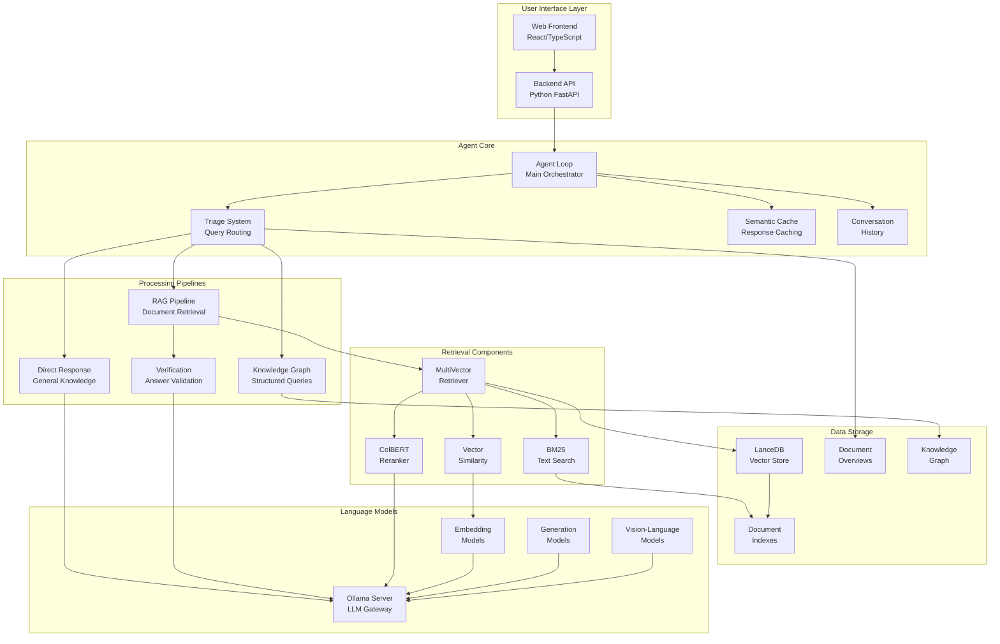
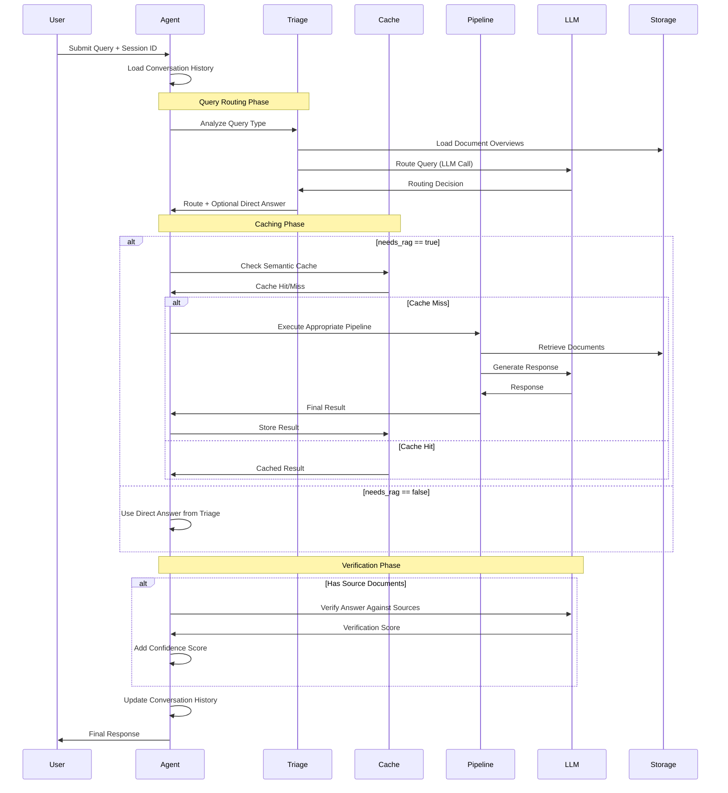
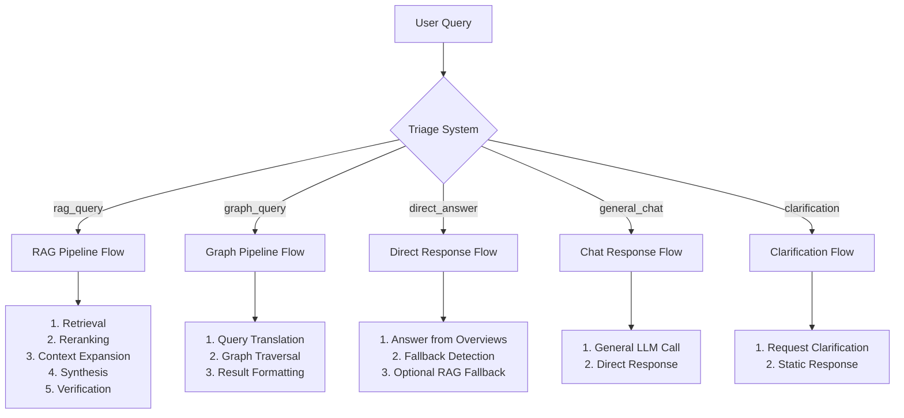
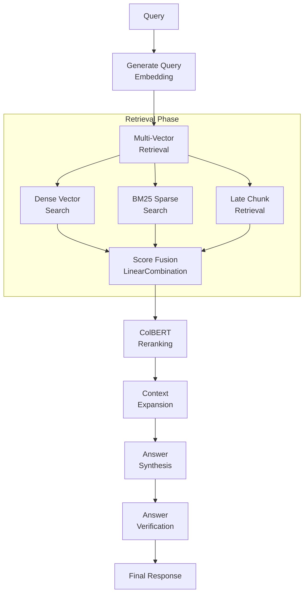
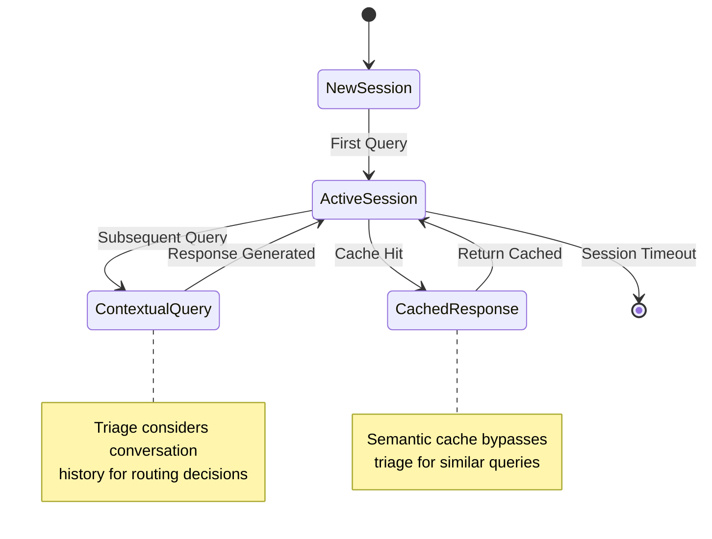
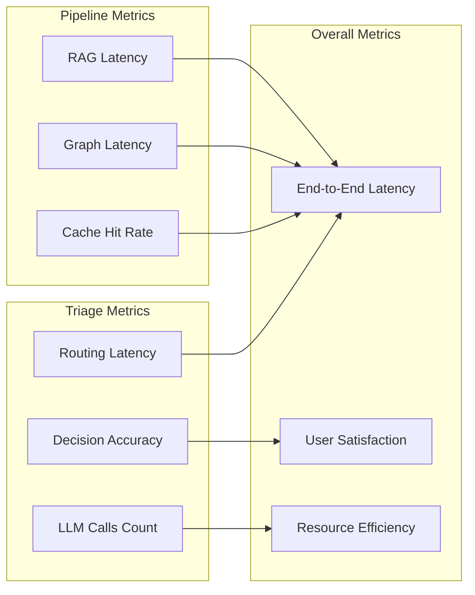

# RAG Agent Architecture Overview

## 🎯 **System Purpose**

The multimodal RAG (Retrieval-Augmented Generation) agent provides intelligent document-based question answering with support for text, images, and knowledge graphs. The system intelligently routes queries through different processing pipelines based on query type and complexity.

## 🏗️ **Complete System Architecture**



## 🎛️ **Agent Loop Execution Flow**



## 🧠 **Triage System Integration**

The triage system is the **decision engine** that determines which processing pipeline should handle each query:

### **Triage Decision Impact**



## 🔄 **Processing Pipeline Details**

### **RAG Pipeline (Full Document Retrieval)**



### **Performance Characteristics by Pipeline**

| Pipeline | Avg Latency | Token Usage | Cache Benefits | Use Cases |
|----------|-------------|-------------|----------------|-----------|
| **Direct Answer** | 800ms-5.8s | 800-1200 | Low | Overview-answerable questions |
| **General Chat** | 700ms | 400 | High | Greetings, general knowledge |
| **RAG Pipeline** | 2.4s-5.4s | 600+ | Medium | Document-specific queries |
| **Graph Query** | 1.2s-2.0s | 300-500 | Medium | Factual relationships |
| **Clarification** | 50ms | 0 | N/A | Ambiguous queries |

## 🎚️ **Configuration Layers**

The system supports multiple configuration layers that affect triage behavior:

### **Pipeline Configurations**

```python
PIPELINE_CONFIGS = {
    "default": {
        "verification": {"enabled": True},
        "query_decomposition": {"enabled": True},
        "reranker": {"enabled": True, "strategy": "rerankers-lib"},
        "contextual_enricher": {"enabled": True, "window_size": 1}
    },
    "fast": {
        "verification": {"enabled": False},
        "reranker": {"enabled": False},
        "context_expansion": False
    }
}
```

### **Triage Behavior Modifiers**

| Configuration | Impact on Triage | Performance Trade-off |
|---------------|-------------------|----------------------|
| `verification.enabled` | Affects post-processing, not routing | +200ms for verified responses |
| `query_decomposition.enabled` | Changes RAG pipeline complexity | +500ms-2s for complex queries |
| `reranker.enabled` | Affects retrieval quality | +300-500ms for reranked results |
| Document overviews available | Enables advanced routing | +100-200ms triage overhead |

## 🎭 **Agent States and Context**

### **Session Management**



### **Context Influence on Triage**

| Context State | Triage Behavior | Example |
|---------------|-----------------|---------|
| **New Session** | Full triage evaluation | "Hello" → general_chat |
| **Has History** | Biased toward RAG | "What about the total?" → rag_query |
| **Recent RAG** | Semantic cache check first | Similar question → cached |
| **Multiple Docs** | Overview-based routing | Complex routing logic |

## 🔧 **Key Integration Points**

### **1. Frontend → Agent**
- **Input**: Query + session ID + optional parameters
- **Output**: Streamed response with events
- **Triage Impact**: Session continuity affects routing

### **2. Agent → Triage**
- **Input**: Query + conversation history
- **Output**: Route decision + optional direct answer
- **Performance**: 300-800ms for routing decision

### **3. Triage → Pipelines**
- **RAG**: Full document retrieval and synthesis
- **Graph**: Structured query and graph traversal  
- **Direct**: Immediate response (various sources)

### **4. Cache Integration**
- **Semantic Cache**: Bypasses triage for similar queries
- **Response Cache**: Stores final responses with embeddings
- **Triage Cache**: Could cache routing decisions (not implemented)

## 📊 **Performance Monitoring Points**

### **Key Metrics to Track**

1. **Triage Latency**: Time from query to routing decision
2. **Pipeline Selection Accuracy**: How often routing is optimal
3. **Cache Hit Rates**: Effectiveness of semantic caching
4. **End-to-End Latency**: Total response time by query type
5. **LLM Token Usage**: Cost optimization opportunities

### **Optimization Tracking**



This architecture overview provides the complete context for understanding how the triage system integrates with and affects the overall RAG agent performance. 