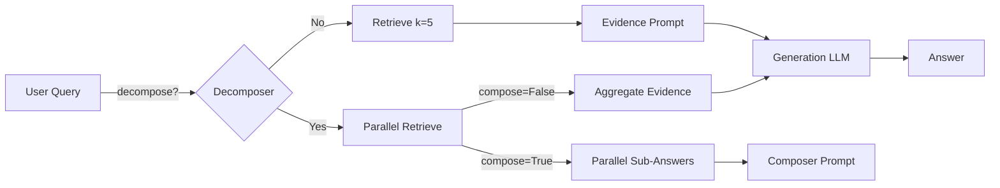

# Multimodal RAG System – Architecture & Config Guide

> Version: June 2025  
> Branch: `feature/parent-child-retrieval`

---

## 1. High-level overview

The codebase implements a **Retrieval-Augmented Generation (RAG)** backend with two interchangeable agent styles and a web UI (legacy localGPT).  The stack:

* **Python / FastAPI** – HTTP API on port `8001`  
* **localGPT React Front-end** – static server on port `8000`  
* **Ollama** – serves all LLMs and embed models (default host `http://localhost:11434`)  
* **LanceDB** – local vector + FTS store  
* **Docling** – PDF → Markdown → text chunk conversion

### Mermaid: data-flow (index + query)
```mermaid
graph TD
    subgraph Indexing
        A[PDF / Image files] --> B[Docling Chunker]
        B --> C[Contextual&nbsp;Enricher<br/>(qwen3-0.6b)]
        C --> D[Embedder<br/>(nomic-embed-text)]
        D --> E[(LanceDB&nbsp;table)]
        E --> F[FTS&nbsp;Index]
    end

    subgraph Query
        Q[User Query] --> AA[Agent]
        AA --> BB[Retriever\n(BM25+Vector)]
        BB --> CC[Top-k chunks]
        CC --> DD[Verifier]
        DD --> EE[LLM&nbsp;Generation<br/>(qwen3-8b)]
        EE --> R[Answer]
    end

    style Indexing fill:#f9f,stroke:#333,stroke-width:1px
    style Query fill:#9ff,stroke:#333,stroke-width:1px
```

---

## 2. Config profiles (`rag_system/config.py`)

| Profile | Purpose | Key toggles (non-exhaustive) |
|---------|---------|--------------------------------|
| `default` | Full-featured, emphasis on quality | `verification=True`, `reranker=True`, `query_decomposition=True (compose)`, `context_expansion=True` |
| `fast` | Low-latency | `verification=False`, `context_expansion=False`, `reranker=None`, `query_decomposition=False` |
| `react` | Tool-driven ReAct agent | `react.max_iterations=5`, `query_decomposition=True`, `compose_from_sub_answers=True`, `contextual_enricher.enabled=True` |

All profiles share the **OLLAMA_CONFIG** defaults:

```python
{
  "embedding_model": "nomic-embed-text",
  "generation_model": "qwen3:8b",
  "rerank_model": "qwen3:8b",
  "enrichment_model": "qwen3:0.6b",
  "qwen_vl_model": "qwen-vl-chat"
}
```

---

## 3. Main components & toggles

| Component | Toggle path | Default | Notes |
|-----------|-------------|---------|-------|
| **Contextual Enrichment** | `contextual_enricher.enabled` | `True` (react) | Uses `qwen3:0.6b`, `enable_thinking=False` to strip CoT.  `window_size=2` |
| **Hybrid Retrieval** | `retrieval.search_type` | `"hybrid"` | Manual fusion of BM25 & vector scores; weights in `fusion.*` |
| **Sub-query Decomposition** | `query_decomposition.enabled` | profile-specific | Parallel retrieval (`ThreadPoolExecutor`); LLM answers also parallel. |
| **Compose from Sub-answers** | `query_decomposition.compose_from_sub_answers` | `True` (react) | If `False`, agent concatenates evidence chunks instead. |
| **Verification** | `verification.enabled` | `True` (default) | Verifier returns `confidence_score`; answers annotated accordingly. |
| **Graph RAG** | `graph_rag.enabled` | `False` | Placeholder; GraphRetriever implemented but disabled. |
| **Reranker** | `retrieval.reranker` | `qwen3:8b` / `None` | Not wired into manual fusion yet. |
| **Semantic Cache** | hidden in `Agent`; size 100; `ttl=300 s` | Cosine threshold 0.98 |

Unused / experimental
* **Vision search** – hooks exist for CLIP embeddings (`LocalVisionModel`) but image indexing disabled.
* **GraphSearchTool** – exposed in ReAct prompt but returns "Graph retriever is not configured." when KG off.
* **BM25Retriever class** – removed; replaced by LanceDB FTS.

---

## 4. Agent modes

### 4.1 ReActAgent (`react` profile)

1. (Optional) **Query decomposition**  
   `QueryDecomposer → [sub-Qᵢ]`
2. **Parallel retrieval** per sub-Q (`k=5`)  
3. **Optional sub-answering** (parallel)  
4. **Composer** or **Aggregated evidence** prompt → `qwen3:8b`
5. **Session transcript** cached (LRU)


### Mermaid – ReAct two-phase path


### 4.2 Loop Agent (`default` / `fast`)

* Auto-triage (`graph_query` vs `rag_query` vs `direct_answer`)
* Query decomposition parallelised with ThreadPoolExecutor
* Verification step after answer

---

## 5. Indexing pipeline (`pipelines/indexing_pipeline.py`)

1. **Chunking** – Docling + custom window slide  
2. **Contextual Enrichment** (batch 25)  
3. **Embeddings** (batch 50) → LanceDB vector insert  
4. **FTS index** ensure  
5. Optional graph extraction (currently off)

Stats printed after run: files, chunks, memory, timings.

---

## 6. Runtime defaults

| Setting | Value |
|---------|-------|
| `embedding_batch_size` | 50 |
| `enrichment_batch_size` | 25 |
| Retrieval `k` | 5 |
| ReAct max iterations | 5 (profile) → 8 (code safety) |
| Max sub-queries | 3 |

---

## 7. How to disable thinking mode (qwen3-0.6b only)

Implemented in `OllamaClient`:
```python
client.generate_completion(
    model="qwen3:0.6b",
    prompt="…",
    enable_thinking=False,
)
```
This sets `chat_template_kwargs: {"enable_thinking": false}` as per Ollama ≥0.9 [docs](https://github.com/ollama/ollama/issues/10492).

---

## 8. Developer toggles cheat-sheet

```text
PIPELINE_CONFIGS["react"]["query_decomposition"]["enabled"]         # on/off
PIPELINE_CONFIGS["react"]["query_decomposition"]["compose_from_sub_answers"]
PIPELINE_CONFIGS["react"]["contextual_enricher"]["window_size"]
PIPELINE_CONFIGS["react"]["react"]["max_iterations"]
OLLAMA_CONFIG["generation_model"] / ["enrichment_model"]            # model swap
```

---

## 9. Future / unused features

* **Knowledge-graph retrieval** – scaffolded but KG path disabled in prod config.
* **Rerank fusion** – placeholder for vector+BM25 reranker model.
* **Vision chunks** – table `image_pages` reserved for CLIP embeddings.
* **HyDE synthetic docs** – `HyDEGenerator` class available but not invoked.

---

## 10. File map

```
rag_system/
  agent/
    react_agent.py      # tool-driven agent
    loop.py             # original loop agent
    verifier.py         # answer verifier
  indexing/
    contextualizer.py   # context summaries
    embedders.py
  retrieval/
    retrievers.py       # hybrid search
    query_transformer.py# decomposition / HyDE / graph translator
  utils/
    ollama_client.py    # HTTP wrapper with enable_thinking hack
    logging_utils.py
  pipelines/
    indexing_pipeline.py
    retrieval_pipeline.py
```

---

## 11. Deployment quick-start

```bash
# 1. Pull models
ollama pull qwen3:8b
ollama pull qwen3:0.6b
ollama pull nomic-embed-text

# 2. Run API
RAG_CONFIG_MODE=react python combined_server.py  # port 8001

# 3. Index docs
curl -F files=@doc.pdf http://localhost:8001/index
```

---

*Last updated 2025-06-14 by the assistant.* 