# LocalGPT Architecture Diagrams

**Document Type**: Technical Architecture Diagrams  
**Version**: 1.0  
**Last Updated**: 2025-07-06

---

## Table of Contents

1. [System Overview](#system-overview)
2. [Component Architecture](#component-architecture)
3. [Data Flow Diagrams](#data-flow-diagrams)
4. [Processing Pipelines](#processing-pipelines)
5. [API Interaction Flows](#api-interaction-flows)
6. [Database Relationships](#database-relationships)
7. [Deployment Architecture](#deployment-architecture)

---

## System Overview

### High-Level System Architecture

```mermaid
graph TB
    subgraph "External Layer"
        User[👤 User]
        Admin[👨‍💼 Administrator]
        API_Consumer[🔌 API Consumer]
    end
    
    subgraph "Presentation Layer"
        WebUI[🌐 Web Interface<br/>React/Next.js<br/>Port 3000]
        MobileApp[📱 Mobile App<br/>Future Enhancement]
    end
    
    subgraph "API Gateway Layer"
        Backend[🚪 Backend Server<br/>Python HTTP<br/>Port 8000]
        Auth[🔐 Authentication<br/>Future Enhancement]
        RateLimit[⏱️ Rate Limiting<br/>Future Enhancement]
        LoadBalancer[⚖️ Load Balancer<br/>Production]
    end
    
    subgraph "Business Logic Layer"
        RAG_API[🧠 RAG API Server<br/>Python<br/>Port 8001]
        Agent[🤖 RAG Agent<br/>Core Intelligence]
        Triage[🎯 Query Triage<br/>Smart Routing]
        Verifier[✅ Response Verifier<br/>Quality Control]
    end
    
    subgraph "AI Services Layer"
        Ollama[🦙 Ollama Server<br/>Local LLMs<br/>Port 11434]
        HuggingFace[🤗 Hugging Face<br/>External Models]
        EmbeddingService[🔢 Embedding Service<br/>Vector Generation]
        RerankerService[📊 Reranker Service<br/>Result Refinement]
    end
    
    subgraph "Data Persistence Layer"
        SQLite[(📊 SQLite<br/>Metadata & Sessions)]
        LanceDB[(🎯 LanceDB<br/>Vector Database)]
        BM25Index[(🔍 BM25 Index<br/>Keyword Search)]
        FileStorage[📁 File Storage<br/>Document Repository)]
    end
    
    subgraph "Infrastructure Layer"
        Docker[🐳 Docker Containers]
        Monitoring[📈 Monitoring<br/>Logs & Metrics]
        Backup[💾 Backup System<br/>Data Protection]
    end
    
    User --> WebUI
    Admin --> WebUI
    API_Consumer --> Backend
    
    WebUI --> Backend
    MobileApp --> Backend
    
    Backend --> Auth
    Backend --> RateLimit
    Backend --> RAG_API
    
    RAG_API --> Agent
    Agent --> Triage
    Agent --> Verifier
    
    Agent --> Ollama
    Agent --> HuggingFace
    Agent --> EmbeddingService
    Agent --> RerankerService
    
    Agent --> SQLite
    Agent --> LanceDB
    Agent --> BM25Index
    Agent --> FileStorage
    
    Backend --> SQLite
    
    Docker --> Monitoring
    Docker --> Backup
```

### Technology Stack Overview

```mermaid
graph TB
    subgraph "Frontend Technologies"
        React[React 19]
        NextJS[Next.js 15]
        TypeScript[TypeScript]
        TailwindCSS[Tailwind CSS]
    end
    
    subgraph "Backend Technologies"
        Python[Python 3.11]
        HTTPServer[HTTP Server]
        SQLite3[SQLite3]
        AsyncIO[AsyncIO]
    end
    
    subgraph "AI/ML Technologies"
        Transformers[🤗 Transformers]
        PyTorch[PyTorch]
        SentenceTransformers[Sentence Transformers]
        FAISS[FAISS - Future]
    end
    
    subgraph "Database Technologies"
        LanceDB[LanceDB Vector DB]
        SQLiteDB[SQLite RDBMS]
        BM25[BM25 Search]
        FTS[Full-Text Search]
    end
    
    subgraph "Infrastructure"
        DockerEngine[Docker Engine]
        DockerCompose[Docker Compose]
        Nginx[Nginx - Production]
        SystemD[SystemD - Linux]
    end
    
    React --> NextJS
    NextJS --> TypeScript
    TypeScript --> TailwindCSS
    
    Python --> HTTPServer
    Python --> SQLite3
    Python --> AsyncIO
    
    Transformers --> PyTorch
    PyTorch --> SentenceTransformers
    
    LanceDB --> SQLiteDB
    SQLiteDB --> BM25
    BM25 --> FTS
    
    DockerEngine --> DockerCompose
    DockerCompose --> Nginx
```

---

## Component Architecture

### Frontend Component Hierarchy

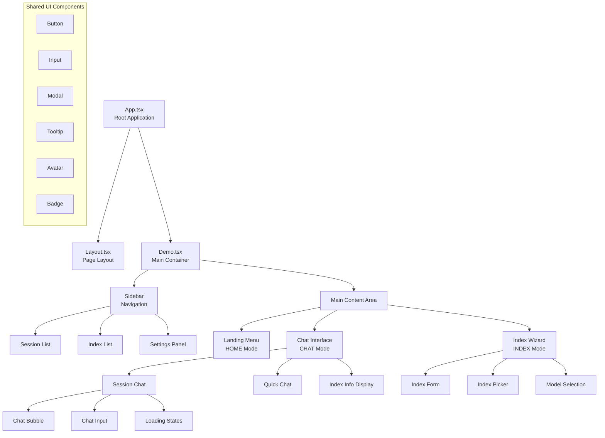

### Backend Service Architecture

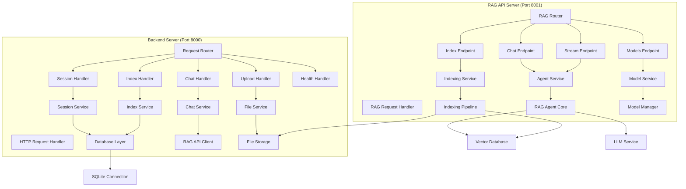

### RAG Agent Internal Architecture

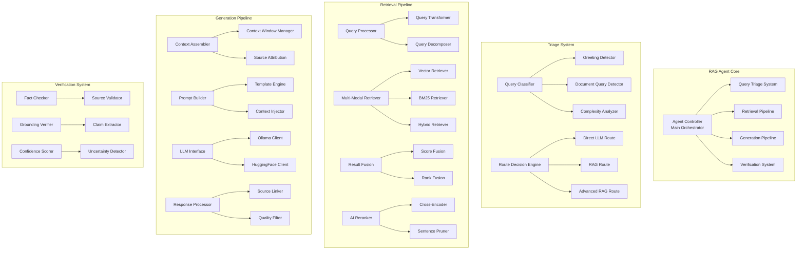

---

## Data Flow Diagrams

### Document Indexing Flow

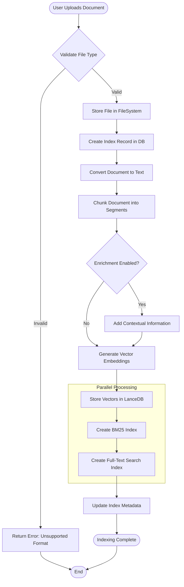

### Query Processing Flow

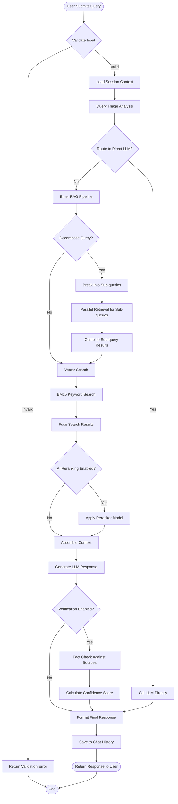

### Real-time Chat Flow

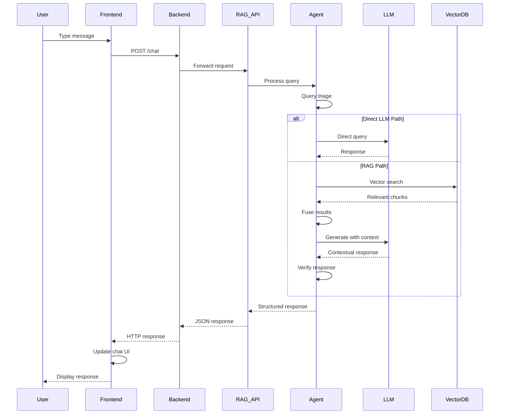

### Streaming Response Flow

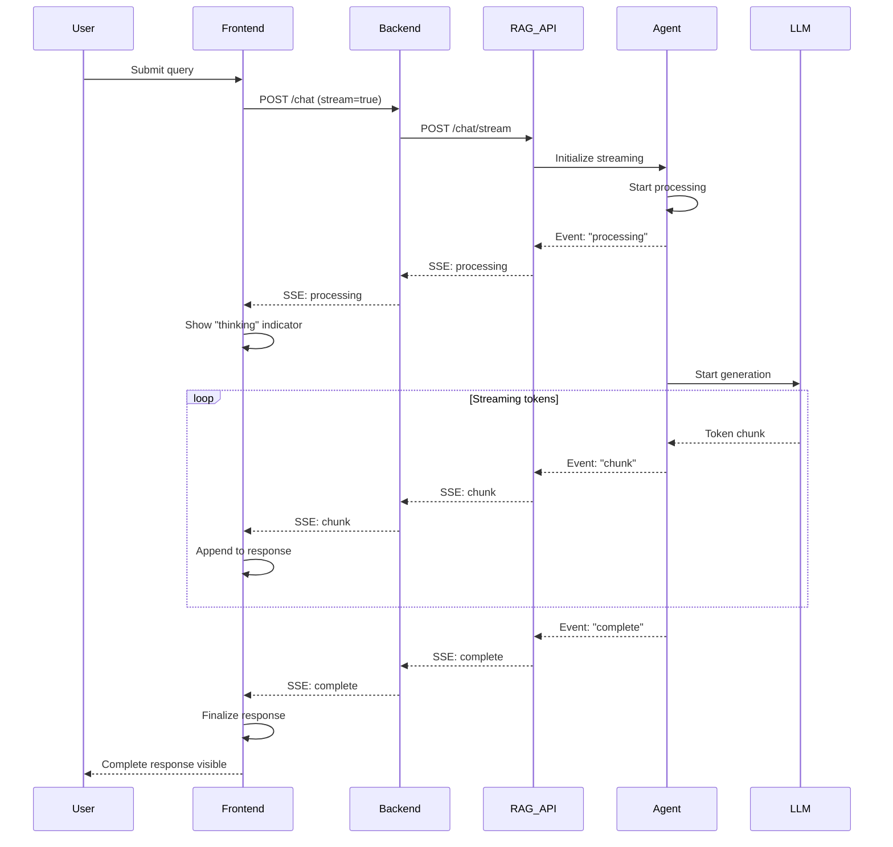

---

## Processing Pipelines

### Document Processing Pipeline

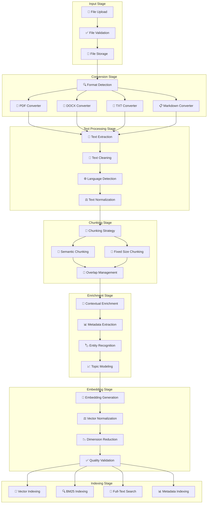

### Query Understanding Pipeline

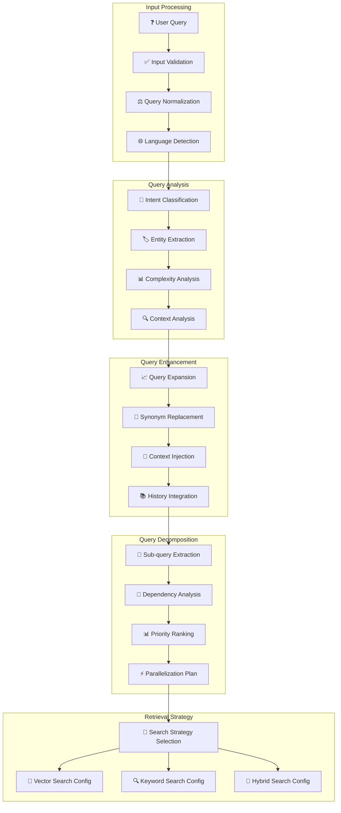

---

## API Interaction Flows

### Session Management Flow

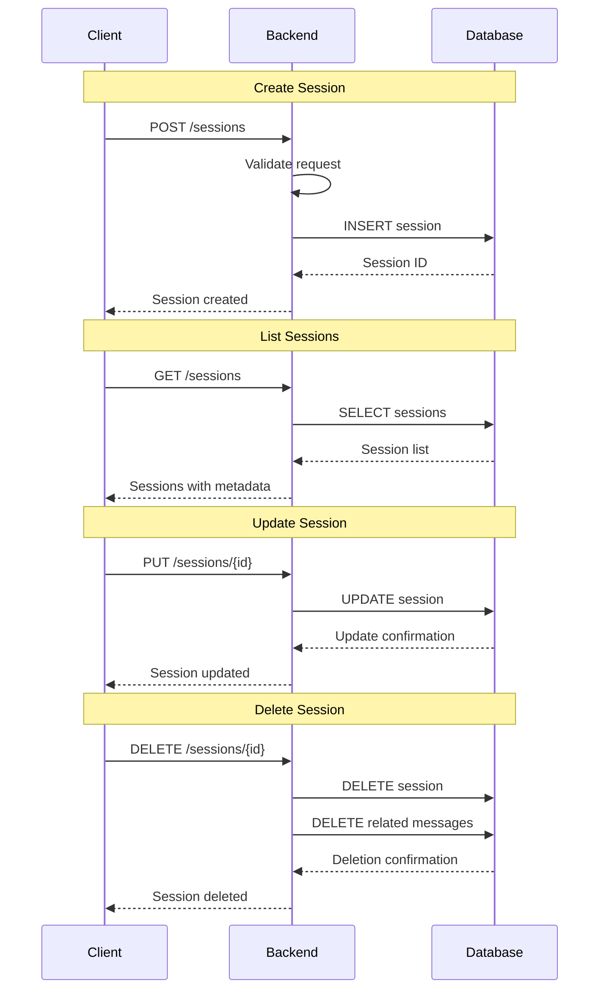

### Index Lifecycle Flow

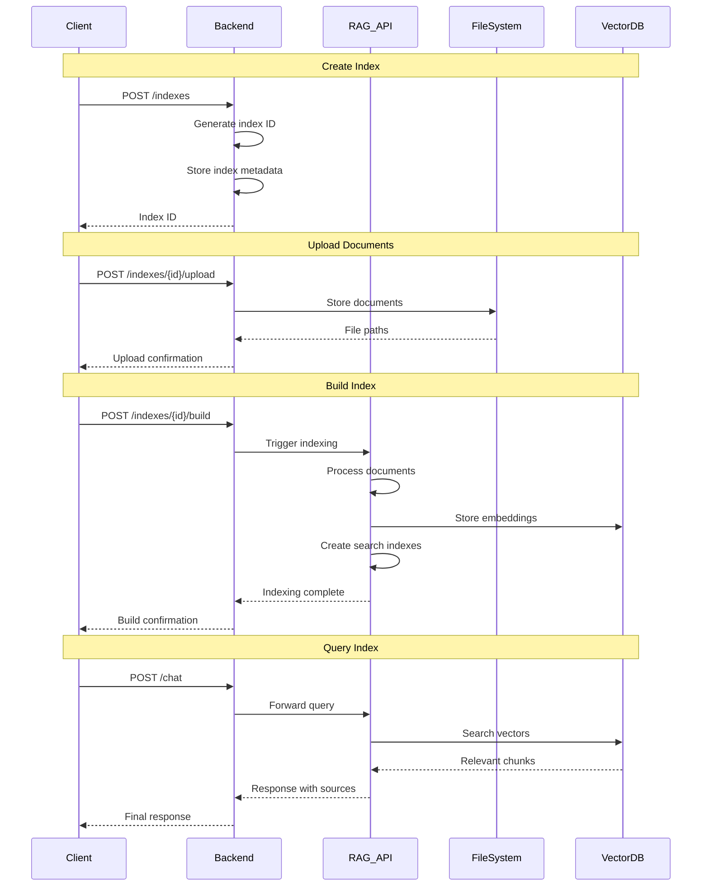

### Error Handling Flow

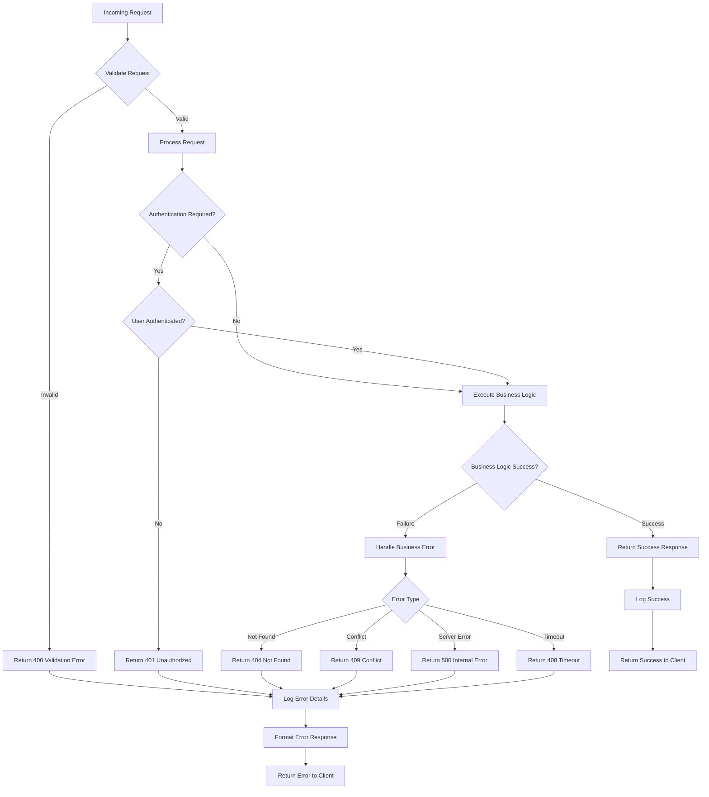

---

## Database Relationships

### Entity Relationship Diagram

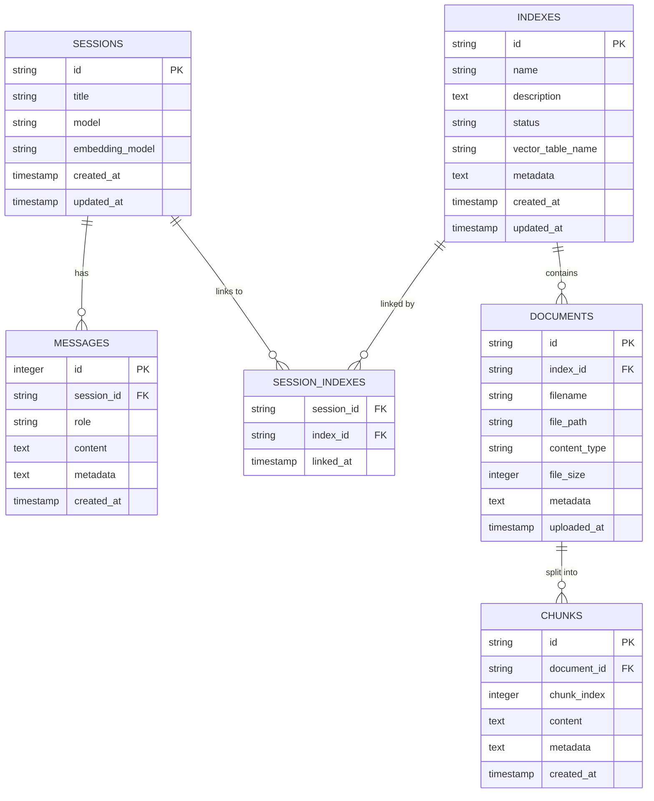

### Vector Database Schema

```mermaid
graph TB
    subgraph "LanceDB Tables"
        VectorTable[Vector Table<br/>text_pages_{index_id}]
        MetadataTable[Metadata Table<br/>chunk_metadata]
        IndexTable[Index Configuration<br/>index_config]
    end
    
    subgraph "Vector Table Schema"
        VectorField[vector: List[Float32]]
        TextField[text: String]
        ChunkIdField[chunk_id: String]
        DocumentIdField[document_id: String]
        ChunkIndexField[chunk_index: Int32]
        MetadataField[metadata: String JSON]
    end
    
    subgraph "Search Indexes"
        VectorIndex[Vector Index<br/>HNSW/IVF]
        FTSIndex[Full-Text Search<br/>Tantivy]
        MetadataIndex[Metadata Index<br/>B-Tree]
    end
    
    VectorTable --> VectorField
    VectorTable --> TextField
    VectorTable --> ChunkIdField
    VectorTable --> DocumentIdField
    VectorTable --> ChunkIndexField
    VectorTable --> MetadataField
    
    VectorField --> VectorIndex
    TextField --> FTSIndex
    MetadataField --> MetadataIndex
```

---

## Deployment Architecture

### Docker Container Architecture

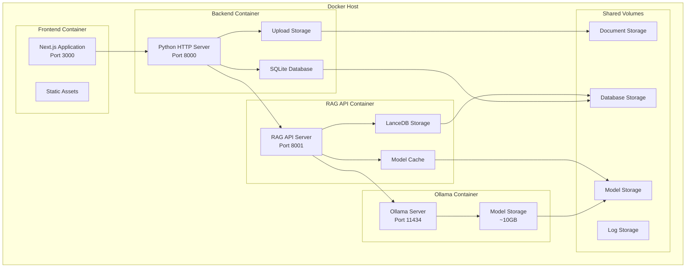

### Production Deployment

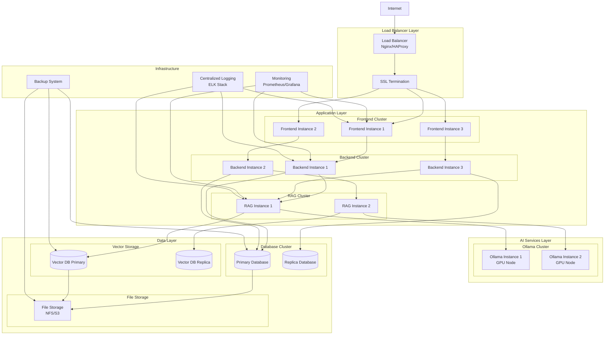

---

This comprehensive architectural documentation provides detailed visual representations of LocalGPT's system design, component interactions, data flows, and deployment strategies. These diagrams serve as the foundation for understanding the system's structure and can be used for development, maintenance, and scaling decisions. 