# Binary Triage System Documentation

## Overview

The simplified binary triage system is a streamlined approach to query routing that makes intelligent decisions about whether to use full RAG (Retrieval-Augmented Generation) pipeline or provide direct LLM responses. This system prioritizes speed and efficiency while maintaining accuracy.

## System Architecture Diagram

```mermaid
graph TD
    A["🔤 User Query"] --> B["📊 Overview Router Available?"]
    
    B -->|Yes| C["🧠 Overview Router<br/>(Fast Context-Aware)"]
    B -->|No| D["🤖 Binary LLM Triage<br/>(qwen3:8b, think=False)"]
    
    C --> E{"🎯 Router Decision"}
    D --> F{"🎯 Triage Decision"}
    
    E -->|"needs_rag"| G["📚 RAG Pipeline<br/>(Full Document Retrieval)"]
    E -->|"direct_answer"| H["⚡ Direct Answer from Overviews<br/>(qwen3:0.6b, think=False)"]
    
    F -->|"needs_rag"| G
    F -->|"direct_answer"| I["⚡ General Knowledge Answer<br/>(qwen3:0.6b, think=False)"]
    
    G --> J["📋 Multi-Vector Retrieval"]
    G --> K["🔍 Hybrid Search<br/>(Vector + BM25)"]
    G --> L["📑 Context Expansion"]
    G --> M["🎯 Answer Generation<br/>(qwen3:8b)"]
    
    H --> N["✅ Final Response"]
    I --> N
    M --> N
    
    style A fill:#e1f5fe
    style C fill:#f3e5f5
    style D fill:#f3e5f5
    style G fill:#fff3e0
    style H fill:#e8f5e8
    style I fill:#e8f5e8
    style N fill:#f1f8e9
```



## Core Architecture

### 🎯 Binary Decision Logic

The system operates on a simple but effective binary classification:

1. **`needs_rag`** - Queries requiring document retrieval and analysis
2. **`direct_answer`** - Queries answerable with direct LLM responses

### ⚡ Performance Optimizations

| Component | Model | Think Mode | Purpose | Speed |
|-----------|--------|------------|---------|-------|
| **Triage Router** | qwen3:8b | `think=False` | Fast routing decisions | ~1-2s |
| **Direct Answers** | qwen3:0.6b | `think=False` | Ultra-fast responses | ~2-3s |
| **RAG Pipeline** | qwen3:8b | `think=True` | Complex reasoning | ~15-30s |

## Performance Flow Diagram

```mermaid
graph LR
    subgraph "🚀 Fast Path (Overview Router)"
        A1["📄 Document Overviews Available"] --> B1["🧠 LLM Analysis<br/>(qwen3:8b, think=False)"]
        B1 --> C1{"📊 Decision"}
        C1 -->|"direct_answer"| D1["⚡ Extract from Overviews<br/>(qwen3:0.6b, think=False)<br/>~2-3 seconds"]
        C1 -->|"needs_rag"| E1["📚 Full RAG Pipeline<br/>~10-30 seconds"]
    end
    
    subgraph "🔄 Fallback Path (Binary Triage)"
        A2["❌ No Document Overviews"] --> B2["🤖 Binary LLM Triage<br/>(qwen3:8b, think=False)"]
        B2 --> C2{"🎯 Decision"}
        C2 -->|"direct_answer"| D2["⚡ General Knowledge<br/>(qwen3:0.6b, think=False)<br/>~2-3 seconds"]
        C2 -->|"needs_rag"| E2["📚 Full RAG Pipeline<br/>~10-30 seconds"]
    end
    
    F["🔤 User Query"] --> G{"📊 Overviews Available?"}
    G -->|Yes| A1
    G -->|No| A2
    
    style D1 fill:#c8e6c9
    style D2 fill:#c8e6c9
    style E1 fill:#ffecb3
    style E2 fill:#ffecb3
```



## System Flow

### 1. Overview Router (Primary Path)

When document overviews are available, the system uses context-aware routing:

```
Query → Overview Analysis → Binary Decision → Route to Pipeline
```

**Advantages:**
- Uses pre-computed document summaries
- Fast context-aware decisions
- Leverages document knowledge for better routing

### 2. Binary LLM Triage (Fallback Path)

When no overviews are available:

```
Query → LLM Classification → Binary Decision → Route to Pipeline
```

**Advantages:**
- Simple binary classification
- Conservative bias toward RAG
- Fast fallback mechanism

## Binary Decision Logic Detail

```mermaid
graph TD
    subgraph "🎯 Binary Decision Logic"
        A["📝 Query Analysis"] --> B{"🤔 Query Type?"}
        
        B -->|"Document-Related"| C["📋 Examples:<br/>• Invoice amounts<br/>• Research summaries<br/>• Technical details<br/>• PDF content"]
        B -->|"General/Chat"| D["💬 Examples:<br/>• Greetings<br/>• General knowledge<br/>• Weather questions<br/>• Math problems"]
        
        C --> E["🎯 Decision: needs_rag"]
        D --> F["🎯 Decision: direct_answer"]
        
        E --> G["📚 Route to RAG Pipeline"]
        F --> H["⚡ Route to Direct LLM"]
    end
    
    subgraph "⚙️ Model Configuration"
        I["🧠 Triage Model<br/>qwen3:8b<br/>think=False<br/>(Fast routing)"]
        J["⚡ Direct Answer Model<br/>qwen3:0.6b<br/>think=False<br/>(Ultra fast responses)"]
        K["📚 RAG Model<br/>qwen3:8b<br/>think=True<br/>(Complex reasoning)"]
    end
    
    G --> K
    H --> J
    A --> I
    
    style E fill:#ffcdd2
    style F fill:#c8e6c9
    style I fill:#e1f5fe
    style J fill:#e8f5e8
    style K fill:#fff3e0
```



## Query Classification Examples

### ✅ `needs_rag` Examples
- "What's the total on invoice 1041?"
- "Summarize the DeepSeek research paper"
- "What did the Q3 report say about revenue?"
- "Extract the payment terms from the contract"

### ⚡ `direct_answer` Examples
- "Hello, how are you?"
- "What's the capital of France?"
- "Explain quantum physics"
- "What's 2+2?"

## System Interaction Flow

```mermaid
sequenceDiagram
    participant U as 👤 User
    participant API as 🌐 API Server
    participant OR as 📊 Overview Router
    participant BT as 🤖 Binary Triage
    participant DA as ⚡ Direct Answer
    participant RAG as 📚 RAG Pipeline
    
    Note over U,RAG: Scenario 1: Greeting (Fast Path)
    U->>API: "Hello, how are you?"
    API->>OR: Check document overviews
    OR->>OR: Analyze with qwen3:8b (think=False)
    OR->>API: Decision: "direct_answer"
    API->>DA: Generate response with qwen3:0.6b
    DA->>API: "Hello! How can I help you?"
    API->>U: Response (~10-11 seconds)
    
    Note over U,RAG: Scenario 2: General Knowledge (Fallback)
    U->>API: "What is quantum physics?"
    API->>OR: Check document overviews
    OR->>OR: Not relevant to documents
    OR->>API: Decision: "direct_answer"
    API->>DA: Generate with qwen3:0.6b (think=False)
    DA->>API: "Quantum physics is..."
    API->>U: Response (~11-12 seconds)
    
    Note over U,RAG: Scenario 3: Document Query (RAG Path)
    U->>API: "Summarize DeepSeek research"
    API->>OR: Check document overviews
    OR->>OR: Requires detailed retrieval
    OR->>API: Decision: "needs_rag"
    API->>RAG: Full pipeline with qwen3:8b
    RAG->>RAG: Vector search + retrieval
    RAG->>API: Comprehensive answer
    API->>U: Response (~15-30 seconds)
```



## Technical Implementation

### Think Token Control

The system properly implements Ollama's `think` parameter to control chain-of-thought reasoning:

```python
# Disable thinking for fast responses
response = client.generate_completion(
    model="qwen3:0.6b",
    prompt=prompt,
    enable_thinking=False  # No <think> tags
)
```

### Think Token Management Strategy

```mermaid
graph LR
    subgraph "🎯 Think Token Management"
        A["🤖 Model Selection"] --> B{"🧠 Task Complexity?"}
        
        B -->|"Simple Routing"| C["qwen3:8b<br/>think=False<br/>⚡ Fast decisions"]
        B -->|"Direct Answers"| D["qwen3:0.6b<br/>think=False<br/>🚀 Ultra fast"]
        B -->|"Complex RAG"| E["qwen3:8b<br/>think=True<br/>🧠 Full reasoning"]
        
        C --> F["No <think> tags<br/>Clean responses<br/>~1-2 seconds"]
        D --> G["No <think> tags<br/>Instant answers<br/>~0.5-1 seconds"]
        E --> H["Full CoT reasoning<br/>Detailed analysis<br/>~5-15 seconds"]
    end
    
    subgraph "⚙️ Implementation Details"
        I["Ollama Client"] --> J["think parameter"]
        J --> K["payload['think'] = False"]
        K --> L["Disables chain-of-thought"]
        L --> M["Faster token generation"]
        M --> N["Cleaner output format"]
    end
    
    style C fill:#e3f2fd
    style D fill:#e8f5e8
    style E fill:#fff3e0
    style F fill:#e3f2fd
    style G fill:#e8f5e8
    style H fill:#fff3e0
```



### Model Selection Strategy

1. **Triage Decisions**: qwen3:8b with `think=False`
   - Large enough for accurate classification
   - Fast enough for routing decisions

2. **Direct Answers**: qwen3:0.6b with `think=False`
   - Ultra-fast for simple responses
   - Sufficient for general knowledge

3. **RAG Pipeline**: qwen3:8b with `think=True`
   - Full reasoning capability
   - Complex document synthesis

## System Comparison: Old vs New

```mermaid
graph TD
    subgraph "🔴 Old Complex System"
        A1["🔤 User Query"] --> B1["🧠 History Check"]
        B1 --> C1["🤖 4-Category Triage"]
        C1 --> D1{"📊 Decision"}
        D1 -->|"general_knowledge"| E1["💬 General Chat"]
        D1 -->|"history_answer"| F1["📚 History Answer"]
        D1 -->|"needs_rag"| G1["📄 RAG Pipeline"]
        D1 -->|"direct_answer"| H1["⚡ Direct Answer"]
        
        I1["⚠️ Issues:<br/>• Complex routing logic<br/>• Multiple decision points<br/>• Slow history processing<br/>• Chain-of-thought overhead"]
        
        style I1 fill:#ffcdd2
    end
    
    subgraph "🟢 New Binary System"
        A2["🔤 User Query"] --> B2{"📊 Overviews Available?"}
        B2 -->|Yes| C2["🧠 Overview Router<br/>(qwen3:8b, think=False)"]
        B2 -->|No| D2["🤖 Binary Triage<br/>(qwen3:8b, think=False)"]
        
        C2 --> E2{"🎯 Binary Decision"}
        D2 --> E2
        
        E2 -->|"needs_rag"| F2["📄 RAG Pipeline<br/>(qwen3:8b, think=True)"]
        E2 -->|"direct_answer"| G2["⚡ Direct Answer<br/>(qwen3:0.6b, think=False)"]
        
        H2["✅ Benefits:<br/>• Simple binary logic<br/>• Optimized model usage<br/>• No thinking overhead<br/>• Fast routing decisions"]
        
        style H2 fill:#c8e6c9
    end
```



## Performance Metrics

### Response Times (Observed)

| Query Type | Path | Time | Model |
|------------|------|------|-------|
| Greetings | Direct Answer | ~10-11s | qwen3:0.6b |
| General Knowledge | Direct Answer | ~11-12s | qwen3:0.6b |
| Document Queries | RAG Pipeline | ~15-30s | qwen3:8b |
| Overview Answers | Direct from Overviews | ~10-11s | qwen3:0.6b |

### Accuracy Improvements

- **Conservative Routing**: Defaults to RAG when uncertain
- **Context-Aware**: Uses document overviews for better decisions
- **Binary Simplicity**: Eliminates complex multi-category confusion

## Code Architecture

### Key Components

1. **`_triage_query_async()`** - Main binary triage logic
2. **`_route_via_overviews()`** - Overview-based routing
3. **`_answer_general_chat()`** - Direct LLM responses
4. **`_answer_from_overviews()`** - Overview-based answers

### Simplified Agent Logic

```python
# Binary routing
if query_type == "needs_rag":
    # Use full RAG pipeline
    result = await self._run_rag_pipeline(...)
elif query_type == "direct_answer":
    # Use fast direct response
    result = self._answer_general_chat(query)
```

## Configuration

### Ollama Models Required

```python
OLLAMA_CONFIG = {
    "generation_model": "qwen3:8b",      # Main reasoning
    "enrichment_model": "qwen3:0.6b",    # Fast responses
    "embedding_model": "nomic-embed-text" # Embeddings
}
```

### Think Parameter Settings

- **Triage**: `enable_thinking=False` (fast routing)
- **Direct Answers**: `enable_thinking=False` (no reasoning tokens)
- **RAG Pipeline**: `enable_thinking=True` (full reasoning)

## Benefits of Binary Approach

### 🚀 Speed Improvements
- Simple binary decisions vs complex multi-category
- Smaller models for appropriate tasks
- Eliminated unnecessary reasoning steps

### 🎯 Accuracy Improvements
- Conservative bias prevents missed documents
- Context-aware routing with overviews
- Clear decision boundaries

### 🔧 Maintainability
- Simple binary logic vs complex state machines
- Clear separation of concerns
- Easy to debug and modify

### 💰 Cost Efficiency
- Smaller models for simple tasks
- Reduced inference time
- Optimized resource usage

## Monitoring and Debugging

### Debug Output Examples

```
Overview Router Decision: 'direct_answer'. Reason: The user's query is a greeting...
Agent Triage Decision: 'direct_answer'
Agent loop took 10.55 seconds.
```

```
Overview Router Decision: 'needs_rag'. Reason: The user is asking for detailed technical information...
Agent Triage Decision: 'needs_rag'
--- Performing Retrieval for query: '...' ---
```

## Future Enhancements

### Potential Improvements
1. **Caching**: Cache triage decisions for similar queries
2. **Learning**: Track routing accuracy and adjust thresholds
3. **Parallel Processing**: Run triage and embedding in parallel
4. **Dynamic Models**: Auto-select models based on query complexity

### Metrics to Track
- **Routing Accuracy**: Percentage of correct routing decisions
- **Response Times**: Average time per query type
- **User Satisfaction**: Feedback on answer quality
- **Resource Usage**: Token consumption per path

## Conclusion

The binary triage system represents a significant simplification that maintains accuracy while improving performance. By focusing on two clear paths - RAG or direct response - the system provides:

- **Fast responses** for simple queries
- **Accurate routing** for complex document questions
- **Efficient resource usage** with appropriate model selection
- **Simple, maintainable code** that's easy to understand and modify

This approach successfully balances the need for speed with the requirement for accurate, contextual responses in a document-aware RAG system. 