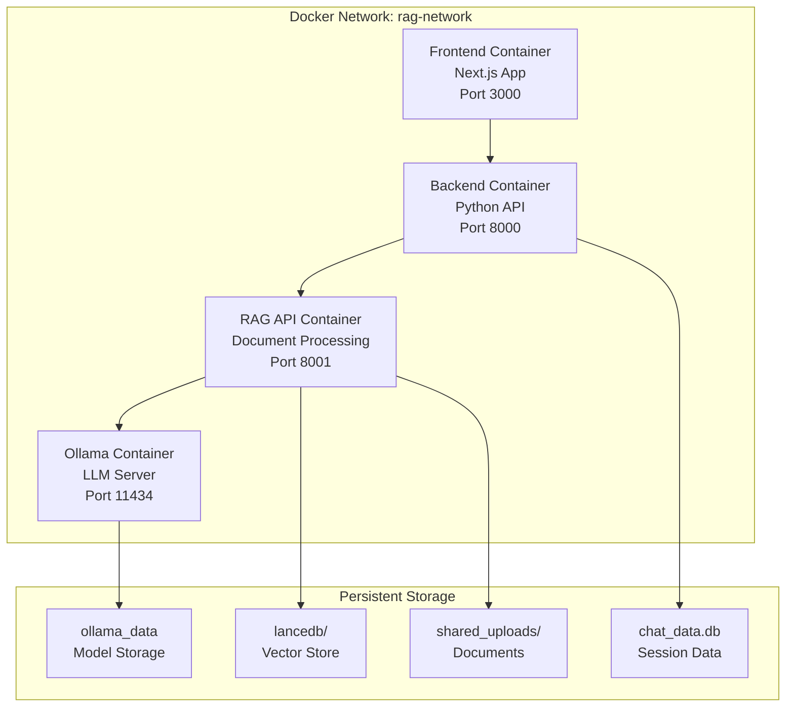

# 🚀 RAG System Deployment Guide

_Last updated: 2025-01-02_

This guide provides comprehensive instructions for deploying the RAG system using Docker, including setup, configuration, and operational procedures.

---

## 1. Prerequisites

### 1.1 System Requirements

#### **Minimum Requirements**
- **CPU**: 4 cores, 2.5GHz+
- **RAM**: 8GB (16GB recommended)
- **Storage**: 50GB free space
- **OS**: Linux, macOS, or Windows with WSL2

#### **Recommended Requirements**
- **CPU**: 8+ cores, 3.0GHz+
- **RAM**: 32GB+ (for large models)
- **Storage**: 200GB+ SSD
- **GPU**: NVIDIA GPU with 8GB+ VRAM (optional, for acceleration)

### 1.2 Software Dependencies

#### **Required Software**
```bash
# Docker & Docker Compose
Docker Engine 24.0+
Docker Compose 2.20+

# Git (for cloning repository)
Git 2.30+

# Optional: NVIDIA Container Toolkit (for GPU support)
nvidia-container-toolkit
```

#### **Installation Commands**

**Ubuntu/Debian:**
```bash
# Install Docker
curl -fsSL https://get.docker.com -o get-docker.sh
sudo sh get-docker.sh
sudo usermod -aG docker $USER

# Install Docker Compose
sudo apt-get update
sudo apt-get install docker-compose-plugin

# For GPU support (optional)
distribution=$(. /etc/os-release;echo $ID$VERSION_ID)
curl -s -L https://nvidia.github.io/nvidia-docker/gpgkey | sudo apt-key add -
curl -s -L https://nvidia.github.io/nvidia-docker/$distribution/nvidia-docker.list | sudo tee /etc/apt/sources.list.d/nvidia-docker.list
sudo apt-get update && sudo apt-get install -y nvidia-container-toolkit
sudo systemctl restart docker
```

**macOS:**
```bash
# Install Docker Desktop
brew install --cask docker

# Or download from: https://www.docker.com/products/docker-desktop
```

**Windows:**
```bash
# Install Docker Desktop with WSL2 backend
# Download from: https://www.docker.com/products/docker-desktop
```

---

## 2. Quick Start

### 2.1 Clone Repository
```bash
git clone https://github.com/your-org/rag-system.git
cd rag-system
```

### 2.2 Environment Setup
```bash
# Create environment file
cp .env.example .env

# Edit configuration (optional)
nano .env
```

### 2.3 Launch System
```bash
# Start all services
docker-compose up -d

# Check status
docker-compose ps

# View logs
docker-compose logs -f
```

### 2.4 Access System
- **Frontend**: http://localhost:3000
- **Backend API**: http://localhost:8000
- **RAG API**: http://localhost:8001
- **Ollama API**: http://localhost:11434

---

## 3. Docker Architecture

### 3.1 Service Overview

The system consists of 4 containerized services:



### 3.2 Container Specifications

#### **Frontend Container**
```dockerfile
# Based on: node:18-alpine
# Build: Next.js production build
# Port: 3000
# Dependencies: React, TypeScript, Tailwind CSS
```

#### **Backend Container**
```dockerfile
# Based on: python:3.11-slim
# Purpose: API gateway, session management
# Port: 8000
# Dependencies: FastAPI, SQLite, requests
```

#### **RAG API Container**
```dockerfile
# Based on: python:3.11-slim
# Purpose: Document processing, retrieval
# Port: 8001
# Dependencies: transformers, lancedb, torch
```

#### **Ollama Container**
```dockerfile
# Based on: ollama/ollama:latest
# Purpose: LLM inference server
# Port: 11434
# Models: Downloaded on first use
```

---

## 4. Configuration

### 4.1 Environment Variables

#### **Global Configuration (`.env`)**
```bash
# System Configuration
NODE_ENV=production
LOG_LEVEL=info

# Service URLs
FRONTEND_URL=http://localhost:3000
BACKEND_URL=http://localhost:8000
RAG_API_URL=http://localhost:8001
OLLAMA_URL=http://localhost:11434

# Database Configuration
DATABASE_PATH=./backend/chat_data.db
LANCEDB_PATH=./lancedb
UPLOADS_PATH=./shared_uploads

# Model Configuration
DEFAULT_EMBEDDING_MODEL=sentence-transformers/all-mpnet-base-v2
DEFAULT_GENERATION_MODEL=qwen2.5:7b
DEFAULT_RERANKER_MODEL=BAAI/bge-reranker-base

# Performance Configuration
MAX_CONCURRENT_REQUESTS=5
REQUEST_TIMEOUT=300
EMBEDDING_BATCH_SIZE=32
```

#### **Service-Specific Configuration**

**Frontend (`docker-compose.yml`)**
```yaml
environment:
  - NODE_ENV=production
  - NEXT_PUBLIC_API_URL=http://localhost:8000
  - NEXT_PUBLIC_ENABLE_STREAMING=true
  - NEXT_PUBLIC_MAX_FILE_SIZE=50MB
```

**Backend (`docker-compose.yml`)**
```yaml
environment:
  - NODE_ENV=production
  - RAG_API_URL=http://rag-api:8001
  - DATABASE_PATH=/app/backend/chat_data.db
  - UPLOADS_PATH=/app/shared_uploads
```

**RAG API (`docker-compose.yml`)**
```yaml
environment:
  - OLLAMA_HOST=http://ollama:11434
  - LANCEDB_PATH=/app/lancedb
  - INDEX_STORE_PATH=/app/index_store
  - UPLOADS_PATH=/app/shared_uploads
```

**Ollama (`docker-compose.yml`)**
```yaml
environment:
  - OLLAMA_HOST=0.0.0.0
  - OLLAMA_ORIGINS=*
  - OLLAMA_MODELS_PATH=/root/.ollama/models
```

### 4.2 Volume Configuration

#### **Persistent Volumes**
```yaml
volumes:
  # Ollama model storage
  ollama_data:
    driver: local
    driver_opts:
      type: none
      o: bind
      device: ./ollama_data

  # Database storage
  chat_data:
    driver: local
    driver_opts:
      type: none
      o: bind
      device: ./backend/chat_data.db

  # Vector database
  lancedb:
    driver: local
    driver_opts:
      type: none
      o: bind
      device: ./lancedb

  # Document uploads
  shared_uploads:
    driver: local
    driver_opts:
      type: none
      o: bind
      device: ./shared_uploads
```

---

## 5. Deployment Procedures

### 5.1 Production Deployment

#### **Step 1: System Preparation**
```bash
# Create deployment directory
mkdir -p /opt/rag-system
cd /opt/rag-system

# Clone repository
git clone https://github.com/your-org/rag-system.git .

# Set proper permissions
sudo chown -R $USER:$USER .
chmod +x scripts/*.sh
```

#### **Step 2: Configuration**
```bash
# Copy and configure environment
cp .env.example .env
nano .env

# Create required directories
mkdir -p {lancedb,shared_uploads,logs,ollama_data}
mkdir -p index_store/{overviews,bm25,graph}

# Set permissions
chmod 755 {lancedb,shared_uploads,logs,ollama_data}
chmod 644 .env
```

#### **Step 3: Service Deployment**
```bash
# Build and start services
docker-compose up -d --build

# Verify deployment
docker-compose ps
docker-compose logs --tail=50

# Test connectivity
curl -f http://localhost:3000 || echo "Frontend not ready"
curl -f http://localhost:8000/health || echo "Backend not ready"
curl -f http://localhost:8001/models || echo "RAG API not ready"
curl -f http://localhost:11434/api/tags || echo "Ollama not ready"
```

#### **Step 4: Model Installation**
```bash
# Install required models via Ollama
docker-compose exec ollama ollama pull qwen2.5:7b
docker-compose exec ollama ollama pull qwen2.5:0.5b

# Verify model installation
docker-compose exec ollama ollama list
```

### 5.2 Development Deployment

#### **Step 1: Development Setup**
```bash
# Clone repository
git clone https://github.com/your-org/rag-system.git
cd rag-system

# Create development environment
cp .env.example .env.dev
nano .env.dev

# Override for development
echo "LOG_LEVEL=debug" >> .env.dev
echo "NODE_ENV=development" >> .env.dev
```

#### **Step 2: Development Services**
```bash
# Start with development overrides
docker-compose -f docker-compose.yml -f docker-compose.dev.yml up -d

# Enable hot reload (optional)
docker-compose -f docker-compose.yml -f docker-compose.dev.yml -f docker-compose.hotreload.yml up -d
```

---

## 6. Operational Procedures

### 6.1 Service Management

#### **Starting Services**
```bash
# Start all services
docker-compose up -d

# Start specific service
docker-compose up -d frontend
docker-compose up -d backend
docker-compose up -d rag-api
docker-compose up -d ollama

# Start with logs
docker-compose up --build
```

#### **Stopping Services**
```bash
# Stop all services
docker-compose down

# Stop specific service
docker-compose stop frontend

# Stop and remove volumes (caution!)
docker-compose down -v
```

#### **Restarting Services**
```bash
# Restart all services
docker-compose restart

# Restart specific service
docker-compose restart rag-api

# Rebuild and restart
docker-compose up -d --build rag-api
```

### 6.2 Monitoring & Logging

#### **Health Checks**
```bash
# Check service status
docker-compose ps

# Check service health
docker-compose exec frontend curl -f http://localhost:3000/api/health
docker-compose exec backend curl -f http://localhost:8000/health
docker-compose exec rag-api curl -f http://localhost:8001/models
docker-compose exec ollama curl -f http://localhost:11434/api/tags
```

#### **Log Management**
```bash
# View all logs
docker-compose logs

# View specific service logs
docker-compose logs frontend
docker-compose logs backend
docker-compose logs rag-api
docker-compose logs ollama

# Follow logs in real-time
docker-compose logs -f

# View last N lines
docker-compose logs --tail=100

# View logs with timestamps
docker-compose logs -t
```

#### **Resource Monitoring**
```bash
# Monitor resource usage
docker stats

# Monitor specific containers
docker stats rag-frontend rag-backend rag-api rag-ollama

# View disk usage
docker system df

# View volume usage
docker volume ls
du -sh ./lancedb ./shared_uploads ./ollama_data
```

### 6.3 Backup & Recovery

#### **Backup Procedures**
```bash
#!/bin/bash
# backup.sh - Complete system backup

BACKUP_DIR="/backup/rag-system/$(date +%Y%m%d_%H%M%S)"
mkdir -p "$BACKUP_DIR"

# Stop services
docker-compose down

# Backup data
cp -r ./backend/chat_data.db "$BACKUP_DIR/"
cp -r ./lancedb "$BACKUP_DIR/"
cp -r ./shared_uploads "$BACKUP_DIR/"
cp -r ./index_store "$BACKUP_DIR/"
cp -r ./ollama_data "$BACKUP_DIR/"

# Backup configuration
cp .env "$BACKUP_DIR/"
cp docker-compose.yml "$BACKUP_DIR/"

# Create archive
tar -czf "$BACKUP_DIR.tar.gz" -C "$BACKUP_DIR" .

# Restart services
docker-compose up -d

echo "Backup completed: $BACKUP_DIR.tar.gz"
```

#### **Recovery Procedures**
```bash
#!/bin/bash
# restore.sh - System recovery

BACKUP_FILE="$1"
if [ -z "$BACKUP_FILE" ]; then
    echo "Usage: $0 <backup-file.tar.gz>"
    exit 1
fi

# Stop services
docker-compose down

# Extract backup
TEMP_DIR=$(mktemp -d)
tar -xzf "$BACKUP_FILE" -C "$TEMP_DIR"

# Restore data
cp -r "$TEMP_DIR/chat_data.db" ./backend/
cp -r "$TEMP_DIR/lancedb" ./
cp -r "$TEMP_DIR/shared_uploads" ./
cp -r "$TEMP_DIR/index_store" ./
cp -r "$TEMP_DIR/ollama_data" ./

# Restore configuration
cp "$TEMP_DIR/.env" ./
cp "$TEMP_DIR/docker-compose.yml" ./

# Restart services
docker-compose up -d

echo "Recovery completed from: $BACKUP_FILE"
```

---

## 7. Scaling & Performance

### 7.1 Horizontal Scaling

#### **Load Balancer Configuration**
```yaml
# docker-compose.scale.yml
version: '3.8'

services:
  nginx:
    image: nginx:alpine
    ports:
      - "80:80"
      - "443:443"
    volumes:
      - ./nginx.conf:/etc/nginx/nginx.conf
    depends_on:
      - backend
      - rag-api

  backend:
    # ... existing configuration
    deploy:
      replicas: 3
      
  rag-api:
    # ... existing configuration
    deploy:
      replicas: 2
```

#### **Scaling Commands**
```bash
# Scale services
docker-compose up -d --scale backend=3 --scale rag-api=2

# Auto-scaling with Docker Swarm
docker swarm init
docker stack deploy -c docker-compose.yml rag-system
```

### 7.2 Performance Optimization

#### **Resource Limits**
```yaml
# docker-compose.yml
services:
  rag-api:
    # ... existing configuration
    deploy:
      resources:
        limits:
          cpus: '4.0'
          memory: 8G
        reservations:
          cpus: '2.0'
          memory: 4G
```

#### **Caching Configuration**
```yaml
# Add Redis for caching
services:
  redis:
    image: redis:7-alpine
    ports:
      - "6379:6379"
    volumes:
      - redis_data:/data
    command: redis-server --appendonly yes
```

---

## 8. Security Configuration

### 8.1 Network Security

#### **Firewall Configuration**
```bash
# UFW configuration
sudo ufw allow 22/tcp      # SSH
sudo ufw allow 80/tcp      # HTTP
sudo ufw allow 443/tcp     # HTTPS
sudo ufw allow 3000/tcp    # Frontend (development only)
sudo ufw deny 8000/tcp     # Backend (internal only)
sudo ufw deny 8001/tcp     # RAG API (internal only)
sudo ufw deny 11434/tcp    # Ollama (internal only)
sudo ufw enable
```

#### **Docker Network Security**
```yaml
# docker-compose.yml
networks:
  rag-network:
    driver: bridge
    driver_opts:
      com.docker.network.bridge.name: rag-br0
    ipam:
      driver: default
      config:
        - subnet: 172.20.0.0/16
```

### 8.2 SSL/TLS Configuration

#### **SSL Certificate Setup**
```bash
# Using Let's Encrypt
sudo apt-get install certbot
sudo certbot certonly --standalone -d your-domain.com

# Configure nginx with SSL
cp nginx.ssl.conf /etc/nginx/sites-available/rag-system
sudo ln -s /etc/nginx/sites-available/rag-system /etc/nginx/sites-enabled/
sudo systemctl reload nginx
```

#### **SSL Configuration File**
```nginx
# nginx.ssl.conf
server {
    listen 443 ssl http2;
    server_name your-domain.com;
    
    ssl_certificate /etc/letsencrypt/live/your-domain.com/fullchain.pem;
    ssl_certificate_key /etc/letsencrypt/live/your-domain.com/privkey.pem;
    
    location / {
        proxy_pass http://localhost:3000;
        proxy_set_header Host $host;
        proxy_set_header X-Real-IP $remote_addr;
        proxy_set_header X-Forwarded-For $proxy_add_x_forwarded_for;
        proxy_set_header X-Forwarded-Proto $scheme;
    }
    
    location /api/ {
        proxy_pass http://localhost:8000;
        proxy_set_header Host $host;
        proxy_set_header X-Real-IP $remote_addr;
        proxy_set_header X-Forwarded-For $proxy_add_x_forwarded_for;
        proxy_set_header X-Forwarded-Proto $scheme;
    }
}
```

---

## 9. Troubleshooting

### 9.1 Common Issues

#### **Container Startup Issues**
```bash
# Check container logs
docker-compose logs [service-name]

# Check resource usage
docker stats

# Check port conflicts
sudo netstat -tulpn | grep :3000
sudo netstat -tulpn | grep :8000
sudo netstat -tulpn | grep :8001
sudo netstat -tulpn | grep :11434
```

#### **Model Loading Issues**
```bash
# Check Ollama models
docker-compose exec ollama ollama list

# Download missing models
docker-compose exec ollama ollama pull qwen2.5:7b

# Check model storage
docker-compose exec ollama ls -la /root/.ollama/models
```

#### **Database Connection Issues**
```bash
# Check database file
ls -la backend/chat_data.db

# Check database permissions
chmod 664 backend/chat_data.db

# Test database connection
docker-compose exec backend python -c "
import sqlite3
conn = sqlite3.connect('/app/backend/chat_data.db')
print('Database connection successful')
conn.close()
"
```

#### **Vector Database Issues**
```bash
# Check LanceDB tables
docker-compose exec rag-api python -c "
import lancedb
db = lancedb.connect('/app/lancedb')
print(f'Tables: {db.table_names()}')
"

# Check vector dimensions
docker-compose exec rag-api python -c "
import lancedb
db = lancedb.connect('/app/lancedb')
if db.table_names():
    table = db.open_table(db.table_names()[0])
    print(f'Schema: {table.schema}')
"
```

### 9.2 Debug Commands

#### **System Health Check**
```bash
#!/bin/bash
# health_check.sh - Comprehensive system health check

echo "=== RAG System Health Check ==="

# Check Docker
echo "Docker status:"
docker --version
docker-compose --version

# Check containers
echo -e "\nContainer status:"
docker-compose ps

# Check ports
echo -e "\nPort availability:"
for port in 3000 8000 8001 11434; do
    if nc -z localhost $port; then
        echo "Port $port: OPEN"
    else
        echo "Port $port: CLOSED"
    fi
done

# Check disk space
echo -e "\nDisk usage:"
df -h | grep -E "/$|/opt|/var"

# Check memory
echo -e "\nMemory usage:"
free -h

# Check services
echo -e "\nService health:"
curl -s -f http://localhost:3000/api/health && echo "Frontend: OK" || echo "Frontend: FAIL"
curl -s -f http://localhost:8000/health && echo "Backend: OK" || echo "Backend: FAIL"
curl -s -f http://localhost:8001/models && echo "RAG API: OK" || echo "RAG API: FAIL"
curl -s -f http://localhost:11434/api/tags && echo "Ollama: OK" || echo "Ollama: FAIL"

echo -e "\n=== Health Check Complete ==="
```

#### **Performance Monitoring**
```bash
#!/bin/bash
# monitor.sh - Continuous performance monitoring

while true; do
    echo "=== $(date) ==="
    
    # Container stats
    docker stats --no-stream --format "table {{.Name}}\t{{.CPUPerc}}\t{{.MemUsage}}\t{{.NetIO}}\t{{.BlockIO}}"
    
    # System load
    echo -e "\nSystem load:"
    uptime
    
    # Memory usage
    echo -e "\nMemory usage:"
    free -h
    
    # Disk usage
    echo -e "\nDisk usage:"
    df -h | grep -E "/$|lancedb|shared_uploads"
    
    echo -e "\n" | head -20
    sleep 30
done
```

---

## 10. Maintenance

### 10.1 Regular Maintenance Tasks

#### **Daily Tasks**
```bash
# Check system health
./scripts/health_check.sh

# Review logs for errors
docker-compose logs --since=24h | grep -i error

# Monitor disk usage
df -h | grep -E "lancedb|shared_uploads|ollama_data"
```

#### **Weekly Tasks**
```bash
# Update system packages
sudo apt-get update && sudo apt-get upgrade -y

# Clean Docker resources
docker system prune -f

# Backup system data
./scripts/backup.sh

# Check for security updates
sudo unattended-upgrades --dry-run
```

#### **Monthly Tasks**
```bash
# Update Docker images
docker-compose pull
docker-compose up -d --build

# Review and rotate logs
docker-compose logs --since=30d > logs/archive/$(date +%Y%m).log

# Performance review
./scripts/performance_report.sh

# Security audit
./scripts/security_audit.sh
```

### 10.2 Update Procedures

#### **Application Updates**
```bash
#!/bin/bash
# update.sh - Application update procedure

# Backup current system
./scripts/backup.sh

# Stop services
docker-compose down

# Update code
git pull origin main

# Update dependencies
docker-compose build --no-cache

# Start services
docker-compose up -d

# Verify update
./scripts/health_check.sh
```

#### **Model Updates**
```bash
#!/bin/bash
# update_models.sh - Update AI models

# Update Ollama models
docker-compose exec ollama ollama pull qwen2.5:7b
docker-compose exec ollama ollama pull qwen2.5:0.5b

# Update embedding models (requires restart)
docker-compose restart rag-api

# Verify model updates
docker-compose exec ollama ollama list
```

---

## 11. Appendices

### 11.1 Complete Configuration Files

#### **docker-compose.yml**
```yaml
version: '3.8'

services:
  # Ollama service for LLM inference
  ollama:
    image: ollama/ollama:latest
    container_name: rag-ollama
    ports:
      - "11434:11434"
    volumes:
      - ollama_data:/root/.ollama
    environment:
      - OLLAMA_HOST=0.0.0.0
    healthcheck:
      test: ["CMD", "curl", "-f", "http://localhost:11434/api/tags"]
      interval: 30s
      timeout: 10s
      retries: 3
    restart: unless-stopped
    networks:
      - rag-network

  # RAG API server
  rag-api:
    build:
      context: .
      dockerfile: Dockerfile.rag-api
    container_name: rag-api
    ports:
      - "8001:8001"
    environment:
      - OLLAMA_HOST=http://ollama:11434
      - NODE_ENV=production
    volumes:
      - ./lancedb:/app/lancedb
      - ./index_store:/app/index_store
      - ./shared_uploads:/app/shared_uploads
      - ./backend/chat_data.db:/app/backend/chat_data.db
    depends_on:
      ollama:
        condition: service_healthy
    healthcheck:
      test: ["CMD", "curl", "-f", "http://localhost:8001/models"]
      interval: 30s
      timeout: 10s
      retries: 3
    restart: unless-stopped
    networks:
      - rag-network

  # Backend API server
  backend:
    build:
      context: .
      dockerfile: Dockerfile.backend
    container_name: rag-backend
    ports:
      - "8000:8000"
    environment:
      - NODE_ENV=production
      - RAG_API_URL=http://rag-api:8001
    volumes:
      - ./backend/chat_data.db:/app/backend/chat_data.db
      - ./shared_uploads:/app/shared_uploads
    depends_on:
      rag-api:
        condition: service_healthy
    healthcheck:
      test: ["CMD", "curl", "-f", "http://localhost:8000/health"]
      interval: 30s
      timeout: 10s
      retries: 3
    restart: unless-stopped
    networks:
      - rag-network

  # Frontend Next.js application
  frontend:
    build:
      context: .
      dockerfile: Dockerfile.frontend
    container_name: rag-frontend
    ports:
      - "3000:3000"
    environment:
      - NODE_ENV=production
      - NEXT_PUBLIC_API_URL=http://localhost:8000
    depends_on:
      backend:
        condition: service_healthy
    healthcheck:
      test: ["CMD", "curl", "-f", "http://localhost:3000"]
      interval: 30s
      timeout: 10s
      retries: 3
    restart: unless-stopped
    networks:
      - rag-network

volumes:
  ollama_data:
    driver: local

networks:
  rag-network:
    driver: bridge
```

### 11.2 Environment Template

#### **.env.example**
```bash
# System Configuration
NODE_ENV=production
LOG_LEVEL=info
DEBUG=false

# Service URLs
FRONTEND_URL=http://localhost:3000
BACKEND_URL=http://localhost:8000
RAG_API_URL=http://localhost:8001
OLLAMA_URL=http://localhost:11434

# Database Configuration
DATABASE_PATH=./backend/chat_data.db
LANCEDB_PATH=./lancedb
UPLOADS_PATH=./shared_uploads
INDEX_STORE_PATH=./index_store

# Model Configuration
DEFAULT_EMBEDDING_MODEL=sentence-transformers/all-mpnet-base-v2
DEFAULT_GENERATION_MODEL=qwen2.5:7b
DEFAULT_RERANKER_MODEL=BAAI/bge-reranker-base
DEFAULT_ENRICHMENT_MODEL=qwen2.5:0.5b

# Performance Configuration
MAX_CONCURRENT_REQUESTS=5
REQUEST_TIMEOUT=300
EMBEDDING_BATCH_SIZE=32
MAX_CONTEXT_LENGTH=4096

# Security Configuration
CORS_ORIGINS=http://localhost:3000
API_KEY_REQUIRED=false
RATE_LIMIT_REQUESTS=100
RATE_LIMIT_WINDOW=60

# Storage Configuration
MAX_FILE_SIZE=50MB
MAX_UPLOAD_FILES=10
CLEANUP_INTERVAL=3600
BACKUP_RETENTION_DAYS=30
```

---

This deployment guide provides everything needed to successfully deploy, configure, and maintain the RAG system in production or development environments. For additional support, refer to the troubleshooting section or system documentation. 