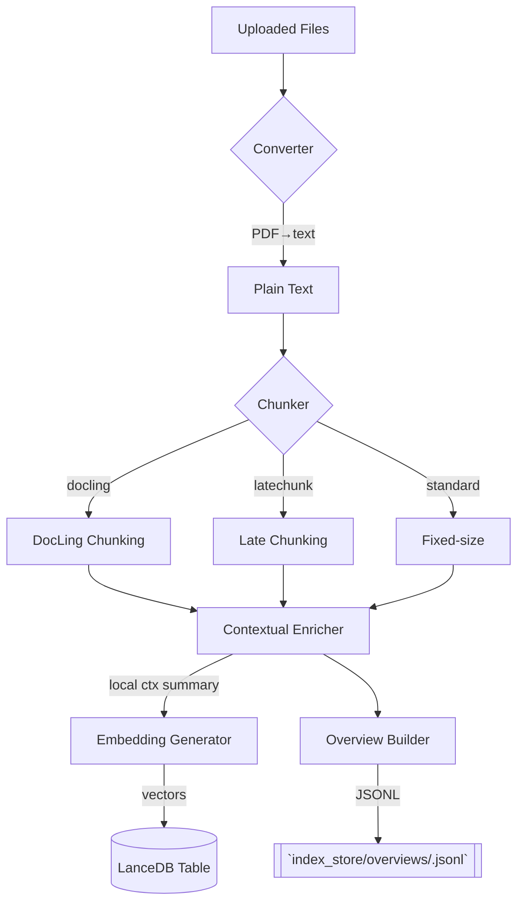

# 🗂️ Indexing Pipeline

_Implementation entry-point: `rag_system/pipelines/indexing_pipeline.py` + helpers in `indexing/` & `ingestion/`._

## Overview
Transforms raw documents (PDF, TXT, etc.) into search-ready **chunks** with embeddings, storing them in LanceDB and generating auxiliary assets (overviews, context summaries).

## High-Level Diagram


## Steps in Detail
| Step | Module | Key Classes | Notes |
|------|--------|------------|-------|
| Conversion | `ingestion/pdf_converter.py`, `simple_pdf_processor.py` | `PDFConverter` | Uses `PyMuPDF` to extract text pages. |
| Chunking | `ingestion/chunking.py`, `indexing/latechunk.py`, `ingestion/docling_chunker.py` | `Chunker` variants | Controlled by flags `latechunk`, `doclingChunk`, `chunkSize`, `chunkOverlap`. |
| Contextual Enrichment | `indexing/contextualizer.py` | `ContextualEnricher` | Generates per-chunk summaries (LLM call). |
| Embedding | `indexing/embedders.py`, `indexing/representations.py` | `QwenEmbedder`, `EmbeddingGenerator` | Batch size tunable (`batchSizeEmbed`). |
| LanceDB Ingest | `index_store/lancedb/…` | – | Each index has a dedicated table `text_pages_<index_id>`. |
| Overview | `indexing/overview_builder.py` | `OverviewBuilder` | First-N chunks summarised for triage routing. |

### Control Flow (Code)
1. **backend/server.py → handle_build_index()** collects files + opts and POSTs to `/index` endpoint on advanced RAG API (local process).
2. **indexing_pipeline.IndexingPipeline.run()** orchestrates conversion → chunking → enrichment → embedding → storage.
3. Metadata (chunk_size, models, etc.) stored in SQLite `indexes` table.

## Configuration Flags
| Flag | Description | Default |
|------|-------------|---------|
| `latechunk` | Merge k adjacent sibling chunks at query time | false |
| `doclingChunk` | Use DocLing structural chunking | false |
| `chunkSize` / `chunkOverlap` | Standard fixed slicing | 512 / 64 |
| `enableEnrich` | Run contextual summaries | true |
| `embeddingModel` | Override embedder | from `EXTERNAL_MODELS` |
| `overviewModel` | Model used in `OverviewBuilder` | `qwen3:0.6b` |
| `batchSizeEmbed / Enrich` | Batch sizes | 50 / 25 |

## Error Handling
* Duplicate LanceDB table ➟ now idempotent (commit `af99b38`).
* Failed PDF parse ➟ chunker skips file, logs warning.

## Extension Ideas
* Add OCR layer before PDF conversion.
* Store embeddings in Remote LanceDB instance (update URL in config).

## Detailed Implementation Analysis

### Pipeline Architecture Pattern
The `IndexingPipeline` uses a **sequential processing pattern** with parallel batch operations. Each stage processes all documents before moving to the next stage, enabling efficient memory usage and progress tracking.

```python
def run(self, file_paths: List[str]):
    with timer("Complete Indexing Pipeline"):
        # Stage 1: Document Processing & Chunking
        all_chunks = []
        doc_chunks_map = {}
        
        # Stage 2: Contextual Enrichment (optional)
        if self.contextual_enricher:
            all_chunks = self.contextual_enricher.enrich_batch(all_chunks)
        
        # Stage 3: Dense Indexing (embedding + storage)
        if self.vector_indexer:
            self.vector_indexer.index_chunks(all_chunks, table_name)
        
        # Stage 4: Graph Extraction (optional)
        if self.graph_extractor:
            self.graph_extractor.extract_and_store(all_chunks)
```

### Document Processing Deep-Dive

#### PDF Conversion Strategy
```python
# PDFConverter uses PyMuPDF for robust text extraction
def convert_to_markdown(self, file_path: str) -> List[Tuple[str, Dict, Any]]:
    doc = pymupdf.open(file_path)
    pages_data = []
    
    for page_num in range(len(doc)):
        page = doc.load_page(page_num)
        
        # Extract text blocks with positioning
        blocks = page.get_text("dict")
        markdown_text = self._blocks_to_markdown(blocks)
        
        metadata = {
            "page_number": page_num,
            "source_file": os.path.basename(file_path),
            "bbox": page.rect  # Page dimensions
        }
        
        pages_data.append((markdown_text, metadata, page))
    
    return pages_data
```

**Benefits**:
- Preserves document structure (headings, lists, tables)
- Maintains page-level metadata for source attribution
- Handles complex layouts better than simple text extraction

#### Chunking Strategy Selection
```python
# Dynamic chunker selection based on config
chunker_mode = config.get("chunker_mode", "legacy")

if chunker_mode == "docling":
    self.chunker = DoclingChunker(
        max_tokens=chunk_size,
        overlap=overlap_sentences,
        tokenizer_model="qwen3-embedding-0.6b"
    )
else:
    self.chunker = MarkdownRecursiveChunker(
        max_chunk_size=chunk_size,
        min_chunk_size=min(chunk_overlap, chunk_size // 4)
    )
```

#### Recursive Markdown Chunking Algorithm
```python
def chunk(self, text: str, document_id: str, metadata: Dict) -> List[Dict]:
    # Priority hierarchy for splitting
    separators = [
        "\n\n# ",      # H1 headers (highest priority)
        "\n\n## ",     # H2 headers
        "\n\n### ",    # H3 headers
        "\n\n",        # Paragraph breaks
        "\n",          # Line breaks
        ". ",          # Sentence boundaries
        " "            # Word boundaries (last resort)
    ]
    
    chunks = []
    current_chunk = ""
    
    for separator in separators:
        if len(current_chunk) <= self.max_chunk_size:
            continue
            
        # Split on current separator
        parts = current_chunk.split(separator)
        
        # Reassemble with overlap
        for i, part in enumerate(parts):
            if len(part) > self.max_chunk_size:
                # Recursively split large parts
                continue
            
            # Add overlap from previous chunk
            if i > 0 and len(chunks) > 0:
                overlap_text = chunks[-1]["text"][-self.chunk_overlap:]
                part = overlap_text + separator + part
            
            chunks.append({
                "text": part,
                "document_id": document_id,
                "metadata": {**metadata, "chunk_index": len(chunks)}
            })
```

### Contextual Enrichment Implementation

#### Batch Processing Pattern
```python
class ContextualEnricher:
    def enrich_batch(self, chunks: List[Dict]) -> List[Dict]:
        enriched_chunks = []
        
        # Process in batches to manage memory
        for i in range(0, len(chunks), self.batch_size):
            batch = chunks[i:i + self.batch_size]
            
            # Parallel enrichment within batch
            with concurrent.futures.ThreadPoolExecutor(max_workers=4) as executor:
                futures = [
                    executor.submit(self._enrich_single_chunk, chunk)
                    for chunk in batch
                ]
                
                for future in concurrent.futures.as_completed(futures):
                    enriched_chunks.append(future.result())
        
        return enriched_chunks
```

#### Contextual Prompt Engineering
```python
def _enrich_single_chunk(self, chunk: Dict) -> Dict:
    context_prompt = f"""
You are an expert document analyst. Your task is to enrich a text chunk with contextual information.

ORIGINAL CHUNK:
{chunk['text']}

DOCUMENT CONTEXT:
- Source: {chunk['metadata']['source_file']}
- Page: {chunk['metadata']['page_number']}
- Position: Chunk {chunk['metadata']['chunk_index']}

ENRICHMENT INSTRUCTIONS:
1. Identify key concepts, entities, and relationships
2. Add relevant context that would help with search and retrieval
3. Expand abbreviations and acronyms
4. Clarify implicit references
5. Maintain original meaning while adding searchable context

ENRICHED CHUNK:
"""
    
    response = self.llm_client.complete(
        model=self.llm_model,
        prompt=context_prompt,
        max_tokens=len(chunk['text']) + 200  # Allow for expansion
    )
    
    # Update chunk with enriched content
    enriched_chunk = chunk.copy()
    enriched_chunk['enriched_text'] = response.strip()
    enriched_chunk['metadata']['enriched'] = True
    
    return enriched_chunk
```

### Dense Vector Indexing Deep-Dive

#### Embedding Generation Pipeline
```python
class EmbeddingGenerator:
    def generate_embeddings(self, chunks: List[Dict]) -> List[np.ndarray]:
        texts = [chunk.get('enriched_text', chunk['text']) for chunk in chunks]
        
        # Batch processing for efficiency
        all_embeddings = []
        for i in range(0, len(texts), self.batch_size):
            batch_texts = texts[i:i + self.batch_size]
            
            # Generate embeddings using sentence-transformers
            batch_embeddings = self.model.encode(
                batch_texts,
                batch_size=self.batch_size,
                show_progress_bar=True,
                convert_to_numpy=True
            )
            
            all_embeddings.extend(batch_embeddings)
        
        return all_embeddings
```

#### LanceDB Storage Strategy
```python
class VectorIndexer:
    def index_chunks(self, chunks: List[Dict], table_name: str):
        # Generate embeddings
        embeddings = self.embedding_generator.generate_embeddings(chunks)
        
        # Prepare data for LanceDB
        data = []
        for chunk, embedding in zip(chunks, embeddings):
            data.append({
                "chunk_id": f"{chunk['document_id']}_{chunk['metadata']['chunk_index']}",
                "text": chunk['text'],
                "enriched_text": chunk.get('enriched_text', ''),
                "embedding": embedding.tolist(),
                "document_id": chunk['document_id'],
                "chunk_index": chunk['metadata']['chunk_index'],
                "metadata": json.dumps(chunk['metadata'])
            })
        
        # Create or append to LanceDB table
        try:
            table = self.db_manager.get_table(table_name)
            table.add(data)
        except Exception:
            # Table doesn't exist, create it
            table = self.db_manager.create_table(table_name, data)
        
        # Create vector index for fast similarity search
        table.create_index(
            "embedding",
            index_type="IVF_PQ",
            num_partitions=256,
            num_sub_vectors=96
        )
```

### Graph Extraction Implementation

#### Entity and Relationship Extraction
```python
class GraphExtractor:
    def extract_and_store(self, chunks: List[Dict]):
        G = nx.Graph()
        
        for chunk in chunks:
            # Extract entities and relationships using LLM
            extraction_prompt = f"""
Extract entities and relationships from this text:

{chunk['text']}

Format as JSON:
{{
  "entities": [
    {{"name": "Entity Name", "type": "PERSON|ORGANIZATION|CONCEPT", "description": "brief description"}}
  ],
  "relationships": [
    {{"source": "Entity1", "target": "Entity2", "relation": "relationship_type", "context": "supporting text"}}
  ]
}}
"""
            
            response = self.llm_client.complete(
                model=self.llm_model,
                prompt=extraction_prompt
            )
            
            # Parse and add to graph
            try:
                data = json.loads(response)
                
                # Add entities as nodes
                for entity in data.get("entities", []):
                    G.add_node(
                        entity["name"],
                        type=entity["type"],
                        description=entity["description"],
                        chunk_id=chunk["chunk_id"]
                    )
                
                # Add relationships as edges
                for rel in data.get("relationships", []):
                    G.add_edge(
                        rel["source"],
                        rel["target"],
                        relation=rel["relation"],
                        context=rel["context"],
                        chunk_id=chunk["chunk_id"]
                    )
            
            except json.JSONDecodeError:
                print(f"Failed to parse graph data for chunk {chunk['chunk_id']}")
        
        # Store graph
        nx.write_gml(G, self.storage_path)
```

### Overview Generation Strategy

#### Document Summarization Pipeline
```python
class OverviewBuilder:
    def build_and_store(self, document_id: str, chunks: List[Dict]):
        # Use first N chunks for overview (typically 5)
        overview_chunks = chunks[:self.first_n_chunks]
        combined_text = "\n\n".join([chunk['text'] for chunk in overview_chunks])
        
        overview_prompt = f"""
Create a comprehensive overview of this document based on the first few sections:

DOCUMENT: {document_id}

CONTENT:
{combined_text}

OVERVIEW REQUIREMENTS:
1. Summarize the main topics and themes
2. Identify key entities (people, organizations, concepts)
3. Note the document type and purpose
4. Highlight important facts and figures
5. Describe the document's structure and organization

OVERVIEW:
"""
        
        overview = self.llm_client.complete(
            model=self.model,
            prompt=overview_prompt,
            max_tokens=1000
        )
        
        # Store overview for triage system
        overview_data = {
            "document_id": document_id,
            "overview": overview,
            "num_chunks": len(chunks),
            "created_at": datetime.now().isoformat()
        }
        
        if self.out_path:
            with open(f"{self.out_path}/{document_id}_overview.json", "w") as f:
                json.dump(overview_data, f, indent=2)
```

### Performance Optimization Techniques

#### Memory Management
```python
# Estimate memory usage before processing
def estimate_memory_usage(chunks: List[Dict], embedding_dim: int) -> float:
    text_size = sum(len(chunk['text'].encode('utf-8')) for chunk in chunks)
    embedding_size = len(chunks) * embedding_dim * 4  # 4 bytes per float32
    overhead = len(chunks) * 1000  # Metadata overhead
    
    total_mb = (text_size + embedding_size + overhead) / (1024 * 1024)
    return total_mb

# Batch size adjustment based on available memory
def adjust_batch_size(base_batch_size: int, estimated_memory: float) -> int:
    available_memory = psutil.virtual_memory().available / (1024 * 1024)
    
    if estimated_memory > available_memory * 0.8:
        # Reduce batch size to prevent OOM
        return max(1, base_batch_size // 2)
    
    return base_batch_size
```

#### Parallel Processing Strategy
```python
# Parallel document processing
with concurrent.futures.ThreadPoolExecutor(max_workers=4) as executor:
    futures = {
        executor.submit(self._process_single_document, file_path): file_path
        for file_path in file_paths
    }
    
    for future in concurrent.futures.as_completed(futures):
        file_path = futures[future]
        try:
            chunks = future.result()
            all_chunks.extend(chunks)
        except Exception as e:
            print(f"Error processing {file_path}: {e}")
```

### Error Handling & Recovery

#### Graceful Degradation Strategy
```python
def run(self, file_paths: List[str]):
    try:
        # Main processing pipeline
        all_chunks = self._process_documents(file_paths)
        
        # Optional enrichment (non-blocking)
        if self.contextual_enricher:
            try:
                all_chunks = self.contextual_enricher.enrich_batch(all_chunks)
            except Exception as e:
                print(f"⚠️ Enrichment failed: {e}. Continuing with original chunks.")
        
        # Dense indexing (critical)
        if self.vector_indexer:
            self.vector_indexer.index_chunks(all_chunks, table_name)
        
        # Graph extraction (optional)
        if self.graph_extractor:
            try:
                self.graph_extractor.extract_and_store(all_chunks)
            except Exception as e:
                print(f"⚠️ Graph extraction failed: {e}. Continuing without graph.")
                
    except Exception as e:
        print(f"❌ Critical pipeline failure: {e}")
        raise
```

### Configuration Deep-Dive

#### Chunking Configuration Impact
```python
# Configuration affects chunk quality vs. quantity tradeoff
chunking_configs = {
    "small_chunks": {
        "chunk_size": 500,
        "chunk_overlap": 50,
        "benefits": "High precision, good for specific queries",
        "drawbacks": "May lose context, more chunks to process"
    },
    "medium_chunks": {
        "chunk_size": 1500,
        "chunk_overlap": 200,
        "benefits": "Balanced precision/context",
        "drawbacks": "Standard tradeoff"
    },
    "large_chunks": {
        "chunk_size": 3000,
        "chunk_overlap": 300,
        "benefits": "Rich context, fewer chunks",
        "drawbacks": "Lower precision, may exceed model limits"
    }
}
```

#### Model Selection Impact
| Component | Model | Speed | Quality | Memory |
|-----------|-------|-------|---------|--------|
| Embedding | BGE-small | Fast | Good | 133MB |
| Embedding | Qwen-0.6B | Medium | Better | 600MB |
| Enrichment | Qwen-0.6B | Fast | Good | 600MB |
| Enrichment | Qwen-8B | Slow | Excellent | 8GB |
| Graph Extraction | Qwen-8B | Slow | Good | 8GB |

### Storage Layout & Schema

#### LanceDB Table Structure
```sql
-- Text chunks table
CREATE TABLE text_pages_<index_id> (
    chunk_id TEXT PRIMARY KEY,           -- document_id + chunk_index
    text TEXT NOT NULL,                  -- Original chunk text
    enriched_text TEXT,                  -- Contextually enriched version
    embedding VECTOR(896),               -- Dense embedding (Qwen: 896D)
    document_id TEXT,                    -- Source document identifier
    chunk_index INTEGER,                 -- Sequential position in document
    metadata JSON,                       -- Page numbers, bbox, etc.
    created_at TIMESTAMP DEFAULT NOW()
);

-- Vector index for similarity search
CREATE INDEX idx_embedding ON text_pages_<index_id> 
USING ivf_pq(embedding) WITH (num_partitions=256, num_sub_vectors=96);
```

#### Graph Storage Format
```python
# NetworkX graph saved as GML
# Example structure:
{
    "nodes": [
        {
            "id": "Apple Inc.",
            "type": "ORGANIZATION",
            "description": "Technology company",
            "chunk_ids": ["doc1_5", "doc1_12"]
        }
    ],
    "edges": [
        {
            "source": "Apple Inc.",
            "target": "iPhone",
            "relation": "MANUFACTURES",
            "context": "Apple Inc. manufactures the iPhone",
            "chunk_id": "doc1_5"
        }
    ]
}
```

---
_Keep this document updated when adding new chunking strategies or changing embedding models._ 