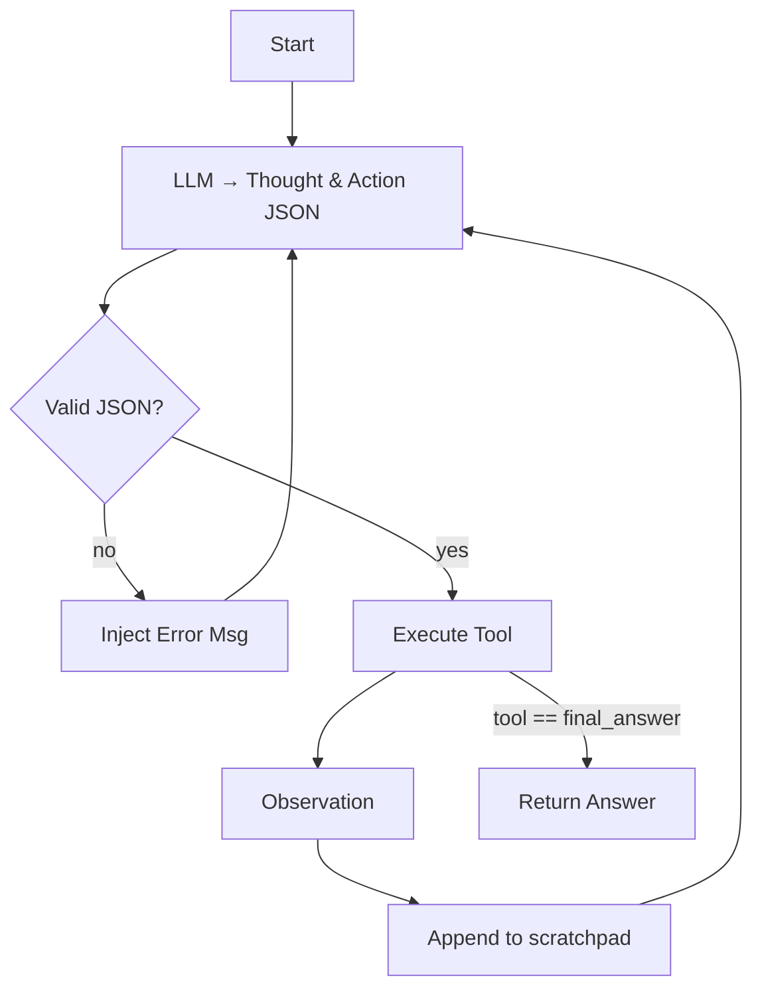

# 🤖 ReAct Agent

_Source: `rag_system/agent/react_agent.py`_

## Purpose
Implements a **ReAct-style tool-using agent** that can:
1. Decompose complex questions.
2. Search documents via the `RetrievalPipeline` tool.
3. Compose final answers.

## Tools
| Name | Class | Description |
|------|-------|-------------|
| `document_search` | `DocumentSearchTool` | Wrapper around `RetrievalPipeline.retriever.retrieve(...)` |
| `final_answer` | `AnswerTool` | Emits the agent's answer and terminates the loop. |

## Loop Logic


### PROMPT_TEMPLATE (simplified)
```
You are a helpful assistant with access to these tools:
{tool_descriptions}
...
THOUGHT: <reason>
ACTION: {{"tool_name": "...", "tool_input": "..."}}
```

Max iterations = 8 by default (configurable).

## Two-Phase Variant
If `two_phase=True` the agent first runs a standard RetrievalPipeline answer; if confidence < τ it falls back to full ReAct loop.

## Key Config
| Key | Default | Meaning |
|-----|---------|---------|
| `react.max_iterations` | 8 | Safety cap. |
| `react.two_phase` | true | Simple answer first, ReAct second. |

## Files & Classes
* `react_agent.py` – main implementation.
* `agent/tools.py` – tool definitions (future split).
* Uses `OllamaClient.generate_completion()` for all LLM calls.

## Detailed Implementation Analysis

### ReAct Architecture Pattern
The `ReActAgent` implements the **Reasoning and Acting (ReAct) paradigm** where the LLM alternates between reasoning ("Thought") and tool usage ("Action") until it can provide a final answer.

```python
# Core ReAct loop structure
def run(self, query: str, session_id: Optional[str] = None, table_name: Optional[str] = None):
    for iteration in range(self.max_iterations):
        # Generate thought + action
        llm_output = self._generate_response(query, history)
        
        # Parse action from LLM output
        action = self._parse_action(llm_output)
        
        # Execute tool
        observation = self._execute_tool(action, table_name)
        
        # Check for termination
        if action["tool_name"] == "final_answer":
            return observation
        
        # Add to conversation history
        history.append(f"Observation: {observation}")
```

### Tool System Architecture

#### Tool Base Class Design
```python
class Tool:
    def __init__(self, name: str, description: str):
        self.name = name
        self.description = description
    
    def use(self, query: str, **kwargs) -> str:
        raise NotImplementedError("Each tool must implement the 'use' method.")
    
    async def use_async(self, query: str, **kwargs) -> str:
        return await asyncio.to_thread(self.use, query, **kwargs)
```

**Benefits**:
- Consistent interface for all tools
- Async support for concurrent execution
- Extensible design for new tool types

#### Document Search Tool Implementation
```python
class DocumentSearchTool(Tool):
    def use(self, query: str, **kwargs) -> str:
        table_name = kwargs.get("table_name")
        
        # Primary search
        retrieved_docs = self.pipeline.retriever.retrieve(
            query, 
            table_name=table_name, 
            k=5  # Small k for concise context
        )
        
        # Fallback to default table if no results
        if not retrieved_docs:
            default_table = self.pipeline.storage_config.get("text_table_name", "default_text_table")
            if default_table != table_name:
                retrieved_docs = self.pipeline.retriever.retrieve(query, table_name=default_table, k=5)
        
        # Format for LLM consumption
        formatted_docs = [
            f"Source {i+1} (ID: {doc['chunk_id']}):\n{doc['text']}" 
            for i, doc in enumerate(retrieved_docs)
        ]
        
        return "\n---\n".join(formatted_docs) if formatted_docs else "No relevant documents found."
```

**Key Design Decisions**:
- **Small k=5**: Prevents context overflow in ReAct reasoning
- **Fallback strategy**: Tries default table if specified table has no results
- **Structured formatting**: Clear source attribution for LLM reasoning

### Prompt Engineering Deep-Dive

#### ReAct Prompt Template Structure
```python
PROMPT_TEMPLATE = """
You are a helpful AI assistant that answers user queries by using a set of tools. 
Your goal is to gather enough information to confidently answer the user's question.

You will work in a loop of Thought, Action, and Observation.

**Thought**: First, think about what you need to do. Analyze the user's query and the conversation history. Decide if you can answer immediately or if you need to use a tool. Your thought process should be a brief, clear plan.

**Action**: Based on your thought, choose a tool to use. You must output a JSON object with two keys: "tool_name" and "tool_input".

**Observation**: After you perform an action, you will receive an observation. This is the output from the tool.

Repeat this cycle until you have enough information to answer the query.

---

**TOOLS:**
{tool_descriptions}

---

**ACTION FORMAT:**
You must output your action as a single JSON object. For example:
```json
{{
  "tool_name": "document_search",
  "tool_input": "What were the main findings of the study?"
}}
```

---

EXAMPLE (follow this pattern):

Thought: I should look up the invoice amount first.
Action:
```json
{{
  "tool_name": "document_search",
  "tool_input": "invoice amount"
}}
```
Observation: Source 1: ... "$3,000" ...
Thought: I have the amount, now I can answer.
Action:
```json
{{
  "tool_name": "final_answer",
  "tool_input": "The invoice amount is $3,000."
}}
```
---

**CONVERSATION HISTORY:**
{history}

---

Now, begin!

User Query: "{query}"
"""
```

**Prompt Engineering Techniques**:
1. **Clear role definition**: "helpful AI assistant"
2. **Structured workflow**: Thought → Action → Observation
3. **Concrete examples**: Shows exact JSON format
4. **Tool descriptions**: Dynamic insertion of available tools
5. **Conversation history**: Maintains context across turns

### Action Parsing Implementation

#### Robust JSON Extraction
```python
def _parse_action(self, llm_output: str) -> Optional[Dict[str, str]]:
    """Parses the LLM's output to find the action JSON."""
    try:
        # Strategy 1: Find fenced JSON block
        match = re.search(r'```json\n(.*?)\n```', llm_output, re.DOTALL)
        if not match:
            # Strategy 2: Find first balanced curly-brace object
            match = re.search(r'\{[\s\S]*\}', llm_output)
        
        if match:
            json_str = match.group(0) if hasattr(match, 'group') else match.group(1)
            return json.loads(json_str)
        
        return None
    except json.JSONDecodeError:
        return None
```

**Parsing Strategies**:
1. **Fenced code blocks**: Looks for ```json...``` markers
2. **Balanced braces**: Regex for complete JSON objects
3. **Graceful failure**: Returns None instead of crashing

### Query Decomposition Integration

#### Multi-Query Processing
```python
def _handle_query_decomposition(self, query: str, table_name: str) -> str:
    """Handles complex queries by decomposing them into sub-questions."""
    
    # Decompose query into sub-questions
    sub_queries = self.query_decomposer.decompose(query)
    
    if len(sub_queries) <= 1:
        # Simple query, use standard ReAct
        return self._standard_react_loop(query, table_name)
    
    # Process sub-queries in parallel
    sub_answers = []
    with concurrent.futures.ThreadPoolExecutor(max_workers=3) as executor:
        futures = [
            executor.submit(self._answer_sub_question, sub_query, table_name)
            for sub_query in sub_queries
        ]
        
        for future in concurrent.futures.as_completed(futures):
            try:
                sub_answers.append(future.result())
            except Exception as e:
                sub_answers.append(f"Error processing sub-query: {e}")
    
    # Synthesize final answer
    synthesis_prompt = f"""
Original Question: {query}

Sub-questions and their answers:
{chr(10).join(f"Q: {q}{chr(10)}A: {a}" for q, a in zip(sub_queries, sub_answers))}

Based on the sub-answers above, provide a comprehensive answer to the original question.
"""
    
    return self.llm_client.complete(
        model=self.ollama_config["generation_model"],
        prompt=synthesis_prompt
    )
```

### Session Management & Memory

#### Conversation History Tracking
```python
class ReActAgent:
    def __init__(self, ...):
        # Simple in-memory conversation transcripts (per session)
        self.session_transcripts: Dict[str, List[str]] = {}
    
    def _update_session_history(self, session_id: str, query: str, response: str):
        """Updates conversation history for a session."""
        if session_id not in self.session_transcripts:
            self.session_transcripts[session_id] = []
        
        # Add user query and agent response
        self.session_transcripts[session_id].extend([
            f"User: {query}",
            f"Assistant: {response}"
        ])
        
        # Limit history to prevent context overflow
        max_history_items = 20
        if len(self.session_transcripts[session_id]) > max_history_items:
            self.session_transcripts[session_id] = self.session_transcripts[session_id][-max_history_items:]
    
    def _get_session_history(self, session_id: str) -> str:
        """Retrieves formatted conversation history for a session."""
        if session_id not in self.session_transcripts:
            return ""
        
        return "\n".join(self.session_transcripts[session_id])
```

### Two-Phase Execution Mode

#### Simplified vs. Full ReAct
```python
def run(self, query: str, session_id: Optional[str] = None, table_name: Optional[str] = None):
    if self.two_phase:
        # Simplified two-phase mode
        return self._two_phase_execution(query, table_name)
    else:
        # Full ReAct loop
        return self._full_react_loop(query, session_id, table_name)

def _two_phase_execution(self, query: str, table_name: str) -> str:
    """Simplified execution: search then answer."""
    
    # Phase 1: Document search
    search_tool = self.tools["document_search"]
    retrieved_docs = search_tool.use(query, table_name=table_name)
    
    # Phase 2: Generate answer
    answer_prompt = f"""
Based on the following retrieved documents, answer the user's question:

Question: {query}

Retrieved Documents:
{retrieved_docs}

Answer:
"""
    
    return self.llm_client.complete(
        model=self.ollama_config["generation_model"],
        prompt=answer_prompt
    )
```

**Benefits of Two-Phase Mode**:
- **Faster execution**: No iterative reasoning overhead
- **Predictable behavior**: Always search → answer
- **Lower token usage**: Single LLM call instead of multiple
- **Fewer failure modes**: No action parsing errors

### Error Handling & Fallbacks

#### Robust Execution Strategy
```python
def _execute_tool(self, action: Dict[str, str], table_name: str) -> str:
    """Executes a tool action with error handling."""
    try:
        tool_name = action.get("tool_name")
        tool_input = action.get("tool_input", "")
        
        if tool_name not in self.tools:
            return f"Error: Unknown tool '{tool_name}'. Available tools: {list(self.tools.keys())}"
        
        tool = self.tools[tool_name]
        
        # Execute tool with appropriate parameters
        if tool_name == "document_search":
            return tool.use(tool_input, table_name=table_name)
        elif tool_name == "final_answer":
            return tool.use(tool_input)
        else:
            return tool.use(tool_input)
    
    except Exception as e:
        return f"Error executing tool '{tool_name}': {str(e)}"
```

#### Iteration Limit Protection
```python
def _full_react_loop(self, query: str, session_id: str, table_name: str) -> str:
    history = []
    
    for iteration in range(self.max_iterations):
        # Generate LLM response
        llm_output = self._generate_response(query, history, session_id)
        
        # Parse action
        action = self._parse_action(llm_output)
        if not action:
            # Fallback: treat as final answer
            return self._extract_final_thought(llm_output)
        
        # Execute tool
        observation = self._execute_tool(action, table_name)
        
        # Check for termination
        if action["tool_name"] == "final_answer":
            return observation
        
        # Add to history
        history.append(f"Observation: {observation}")
    
    # Max iterations reached - emergency fallback
    return self._emergency_fallback(query, table_name)

def _emergency_fallback(self, query: str, table_name: str) -> str:
    """Emergency fallback when max iterations reached."""
    return f"I apologize, but I couldn't complete the reasoning process within {self.max_iterations} steps. Let me try a direct search approach."
```

### Performance Optimization Techniques

#### Async Execution Support
```python
async def run_async(self, query: str, session_id: Optional[str] = None, table_name: Optional[str] = None):
    """Async version of run() for concurrent execution."""
    if self.two_phase:
        return await self._two_phase_execution_async(query, table_name)
    else:
        return await self._full_react_loop_async(query, session_id, table_name)

async def _execute_tool_async(self, action: Dict[str, str], table_name: str) -> str:
    """Async tool execution."""
    tool_name = action.get("tool_name")
    tool_input = action.get("tool_input", "")
    
    if tool_name not in self.tools:
        return f"Error: Unknown tool '{tool_name}'"
    
    tool = self.tools[tool_name]
    
    # Use async method if available
    if hasattr(tool, 'use_async'):
        return await tool.use_async(tool_input, table_name=table_name)
    else:
        # Fallback to sync execution in thread
        return await asyncio.to_thread(tool.use, tool_input, table_name=table_name)
```

### Integration with Retrieval Pipeline

#### Pipeline Configuration Inheritance
```python
def __init__(self, pipeline_configs: Dict[str, Any], llm_client: OllamaClient, ollama_config: Dict[str, str]):
    # Inherit configuration from main pipeline
    self.retrieval_pipeline = RetrievalPipeline(pipeline_configs, llm_client, ollama_config)
    
    # ReAct-specific configuration
    react_config = pipeline_configs.get("react", {})
    self.max_iterations = react_config.get("max_iterations", 8)
    self.two_phase = react_config.get("two_phase", True)
    
    # Query decomposition configuration
    self.query_decomp_config = pipeline_configs.get("query_decomposition", {})
    if self.query_decomp_config.get("enabled", False):
        self.query_decomposer = QueryDecomposer(llm_client, ollama_config["generation_model"])
```

### Configuration Deep-Dive

#### ReAct Configuration Options
```python
react_config = {
    "max_iterations": 8,          # Maximum ReAct loops before fallback
    "two_phase": True,            # Enable simplified search→answer mode
    "tools": {
        "document_search": {
            "enabled": True,
            "k": 5,                # Number of documents to retrieve
            "fallback_table": "default_text_table"
        },
        "graph_search": {
            "enabled": False       # Disabled by default
        }
    }
}

query_decomposition_config = {
    "enabled": False,             # Disabled by default
    "max_sub_queries": 3,         # Limit decomposition complexity
    "parallel_execution": True    # Process sub-queries concurrently
}
```

#### Model Selection Impact
| Model | ReAct Quality | Speed | Memory | Best Use Case |
|-------|---------------|-------|--------|---------------|
| qwen3:0.6b | Fair | Fast | 600MB | Simple queries, development |
| qwen3:8b | Good | Medium | 8GB | Complex reasoning, production |
| llama3:8b | Good | Slow | 8GB | High-quality reasoning |
| gpt-4 | Excellent | Medium | N/A | Complex multi-step queries |

### Debugging & Observability

#### Execution Tracing
```python
def run(self, query: str, session_id: Optional[str] = None, table_name: Optional[str] = None):
    # Log initial query
    log_query(query, session_id, "react_agent_start")
    
    execution_trace = {
        "query": query,
        "session_id": session_id,
        "table_name": table_name,
        "iterations": [],
        "mode": "two_phase" if self.two_phase else "full_react"
    }
    
    try:
        result = self._execute_with_tracing(query, session_id, table_name, execution_trace)
        log_query(f"Success: {result[:100]}...", session_id, "react_agent_success")
        return result
    except Exception as e:
        log_query(f"Error: {str(e)}", session_id, "react_agent_error")
        execution_trace["error"] = str(e)
        raise
    finally:
        # Store execution trace for debugging
        self._store_execution_trace(execution_trace)
```

---
_Update whenever tool set or prompt template changes._ 