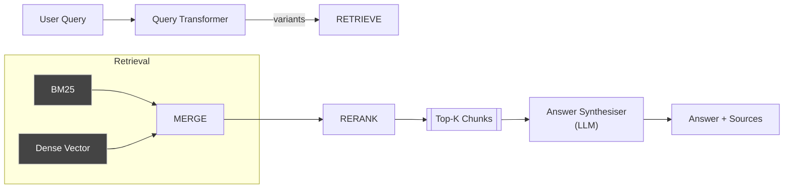

# 📥 Retrieval Pipeline

_Maps to `rag_system/pipelines/retrieval_pipeline.py` and helpers in `retrieval/`, `rerankers/`._

## Role
Given a **user query** and one or more indexed tables, retrieve the most relevant text chunks and synthesise an answer.

## Sub-components
| Stage | Module | Key Classes / Fns | Notes |
|-------|--------|-------------------|-------|
| Query Pre-processing | `retrieval/query_transformer.py` | `QueryTransformer`, `HyDEGenerator`, `GraphQueryTranslator` | Expands, rewrites, or translates the raw query. |
| Retrieval | `retrieval/retrievers.py` | `BM25Retriever`, `DenseRetriever`, `HybridRetriever` | Abstract over LanceDB vector + FTS search. |
| Reranking | `rerankers/reranker.py` | `ColBERTSmall`, fallback `bge-reranker` | Optionally improves result ordering. |
| Synthesis | `pipelines/retrieval_pipeline.py` | `_synthesize_final_answer()` | Calls LLM with evidence snippets. |

## End-to-End Flow



### Narrative
1. **Query Transformer** may expand the query (keyword list, HyDE doc, KG translation) depending on `searchType`.
2. **Retrievers** execute BM25 and/or dense similarity against LanceDB.  Combination controlled by `retrievalMode` and `denseWeight`.
3. **Reranker** (if `aiRerank=true` or hybrid search) scores snippets; top `rerankerTopK` chosen.
4. **Synthesiser** streams an LLM completion using the prompt described in `prompt_inventory.md` (`retrieval_pipeline.synth_final`).

## Configuration Flags (passed from UI → backend)
| Flag | Default | Effect |
|------|---------|--------|
| `searchType` | `fts` | UI label (FTS / Dense / Hybrid). |
| `retrievalK` | 10 | Initial candidate count per retriever. |
| `contextWindowSize` | 5 | How many adjacent chunks to merge (late-chunk). |
| `rerankerTopK` | 20 | How many docs to pass into AI reranker. |
| `denseWeight` | 0.5 | When `hybrid`, linear mix weight. |
| `aiRerank` | bool | Toggle reranker. |
| `verify` | bool | If true, pass answer to **Verifier** component. |

## Interfaces
* Reads from **LanceDB** tables `text_pages_<index>`.
* Calls **Ollama** generation model specified in `PIPELINE_CONFIGS`.
* Exposes `RetrievalPipeline.answer_stream()` iterator consumed by SSE API.

## Extension Points
* Plug new retriever by inheriting `BaseRetriever` and registering in `retrievers.py`.
* Swap reranker model via `EXTERNAL_MODELS['reranker_model']`.
* Custom answer prompt can be overridden by passing `prompt_override` to `_synthesize_final_answer()` (not yet surfaced in UI).

##  Detailed Implementation Analysis

### Core Architecture Pattern
The `RetrievalPipeline` uses **lazy initialization** for all components to avoid heavy memory usage during startup. Each component (embedder, retrievers, rerankers) is only loaded when first accessed via private `_get_*()` methods.

```python
def _get_text_embedder(self):
    if self.text_embedder is None:
        self.text_embedder = select_embedder(
            self.config.get("embedding_model_name", "BAAI/bge-small-en-v1.5"),
            self.ollama_config.get("host")
        )
    return self.text_embedder
```

### Thread Safety Implementation
**Critical Issue**: ColBERT reranker and model loading are not thread-safe. The system uses multiple locks:

```python
# Global locks to prevent race conditions
_rerank_lock: Lock = Lock()           # Protects .rank() calls
_ai_reranker_init_lock: Lock = Lock() # Prevents concurrent model loading
_sentence_pruner_lock: Lock = Lock()  # Serializes Provence model init
```

When multiple queries run in parallel, only one thread can initialize heavy models or perform reranking operations.

### Retrieval Strategy Deep-Dive

#### 1. Multi-Vector Dense Retrieval (`_get_dense_retriever()`)
```python
self.dense_retriever = MultiVectorRetriever(
    db_manager,           # LanceDB connection
    text_embedder,        # Qwen/BGE embedder
    vision_model=None,    # Optional multimodal
    fusion_config={}      # Score combination rules
)
```

**Process**:
1. Query → embedding vector (768D for BGE, 896D for Qwen)
2. LanceDB ANN search using IVF-PQ index
3. Cosine similarity scoring
4. Returns top-K with metadata

#### 2. BM25 Full-Text Search (`_get_bm25_retriever()`)
```python
# Uses SQLite FTS5 under the hood
SELECT chunk_id, text, bm25(fts_table) as score 
FROM fts_table 
WHERE fts_table MATCH ? 
ORDER BY bm25(fts_table) 
LIMIT ?
```

**Token Processing**:
- Stemming via Porter algorithm
- Stop-word removal
- N-gram tokenization (configurable)

#### 3. Hybrid Score Fusion
When both retrievers are enabled:
```python
final_score = (1 - dense_weight) * bm25_score + dense_weight * dense_score
```
Default `dense_weight = 0.5` balances semantic and lexical matching.

### Late-Chunk Merging Algorithm

**Problem**: Small chunks lose context; large chunks dilute relevance.  
**Solution**: Retrieve small chunks, then expand with neighbors.

```python
def _get_surrounding_chunks_lancedb(self, chunk, window_size):
    start_index = max(0, chunk_index - window_size)
    end_index = chunk_index + window_size
    
    sql_filter = f"document_id = '{document_id}' AND chunk_index >= {start_index} AND chunk_index <= {end_index}"
    results = tbl.search().where(sql_filter).to_list()
    
    # Sort by chunk_index to maintain document order
    return sorted(results, key=lambda x: x.get("chunk_index", 0))
```

**Benefits**:
- Maintains granular search precision
- Provides richer context for answer generation
- Configurable window size (default: 5 chunks = ~2500 tokens)

### AI Reranker Implementation

#### ColBERT Strategy (via rerankers-lib)
```python
from rerankers import Reranker
self.ai_reranker = Reranker("answerdotai/answerai-colbert-small-v1", model_type="colbert")

# Usage
scores = reranker.rank(query, [doc.text for doc in candidates])
```

**ColBERT Architecture**:
- **Query encoding**: Each token → 128D vector
- **Document encoding**: Each token → 128D vector  
- **Interaction**: MaxSim between all query-doc token pairs
- **Advantage**: Fine-grained token-level matching

#### Fallback: BGE Cross-Encoder
```python
# When ColBERT fails/unavailable
from sentence_transformers import CrossEncoder
model = CrossEncoder('BAAI/bge-reranker-base')
scores = model.predict([(query, doc.text) for doc in candidates])
```

### Answer Synthesis Pipeline

#### Prompt Engineering Pattern
```python
def _synthesize_final_answer(self, query: str, facts: str, *, event_callback=None):
    prompt = f"""
You are an AI assistant specialised in answering questions from retrieved context.

Context you receive
• VERIFIED FACTS – text snippets retrieved from the user's documents.
• ORIGINAL QUESTION – the user's actual query.

Instructions
1. Evaluate each snippet for relevance to the ORIGINAL QUESTION
2. Synthesise an answer **using only information from relevant snippets**
3. If snippets contradict, mention the contradiction explicitly
4. If insufficient information: "I could not find that information in the provided documents."
5. Provide thorough, well-structured answer with relevant numbers/names
6. Do **not** introduce external knowledge

–––––  Retrieved Snippets  –––––
{facts}
––––––––––––––––––––––––––––––

ORIGINAL QUESTION: "{query}"
"""
```

#### Streaming Implementation
```python
answer_parts: list[str] = []
for tok in self.ollama_client.stream_completion(
    model=self.ollama_config["generation_model"],
    prompt=prompt,
):
    answer_parts.append(tok)
    if event_callback:
        event_callback("token", {"text": tok})  # SSE to frontend

return "".join(answer_parts)
```

**Benefits**:
- Real-time user feedback
- Reduced perceived latency
- Graceful handling of long responses

### Performance Optimizations

#### 1. Vector Index Strategy
```sql
-- LanceDB automatically creates IVF-PQ index
CREATE INDEX IF NOT EXISTS idx_embedding ON text_pages 
USING ivf_pq(embedding) WITH (num_partitions=256, num_sub_vectors=96)
```

#### 2. Batch Processing
```python
# Embedding generation uses batch processing
batch_processor = BatchProcessor(batch_size=self.batch_size)
all_embeddings = batch_processor.process_in_batches(
    texts_to_embed,
    process_text_batch,
    "Embedding Generation"
)
```

#### 3. Memory Management
- **Lazy loading**: Components loaded on first use
- **Singleton pattern**: One reranker instance per process
- **Cleanup**: Explicit model unloading after batch operations

### Error Handling & Fallbacks

| Component | Primary Method | Fallback Strategy |
|-----------|----------------|-------------------|
| Dense Retrieval | LanceDB ANN | Skip dense, use BM25 only |
| BM25 Search | SQLite FTS5 | Return empty results |
| AI Reranker | ColBERT | Use original retrieval order |
| Answer Synthesis | Ollama streaming | Return "Unable to generate answer" |
| Embedding | HuggingFace model | Retry with reduced batch size |

### Configuration Deep-Dive

#### Critical Parameters
```python
config = {
    "retrieval": {
        "k": 10,                    # Initial candidates per retriever
        "dense_weight": 0.5,        # Hybrid fusion weight
        "context_window": 5,        # Late-chunk merge window
        "reranker_top_k": 20       # Post-rerank limit
    },
    "reranker": {
        "enabled": True,
        "model_name": "answerdotai/answerai-colbert-small-v1",
        "strategy": "rerankers-lib"  # vs "qwen"
    }
}
```

#### Model Selection Impact
| Model | Embedding Dim | Speed | Quality | Memory |
|-------|---------------|-------|---------|--------|
| BGE-small | 384 | Fast | Good | 133MB |
| BGE-base | 768 | Medium | Better | 438MB |
| Qwen-0.6B | 896 | Slow | Best | 1.2GB |

### Integration Points

#### Frontend → Backend Flow
```typescript
// Frontend (api.ts)
const response = await fetch('/sessions/123/messages', {
  method: 'POST',
  body: JSON.stringify({
    message: "What is the revenue?",
    retrievalK: 15,
    aiRerank: true,
    contextWindowSize: 3
  })
});

// Backend routes to:
// agent/loop.py → RetrievalPipeline.answer_stream()
```

#### Database Schema Integration
```sql
-- LanceDB table structure
CREATE TABLE text_pages_<index_id> (
    chunk_id TEXT PRIMARY KEY,
    text TEXT NOT NULL,
    embedding VECTOR(896),        -- Qwen embedding
    document_id TEXT,
    chunk_index INTEGER,
    metadata JSON
);
```

---
_Keep in sync with retrieval-related PRs, especially if adding vector-DB filters or new reranker logic._ 