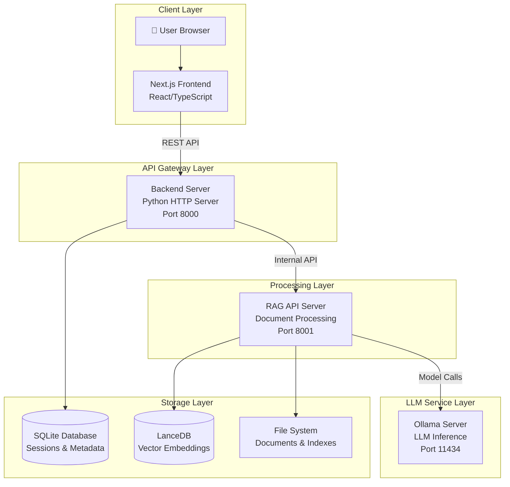

# 🏗️ RAG System - Complete System Overview

_Last updated: 2025-01-02_

This document provides a comprehensive overview of the Advanced Retrieval-Augmented Generation (RAG) System, covering its architecture, components, data flow, and operational characteristics.

---

## 1. System Architecture

### 1.1 High-Level Architecture

The RAG system implements a sophisticated 4-tier microservices architecture:



### 1.2 Component Breakdown

| Component | Technology | Port | Purpose |
|-----------|------------|------|---------|
| **Frontend** | Next.js 15, React 19, TypeScript | 3000 | User interface, chat interactions |
| **Backend** | Python 3.11, HTTP Server | 8000 | API gateway, session management, routing |
| **RAG API** | Python 3.11, Advanced NLP | 8001 | Document processing, retrieval, generation |
| **Ollama** | Go-based LLM server | 11434 | Local LLM inference (embedding, generation) |
| **SQLite** | Embedded database | - | Sessions, messages, index metadata |
| **LanceDB** | Vector database | - | Document embeddings, similarity search |

---

## 2. Core Functionality

### 2.1 Intelligent Dual-Layer Routing

The system's key innovation is its **dual-layer routing architecture** that optimizes both speed and intelligence:

#### **Layer 1: Speed Optimization Routing**
- **Location**: `backend/server.py`
- **Purpose**: Route simple queries to Direct LLM (~1.3s) vs complex queries to RAG Pipeline (~20s)
- **Decision Logic**: Pattern matching, keyword detection, query complexity analysis

```python
# Example routing decisions
"Hello!" → Direct LLM (greeting pattern)
"What does the document say about pricing?" → RAG Pipeline (document keyword)
"What's 2+2?" → Direct LLM (simple + short)
"Summarize the key findings from the report" → RAG Pipeline (complex + indicators)
```

#### **Layer 2: Intelligence Optimization Routing**
- **Location**: `rag_system/agent/loop.py`
- **Purpose**: Within RAG pipeline, route to optimal processing method
- **Methods**: 
  - `direct_answer`: General knowledge queries
  - `rag_query`: Document-specific queries requiring retrieval
  - `graph_query`: Entity relationship queries (future feature)

### 2.2 Document Processing Pipeline

#### **Indexing Process**
1. **Document Upload**: PDF files uploaded via web interface
2. **Text Extraction**: PyMuPDF extracts text with layout preservation
3. **Chunking**: Intelligent chunking with configurable strategies
4. **Embedding**: Text converted to vector embeddings using configurable models
5. **Storage**: Vectors stored in LanceDB with metadata in SQLite

#### **Retrieval Process**
1. **Query Processing**: User query analyzed and contextualized
2. **Embedding**: Query converted to vector embedding
3. **Search**: Hybrid search combining vector similarity and BM25 keyword matching
4. **Reranking**: AI-powered reranking for relevance optimization
5. **Synthesis**: LLM generates final answer using retrieved context

### 2.3 Advanced Features

#### **Query Decomposition**
- Complex queries automatically broken into sub-queries
- Parallel processing of sub-queries for efficiency
- Intelligent composition of final answers

#### **Contextual Enrichment**
- Conversation history integration
- Context-aware query expansion
- Session-based memory management

#### **Verification System**
- Answer verification against source documents
- Confidence scoring and grounding checks
- Source attribution and citation

---

## 3. Data Architecture

### 3.1 Storage Systems

#### **SQLite Database** (`backend/chat_data.db`)
```sql
-- Core tables
sessions          -- Chat sessions with metadata
messages          -- Individual messages and responses
indexes           -- Document index metadata
session_indexes   -- Links sessions to their indexes
```

#### **LanceDB Vector Store** (`./lancedb/`)
```
tables/
├── text_pages_[uuid]     -- Document text embeddings
├── image_pages_[uuid]    -- Image embeddings (future)
└── metadata_[uuid]       -- Document metadata
```

#### **File System** (`./index_store/`)
```
index_store/
├── overviews/           -- Document summaries for routing
├── bm25/               -- BM25 keyword indexes
└── graph/              -- Knowledge graph data
```

### 3.2 Data Flow

1. **Document Upload** → File System (`shared_uploads/`)
2. **Processing** → Embeddings stored in LanceDB
3. **Metadata** → Index info stored in SQLite
4. **Query** → Search LanceDB + SQLite coordination
5. **Response** → Message history stored in SQLite

---

## 4. Model Architecture

### 4.1 Configurable Model Pipeline

The system supports multiple embedding and generation models with automatic switching:

#### **Default Model Configuration**
```python
EXTERNAL_MODELS = {
    "embedding_model": "sentence-transformers/all-mpnet-base-v2",  # 768D
    "reranker_model": "BAAI/bge-reranker-base",
}

OLLAMA_CONFIG = {
    "generation_model": "qwen2.5:7b",
    "enrichment_model": "qwen2.5:0.5b",
    "host": "http://localhost:11434"
}
```

#### **Model Switching**
- **Per-Session**: Each chat session can use different embedding models
- **Automatic**: System automatically switches models based on index metadata
- **Dynamic**: Models loaded just-in-time to optimize memory usage

### 4.2 Supported Models

#### **Embedding Models**
- `sentence-transformers/all-mpnet-base-v2` (768D) - Default
- `BAAI/bge-small-en-v1.5` (384D) - Lightweight
- `Qwen/Qwen2-7B-instruct` (1024D) - Advanced

#### **Generation Models** (via Ollama)
- `qwen2.5:7b` - Primary generation model
- `qwen2.5:0.5b` - Fast enrichment model
- `llama3.1:8b` - Alternative generation model

#### **Reranking Models**
- `BAAI/bge-reranker-base` - Cross-encoder reranking
- `sentence-transformers/cross-encoder-ms-marco-MiniLM-L-6-v2` - Lightweight

---

## 5. API Architecture

### 5.1 Frontend API (`localhost:3000`)
- **Framework**: Next.js 15 with App Router
- **UI Components**: Radix UI + Tailwind CSS
- **State Management**: React hooks and context
- **Real-time**: Server-Sent Events for streaming responses

### 5.2 Backend API (`localhost:8000`)

#### **Core Endpoints**
```bash
# Session Management
GET    /sessions              # List all sessions
POST   /sessions              # Create new session
GET    /sessions/{id}         # Get session details
DELETE /sessions/{id}         # Delete session

# Chat Operations
POST   /sessions/{id}/chat    # Send message (streaming)
GET    /sessions/{id}/messages # Get message history

# Document Management
POST   /upload                # Upload documents
GET    /indexes               # List indexes
POST   /indexes               # Create index
DELETE /indexes/{id}          # Delete index

# System Operations
GET    /health                # Health check
GET    /models                # List available models
```

### 5.3 RAG API (`localhost:8001`)

#### **Processing Endpoints**
```bash
# Core RAG Operations
POST   /chat                  # Process query with full RAG pipeline
POST   /chat/stream           # Streaming RAG processing

# Index Operations
POST   /index                 # Create document index
GET    /indexes               # List indexes
DELETE /indexes/{id}          # Delete index

# Model Management
GET    /models                # List loaded models
POST   /models/switch         # Switch embedding model
```

---

## 6. Performance Characteristics

### 6.1 Response Times

| Operation | Typical Time | Factors |
|-----------|-------------|---------|
| **Direct LLM** | 1-3 seconds | Model size, query complexity |
| **RAG Query** | 15-30 seconds | Document corpus size, retrieval depth |
| **Document Upload** | 2-5 seconds/MB | File size, processing complexity |
| **Index Creation** | 1-2 minutes/100 pages | Document count, embedding model |

### 6.2 Resource Usage

#### **Memory Requirements**
- **Base System**: ~2GB RAM
- **Embedding Models**: 1-4GB RAM per model
- **Generation Models**: 4-16GB RAM depending on model size
- **Vector Storage**: ~10MB per 1000 document pages

#### **Storage Requirements**
- **Documents**: Original file size
- **Embeddings**: ~3KB per chunk (768D embeddings)
- **Metadata**: ~1KB per document
- **Indexes**: ~5-10% of document size

### 6.3 Scalability

#### **Concurrent Users**
- **Direct LLM**: 10-20 concurrent users
- **RAG Pipeline**: 3-5 concurrent users
- **Document Processing**: 1-2 concurrent operations

#### **Document Limits**
- **Single Index**: Up to 10,000 documents
- **Total Storage**: Limited by disk space
- **Query Performance**: Maintains sub-second search up to 100,000 chunks

---

## 7. Security & Privacy

### 7.1 Data Security
- **Local Processing**: All data processed locally, no external API calls
- **File Isolation**: Documents stored in isolated directories
- **Session Security**: Session-based access control
- **Database Security**: SQLite with file-level permissions

### 7.2 Privacy Features
- **No External Dependencies**: All AI processing happens locally
- **Data Retention**: Configurable message and document retention
- **User Isolation**: Each session maintains separate context
- **Audit Trail**: Complete logging of all operations

---

## 8. Configuration & Customization

### 8.1 Model Configuration
Models can be configured in `rag_system/main.py`:

```python
# Embedding model configuration
EXTERNAL_MODELS = {
    "embedding_model": "your-preferred-model",
    "reranker_model": "your-reranker-model",
}

# Generation model configuration
OLLAMA_CONFIG = {
    "generation_model": "your-llm-model",
    "enrichment_model": "your-fast-model",
}
```

### 8.2 Pipeline Configuration
Processing behavior configured in `PIPELINE_CONFIGS`:

```python
PIPELINE_CONFIGS = {
    "query_decomposition": {"enabled": True},
    "contextual_enricher": {"enabled": True},
    "verification": {"enabled": True},
    "retrieval": {
        "search_type": "hybrid",
        "fusion": {"dense_weight": 0.7, "sparse_weight": 0.3}
    }
}
```

### 8.3 UI Configuration
Frontend behavior configured in environment variables:

```bash
NEXT_PUBLIC_API_URL=http://localhost:8000
NEXT_PUBLIC_ENABLE_STREAMING=true
NEXT_PUBLIC_MAX_FILE_SIZE=50MB
```

---

## 9. Monitoring & Observability

### 9.1 Logging System
- **Structured Logging**: JSON-formatted logs with timestamps
- **Log Levels**: DEBUG, INFO, WARNING, ERROR
- **Log Rotation**: Automatic log file rotation
- **Component Isolation**: Separate logs per service

### 9.2 Health Monitoring
- **Health Endpoints**: `/health` on all services
- **Service Dependencies**: Cascading health checks
- **Performance Metrics**: Response times, error rates
- **Resource Monitoring**: Memory, CPU, disk usage

### 9.3 Debugging Features
- **Debug Mode**: Detailed operation tracing
- **Query Inspection**: Step-by-step query processing
- **Model Switching Logs**: Embedding model change tracking
- **Error Reporting**: Comprehensive error context

---

## 10. Development & Extension

### 10.1 Architecture Principles
- **Modular Design**: Clear separation of concerns
- **Configuration-Driven**: Behavior controlled via config files
- **Plugin Architecture**: Easy addition of new components
- **API-First**: All functionality exposed via APIs

### 10.2 Extension Points
- **Custom Embedders**: Add new embedding models
- **Custom Retrievers**: Implement specialized search methods
- **Custom Rerankers**: Add domain-specific reranking
- **Custom Generators**: Integrate new LLM backends

### 10.3 Testing Strategy
- **Unit Tests**: Component-level testing
- **Integration Tests**: End-to-end workflow testing
- **Performance Tests**: Load and stress testing
- **Model Tests**: Embedding and generation quality tests

---

## 11. Troubleshooting

### 11.1 Common Issues

#### **"No document overviews available"**
- **Cause**: Missing or corrupted overview files
- **Solution**: Regenerate overviews or check file permissions

#### **"Vector dimension mismatch"**
- **Cause**: Embedding model changed without reindexing
- **Solution**: Ensure consistent embedding models or reindex documents

#### **"Table not found"**
- **Cause**: Database-LanceDB synchronization issues
- **Solution**: Verify table names and database consistency

### 11.2 Debug Commands

```bash
# Check system health
python -c "from rag_system.main import get_agent; agent = get_agent('default'); print('✅ System operational')"

# Verify model loading
python -c "from rag_system.main import get_agent; agent = get_agent('default'); embedder = agent.retrieval_pipeline._get_text_embedder(); print(f'Model: {embedder.model}')"

# Check database tables
python -c "import lancedb; db = lancedb.connect('./lancedb'); print(f'Tables: {db.table_names()}')"
```

---

## 12. Future Roadmap

### 12.1 Planned Features
- **Multimodal Support**: Image and video document processing
- **Graph RAG**: Knowledge graph-based retrieval
- **Collaborative Features**: Multi-user sessions
- **API Integrations**: External data source connections

### 12.2 Performance Improvements
- **Caching Layer**: Redis-based caching for frequent queries
- **Distributed Processing**: Multi-node document processing
- **GPU Acceleration**: CUDA support for embedding generation
- **Streaming Optimizations**: Reduced latency for real-time responses

---

This comprehensive overview provides the foundation for understanding, deploying, and extending the RAG system. For specific implementation details, refer to the component-specific documentation in this directory. 