# Frontend Configuration Implementation - Complete Solution

## Overview

This implementation fixes the critical disconnect between frontend configuration parameters and backend processing. Previously, the frontend showed configuration options that were completely ignored by the backend, using hardcoded values instead.

## What Was Fixed

### 🔴 **Before: Fake Configuration UI**
```typescript
// Frontend showed these parameters but they were IGNORED:
const [chunkSize, setChunkSize] = useState(512);           // ❌ Ignored
const [chunkOverlap, setChunkOverlap] = useState(64);      // ❌ Ignored  
const [windowSize, setWindowSize] = useState(2);          // ❌ Ignored
const [batchSizeEmbed, setBatchSizeEmbed] = useState(50);  // ❌ Ignored
const [batchSizeEnrich, setBatchSizeEnrich] = useState(25);// ❌ Ignored
const [retrievalMode, setRetrievalMode] = useState('hybrid'); // ❌ Ignored

// Backend only received 2 parameters:
{ latechunk: boolean, doclingChunk: boolean }
```

### ✅ **After: Real Configuration Control**
```typescript
// Frontend parameters are now fully functional:
await chatAPI.buildIndex(index_id, { 
  latechunk: enableLateChunk, 
  doclingChunk: enableDoclingChunk,
  chunkSize: chunkSize,                    // ✅ Working
  chunkOverlap: chunkOverlap,              // ✅ Working
  contextWindow: windowSize,               // ✅ Working
  embeddingBatchSize: batchSizeEmbed,      // ✅ Working
  enrichmentBatchSize: batchSizeEnrich,    // ✅ Working
  retrievalMode: retrievalMode,            // ✅ Working
  embeddingModel: embeddingModel,          // ✅ Working
  enableContextualEnrich: enableEnrich     // ✅ Working
});
```

## Implementation Details

### 1. **API Interface Updated** (`src/lib/api.ts`)
- Extended `buildIndex()` method to accept all configuration parameters
- Parameters are now properly typed and passed to backend

### 2. **Enhanced Server Updated** (`backend/enhanced_server.py`)
- Parses all frontend configuration parameters
- Builds structured `config_overrides` object
- Forwards complete configuration to RAG API

### 3. **RAG API Server Updated** (`rag_system/api_server.py`)
- Added `_apply_config_overrides()` method
- Applies frontend configuration to pipeline config
- Creates customized pipeline instances per request

### 4. **Indexing Pipeline Enhanced** (`rag_system/pipelines/indexing_pipeline.py`)
- Uses dynamic configuration instead of hardcoded values
- Configurable chunking parameters
- Configurable batch sizes
- Added configuration logging for visibility

### 5. **Chunking Class Enhanced** (`rag_system/ingestion/chunking.py`)
- Added `chunk_overlap` parameter support
- Implements proper chunk overlap logic
- Maintains backward compatibility

## Configuration Flow

```mermaid
graph TD
    A["🖥️ Frontend IndexForm<br/>- Chunk Size: 800<br/>- Chunk Overlap: 50<br/>- Context Window: 3<br/>- Embedding Batch: 25<br/>- Retrieval Mode: hybrid"] --> B["📡 chatAPI.buildIndex()<br/>Typed parameters"]
    
    B --> C["⚙️ Enhanced Server<br/>:8000/indexes/build<br/>Parse & structure config"]
    
    C --> D["📦 config_overrides<br/>{chunking: {max_chunk_size: 800},<br/>contextual_enricher: {window_size: 3},<br/>indexing: {embedding_batch_size: 25}}"]
    
    D --> E["🔄 RAG API Server<br/>:8001/index<br/>Apply overrides"]
    
    E --> F["🏗️ Custom Pipeline Instance<br/>IndexingPipeline(config_override)"]
    
    F --> G["✂️ MarkdownRecursiveChunker<br/>max_size=800, overlap=50"]
    F --> H["🧠 ContextualEnricher<br/>window_size=3, batch_size=10"]
    F --> I["⚡ EmbeddingGenerator<br/>batch_size=25"]
    
    G --> J["📄 Document Processing<br/>Custom chunk sizes"]
    H --> J
    I --> J
    
    J --> K["✅ User-Configured Results<br/>Optimized for their settings"]
    
    style A fill:#e3f2fd
    style D fill:#fff3e0
    style F fill:#f3e5f5
    style K fill:#e8f5e8
    
    classDef config fill:#fff3e0,stroke:#ff9800
    classDef processing fill:#f3e5f5,stroke:#9c27b0
    classDef result fill:#e8f5e8,stroke:#4caf50
```



## Configuration Parameters

| Parameter | Frontend Control | Backend Path | Effect |
|-----------|-----------------|--------------|--------|
| **Chunk Size** | `chunkSize` slider | `config.chunking.max_chunk_size` | Controls maximum chunk size |
| **Chunk Overlap** | `chunkOverlap` slider | `config.chunking.chunk_overlap` | Controls text overlap between chunks |
| **Context Window** | `contextWindow` slider | `config.contextual_enricher.window_size` | Controls context enrichment window |
| **Embedding Batch Size** | `embeddingBatchSize` input | `config.indexing.embedding_batch_size` | Controls embedding batch processing |
| **Enrichment Batch Size** | `enrichmentBatchSize` input | `config.indexing.enrichment_batch_size` | Controls LLM enrichment batching |
| **Retrieval Mode** | `retrievalMode` buttons | `config.retrievers.dense/bm25.enabled` | Controls search strategy |
| **Embedding Model** | `embeddingModel` select | `config.embedding_model_name` | Controls embedding model |
| **Enable Enrichment** | `enableContextualEnrich` toggle | `config.contextual_enricher.enabled` | Enables/disables context enrichment |

## Example Configuration Override

When a user selects these frontend options:
- Chunk Size: 800
- Chunk Overlap: 50  
- Context Window: 3
- Embedding Batch Size: 25
- Retrieval Mode: vector

The backend creates this configuration:
```json
{
  "config_overrides": {
    "chunking": {
      "max_chunk_size": 800,
      "chunk_overlap": 50
    },
    "contextual_enricher": {
      "window_size": 3
    },
    "indexing": {
      "embedding_batch_size": 25
    },
    "retrievers": {
      "dense": {"enabled": true},
      "bm25": {"enabled": false}
    }
  }
}
```

## Logging Output

The system now shows configuration being applied:
```
🔧 Chunking config: max_size=800, min_size=200, overlap=50
🔧 Batch config: embedding_batch=25, enrichment_batch=10
🔧 Contextual enricher enabled: window_size=3, batch_size=10
✅ Applied configuration overrides to pipeline config
```

## Testing

### Basic Test
```bash
# Test chunking configuration
python3 -c "
from rag_system.ingestion.chunking import MarkdownRecursiveChunker
chunker = MarkdownRecursiveChunker(max_chunk_size=800, chunk_overlap=50)
print(f'✅ max_size: {chunker.max_chunk_size}, overlap: {chunker.chunk_overlap}')
"
```

### Full Integration Test
1. Open frontend at `http://localhost:3000`
2. Create new index with custom parameters:
   - Chunk Size: 800
   - Context Window: 3
   - Embedding Batch Size: 25
3. Upload documents and build index
4. Check console logs for configuration being applied

## Impact

### ✅ **User Benefits**
- **Real Control**: Frontend settings actually work
- **Performance Tuning**: Users can optimize for their use case
- **Transparency**: Clear feedback on configuration being applied
- **Flexibility**: Different indexes can have different settings

### ✅ **Developer Benefits**
- **No More Fake UI**: Configuration UI is now functional
- **Easier Debugging**: Configuration is logged and visible
- **Extensible**: Easy to add more configuration parameters
- **Type Safety**: All parameters are properly typed

### ✅ **System Benefits**
- **User-Driven Optimization**: Users can tune for their documents
- **Memory Management**: Configurable batch sizes prevent OOM
- **Processing Speed**: Users can balance speed vs quality
- **Resource Efficiency**: Optimal settings for different workloads

## Future Enhancements

This implementation provides the foundation for more advanced configuration:

1. **Saved Configurations**: Store and reuse configuration profiles
2. **Auto-Tuning**: Suggest optimal settings based on document characteristics
3. **Advanced Parameters**: Expose more pipeline configuration options
4. **Performance Metrics**: Show impact of different configuration choices
5. **Validation**: Prevent invalid configuration combinations

## Backward Compatibility

- All existing code continues to work unchanged
- Default values match previous hardcoded behavior
- Legacy configurations are automatically upgraded
- No breaking changes to existing APIs

---

**This implementation transforms the system from having a "fake" configuration UI to providing real user control over the indexing process, making the frontend settings actually functional instead of just decorative.** 