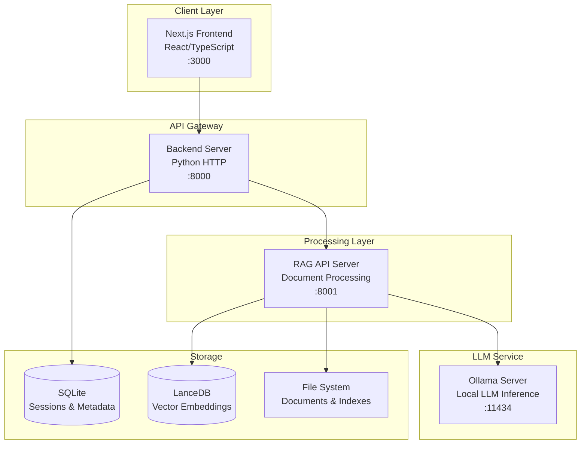

# 🤖 Advanced RAG System

A sophisticated **Retrieval-Augmented Generation (RAG)** system with intelligent routing, multimodal processing, and containerized deployment.

[](https://www.docker.com/)
[](https://python.org/)
[](https://nextjs.org/)
[](LICENSE)

---

## 🚀 Quick Start

**Get up and running in 5 minutes:**

```bash
# Clone and setup everything automatically
git clone https://github.com/your-org/rag-system.git
cd rag-system
./setup_rag_system.sh
```

**Then open:** http://localhost:3000

> **New to Docker?** Run `./install_docker.sh` first to install Docker on your system.

---

## ✨ Key Features

### 🧠 **Intelligent Dual-Layer Routing**
- **Speed Optimization**: Route simple queries to Direct LLM (~1.3s) vs complex queries to RAG Pipeline (~20s)
- **Intelligence Optimization**: Smart query classification within RAG pipeline
- **Context Awareness**: Session-based routing with conversation history

### 📚 **Advanced Document Processing**
- **Multimodal Support**: Process text and images from PDF documents
- **Intelligent Chunking**: Configurable chunking strategies with context preservation
- **Hybrid Retrieval**: Combines dense vector search with BM25 keyword matching
- **AI Reranking**: Cross-encoder reranking for improved relevance

### 🔄 **Sophisticated Query Processing**
- **Query Decomposition**: Complex queries broken into sub-queries for parallel processing
- **Contextual Enrichment**: Conversation history integration and context expansion
- **Answer Verification**: Grounding checks with confidence scoring
- **Source Attribution**: Complete citation and source tracking

### 🐳 **Production-Ready Deployment**
- **Containerized Architecture**: 4-service Docker setup with health checks
- **Scalable Design**: Microservices architecture with clear separation of concerns
- **Monitoring & Logging**: Comprehensive logging with structured output
- **Backup & Recovery**: Automated backup procedures and recovery scripts

---

## 🏗️ Architecture Overview



### Component Breakdown

| Component | Technology | Purpose |
|-----------|------------|---------|
| **Frontend** | Next.js 15, React 19, TypeScript | User interface, chat interactions |
| **Backend** | Python 3.11, HTTP Server | API gateway, session management, intelligent routing |
| **RAG API** | Python 3.11, Advanced NLP | Document processing, retrieval, generation |
| **Ollama** | Go-based LLM server | Local LLM inference (embedding, generation) |
| **SQLite** | Embedded database | Sessions, messages, index metadata |
| **LanceDB** | Vector database | Document embeddings, similarity search |

---

## 📋 System Requirements

### **Minimum Requirements**
- **CPU**: 4 cores, 2.5GHz+
- **RAM**: 8GB (16GB recommended)
- **Storage**: 50GB free space
- **OS**: macOS 10.15+, Ubuntu 20.04+, Windows 10+

### **Recommended Requirements**
- **CPU**: 8+ cores, 3.0GHz+
- **RAM**: 32GB+ (for large models)
- **Storage**: 200GB+ SSD
- **GPU**: NVIDIA GPU with 8GB+ VRAM (optional)

---

## 📖 Documentation

### **Getting Started**
- 📄 **[Quick Start Guide](Documentation/quick_start.md)** - Get running in 5 minutes
- 📄 **[Installation Guide](Documentation/installation_guide.md)** - Detailed setup instructions
- 📄 **[Docker Usage Guide](Documentation/docker_usage.md)** - Docker commands and management

### **System Documentation**
- 📄 **[System Overview](Documentation/system_overview.md)** - Complete architecture and functionality
- 📄 **[Deployment Guide](Documentation/deployment_guide.md)** - Production deployment procedures
- 📄 **[API Reference](Documentation/api_reference.md)** - Complete API documentation

### **Component Documentation**
- 📄 **[Architecture Overview](Documentation/architecture_overview.md)** - High-level system design
- 📄 **[Retrieval Pipeline](Documentation/retrieval_pipeline.md)** - Document retrieval and processing
- 📄 **[Indexing Pipeline](Documentation/indexing_pipeline.md)** - Document indexing and storage
- 📄 **[React Agent](Documentation/react_agent.md)** - Intelligent agent system
- 📄 **[Triage System](Documentation/triage_system.md)** - Query routing and classification

---

## 🛠️ Installation & Setup

### **Option 1: Automated Setup (Recommended)**
```bash
git clone https://github.com/your-org/rag-system.git
cd rag-system
./setup_rag_system.sh
```

### **Option 2: Manual Setup**
```bash
# 1. Install Docker (if not installed)
./install_docker.sh

# 2. Clone repository
git clone https://github.com/your-org/rag-system.git
cd rag-system

# 3. Start services
docker compose up -d

# 4. Install AI models
docker compose exec ollama ollama pull qwen2.5:7b
docker compose exec ollama ollama pull qwen2.5:0.5b

# 5. Access system
open http://localhost:3000
```

### **Option 3: Development Setup**
```bash
# Setup for local development
python3.11 -m venv venv
source venv/bin/activate
pip install -r requirements.txt
npm install

# Start infrastructure only
docker compose up -d ollama

# Run services locally
cd backend && python server.py &
cd rag_system && python -m api_server &
npm run dev
```

---

## 🎯 Usage Examples

### **Basic Chat**
```bash
# Simple conversation
curl -X POST -H "Content-Type: application/json" \
  -d '{"query": "Hello, how are you?", "session_id": "demo"}' \
  http://localhost:8000/sessions/demo/chat
```

### **Document Upload**
```bash
# Upload PDF document
curl -X POST -F "file=@document.pdf" \
  http://localhost:8000/upload
```

### **Document Query**
```bash
# Ask about uploaded documents
curl -X POST -H "Content-Type: application/json" \
  -d '{"query": "What are the key findings in the document?", "session_id": "demo"}' \
  http://localhost:8000/sessions/demo/chat
```

### **Advanced Features**
```bash
# Query with advanced options
curl -X POST -H "Content-Type: application/json" \
  -d '{
    "query": "Summarize the main points",
    "session_id": "demo",
    "query_decompose": true,
    "ai_rerank": true,
    "verify": true
  }' \
  http://localhost:8001/chat/stream
```

---

## 🔧 Configuration

### **Model Configuration**
```python
# Edit rag_system/main.py
EXTERNAL_MODELS = {
    "embedding_model": "sentence-transformers/all-mpnet-base-v2",
    "reranker_model": "BAAI/bge-reranker-base",
}

OLLAMA_CONFIG = {
    "generation_model": "qwen2.5:7b",
    "enrichment_model": "qwen2.5:0.5b",
}
```

### **Pipeline Configuration**
```python
# Edit rag_system/main.py
PIPELINE_CONFIGS = {
    "query_decomposition": {"enabled": True},
    "contextual_enricher": {"enabled": True},
    "verification": {"enabled": True},
    "retrieval": {
        "search_type": "hybrid",
        "fusion": {"dense_weight": 0.7, "sparse_weight": 0.3}
    }
}
```

### **Environment Configuration**
```bash
# Edit .env file
NODE_ENV=production
DEFAULT_EMBEDDING_MODEL=sentence-transformers/all-mpnet-base-v2
DEFAULT_GENERATION_MODEL=qwen2.5:7b
MAX_CONCURRENT_REQUESTS=5
REQUEST_TIMEOUT=300
```

---

## 📊 Performance Characteristics

| Operation | Typical Time | Factors |
|-----------|-------------|---------|
| **Direct LLM** | 1-3 seconds | Model size, query complexity |
| **RAG Query** | 15-30 seconds | Document corpus size, retrieval depth |
| **Document Upload** | 2-5 seconds/MB | File size, processing complexity |
| **Index Creation** | 1-2 minutes/100 pages | Document count, embedding model |

### **Scalability**
- **Concurrent Users**: 10-20 (Direct LLM), 3-5 (RAG Pipeline)
- **Document Limits**: Up to 10,000 documents per index
- **Query Performance**: Sub-second search up to 100,000 chunks

---

## 🛡️ Security & Privacy

- **🔒 Local Processing**: All data processed locally, no external API calls
- **🏠 Data Isolation**: Documents stored in isolated directories
- **🔐 Session Security**: Session-based access control
- **📋 Audit Trail**: Complete logging of all operations
- **🔄 Data Retention**: Configurable message and document retention

---

## 🚀 Management Scripts

The system includes helpful management scripts:

```bash
# System Management
./start_rag_system.sh      # Start the system
./stop_rag_system.sh       # Stop the system
./status_rag_system.sh     # Check system status
./backup_rag_system.sh     # Backup system data
./update_rag_system.sh     # Update the system

# Docker Management
docker compose up -d       # Start services
docker compose down        # Stop services
docker compose ps          # Check status
docker compose logs -f     # View logs
```

---

## 🔍 Monitoring & Troubleshooting

### **Health Checks**
```bash
# Check all services
./status_rag_system.sh

# Individual service checks
curl -f http://localhost:3000 && echo "Frontend OK"
curl -f http://localhost:8000/health && echo "Backend OK"
curl -f http://localhost:8001/models && echo "RAG API OK"
curl -f http://localhost:11434/api/tags && echo "Ollama OK"
```

### **Common Issues**
- **Port Conflicts**: Check `sudo lsof -i :3000` and kill conflicting processes
- **Memory Issues**: Increase Docker memory in Docker Desktop settings
- **Model Loading**: Verify models with `docker compose exec ollama ollama list`
- **Database Issues**: Check database file permissions and connectivity

### **Logs & Debugging**
```bash
# View service logs
docker compose logs frontend
docker compose logs backend
docker compose logs rag-api
docker compose logs ollama

# Follow logs in real-time
docker compose logs -f

# Check resource usage
docker stats
```

---

## 🔄 Updates & Maintenance

### **Regular Updates**
```bash
# Update system
./update_rag_system.sh

# Update models
docker compose exec ollama ollama pull qwen2.5:7b
docker compose restart rag-api
```

### **Backup & Recovery**
```bash
# Create backup
./backup_rag_system.sh

# Restore from backup
./restore_rag_system.sh backup_20250102_143000.tar.gz
```

---

## 🤝 Contributing

We welcome contributions! Please see our [Contributing Guide](CONTRIBUTING.md) for details.

### **Development Setup**
```bash
# Clone repository
git clone https://github.com/your-org/rag-system.git
cd rag-system

# Setup development environment
python3.11 -m venv venv
source venv/bin/activate
pip install -r requirements.txt
npm install

# Start development servers
docker compose up -d ollama
cd backend && python server.py &
cd rag_system && python -m api_server &
npm run dev
```

---

## 📜 License

This project is licensed under the MIT License - see the [LICENSE](LICENSE) file for details.

---

## 🙏 Acknowledgments

- **[Ollama](https://ollama.ai/)** - Local LLM inference
- **[LanceDB](https://lancedb.com/)** - Vector database
- **[Sentence Transformers](https://www.sbert.net/)** - Embedding models
- **[Next.js](https://nextjs.org/)** - Frontend framework
- **[Docker](https://www.docker.com/)** - Containerization

---

## 📞 Support

- 📖 **Documentation**: Check the `Documentation/` folder
- 🐛 **Issues**: Report issues on GitHub
- 💬 **Discussions**: Join our community discussions
- 📧 **Contact**: [your-email@domain.com](mailto:your-email@domain.com)

---

**Built with ❤️ for the AI community**
