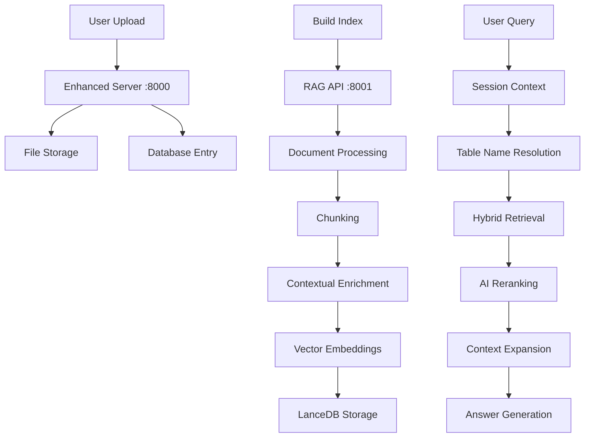
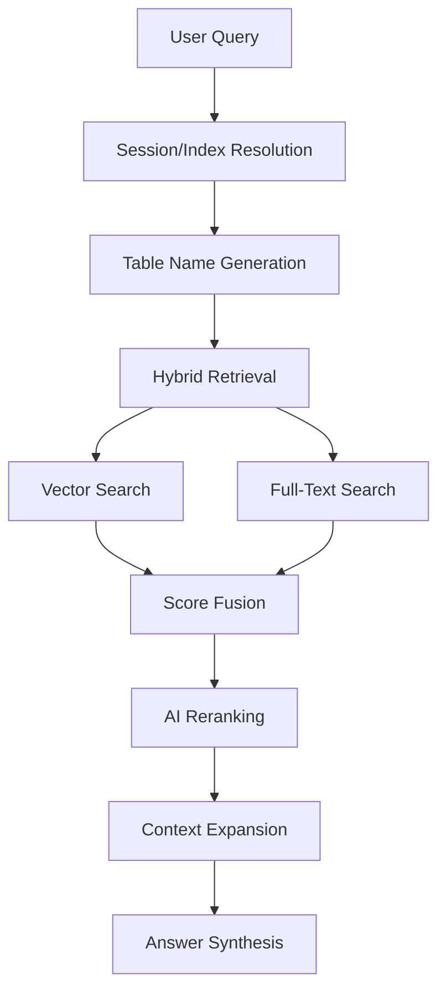
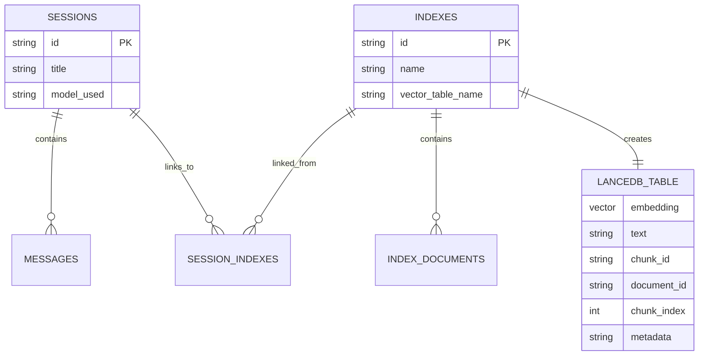

# Multimodal RAG Retrieval System - Complete Documentation

## Table of Contents
1. [System Overview](#system-overview)
2. [Architecture Components](#architecture-components)
3. [Data Flow & Processing Pipeline](#data-flow--processing-pipeline)
4. [Index Creation & Management](#index-creation--management)
5. [Document Indexing Process](#document-indexing-process)
6. [Retrieval Pipeline](#retrieval-pipeline)
7. [Query Processing & Execution](#query-processing--execution)
8. [Database Schema & Relationships](#database-schema--relationships)
9. [Configuration & Deployment](#configuration--deployment)
10. [Troubleshooting & Common Issues](#troubleshooting--common-issues)

---

## System Overview

The Multimodal RAG (Retrieval-Augmented Generation) system is a sophisticated document search and question-answering platform that combines multiple retrieval strategies to provide accurate, context-aware responses. The system processes documents (primarily PDFs) through an advanced indexing pipeline and retrieves relevant information using hybrid search techniques.

### Key Features
- **Hybrid Retrieval**: Combines vector similarity search and full-text search (FTS)
- **Contextual Enrichment**: Enhances chunks with surrounding context for better embeddings
- **AI Reranking**: Uses ColBERT-based models to refine search results
- **Multi-Modal Support**: Handles text, images, and structured data
- **Session Management**: Maintains conversation context and index associations
- **Real-time Processing**: Supports streaming responses and progress tracking

---

## Architecture Components

### 1. **Frontend (Next.js)**
- **Port**: 3000
- **Purpose**: User interface for document upload, index management, and chat
- **Key Files**: `src/components/`, `src/lib/api.ts`

### 2. **Enhanced Backend Server (Flask)**
- **Port**: 8000  
- **Purpose**: Main API server for session/index management, file uploads
- **Key Files**: `backend/enhanced_server.py`, `backend/enhanced_database.py`
- **Database**: SQLite (`chat_history.db`) with connection pooling

### 3. **RAG API Server (Python HTTP)**
- **Port**: 8001
- **Purpose**: Advanced RAG processing, indexing pipeline, query execution
- **Key Files**: `rag_system/api_server.py`, `rag_system/pipelines/`

### 4. **Storage Systems**
- **SQLite Database**: Session, index, and document metadata
- **LanceDB**: Vector embeddings and full-text search indexes
- **File System**: Original documents in `shared_uploads/`

---

## Data Flow & Processing Pipeline



---

## Index Creation & Management

### 1. **Index Creation Flow**

#### Step 1: Create Index Record
```bash
POST /indexes
{
  "name": "My Documents",
  "description": "Company documents collection"
}
```

**Response:**
```json
{
  "data": {
    "index": {
      "id": "07297182-ce0e-4fd2-91ad-be0e066316b3",
      "name": "My Documents", 
      "vector_table_name": "text_pages_07297182-ce0e-4fd2-91ad-be0e066316b3",
      "created_at": "2025-06-25T20:36:12.098871",
      "documents": []
    }
  }
}
```

#### Step 2: Upload Documents
```bash
POST /indexes/{index_id}/upload
Content-Type: multipart/form-data
files: [file1.pdf, file2.pdf]
```

#### Step 3: Build Index (Trigger Processing)
```bash
POST /indexes/{index_id}/build
{
  "latechunk": false,
  "doclingChunk": false  
}
```

### 2. **Database Schema for Indexes**

```sql
-- Main indexes table
CREATE TABLE indexes (
    id TEXT PRIMARY KEY,                    -- UUID
    name TEXT NOT NULL,                     -- Human-readable name
    description TEXT,                       -- Optional description
    created_at TEXT NOT NULL,               -- ISO timestamp
    updated_at TEXT NOT NULL,               -- ISO timestamp  
    vector_table_name TEXT,                 -- LanceDB table name
    metadata TEXT DEFAULT '{}'              -- JSON metadata
);

-- Documents associated with indexes
CREATE TABLE index_documents (
    id INTEGER PRIMARY KEY AUTOINCREMENT,
    index_id TEXT NOT NULL,                 -- Foreign key to indexes.id
    original_filename TEXT,                 -- User's filename
    stored_path TEXT,                       -- Absolute file path
    FOREIGN KEY(index_id) REFERENCES indexes(id)
);

-- Links between sessions and indexes  
CREATE TABLE session_indexes (
    id INTEGER PRIMARY KEY AUTOINCREMENT,
    session_id TEXT,                        -- Foreign key to sessions.id
    index_id TEXT,                          -- Foreign key to indexes.id
    linked_at TEXT,                         -- ISO timestamp
    FOREIGN KEY(session_id) REFERENCES sessions(id),
    FOREIGN KEY(index_id) REFERENCES indexes(id)
);
```

### 3. **Critical Naming Convention**

The system uses a **strict naming convention** to link database records with LanceDB tables:

```python
# When index is created
vector_table_name = f"text_pages_{index_id}"

# When indexing pipeline runs  
table_name = f"text_pages_{session_id}"  # session_id = index_id

# When retrieval runs
table_name = f"text_pages_{session_id}"  # session_id = index_id
```

**⚠️ Critical**: The `session_id` parameter in the RAG API acts as the `index_id` for table naming consistency.

---

## Document Indexing Process

### 1. **Document Processing Pipeline**

When `/indexes/{id}/build` is called:

```python
# Enhanced server delegates to RAG API
payload = {
    "file_paths": ["/path/to/doc1.pdf", "/path/to/doc2.pdf"],
    "session_id": index_id  # ← This becomes the table name
}
requests.post("http://localhost:8001/index", json=payload)
```

### 2. **Indexing Pipeline Steps**

#### **Step 1: Document Conversion**
- **Input**: PDF files
- **Processor**: `docling` library with OCR support
- **Output**: Clean Markdown per page with metadata

```python
# Example chunk metadata
{
  "source": "/path/to/document.pdf",
  "document_id": "uuid_document.pdf", 
  "chunk_index": 0,
  "heading_path": ["Chapter 1", "Introduction"],
  "block_type": "paragraph"
}
```

#### **Step 2: Chunking**
- **Method**: `MarkdownRecursiveChunker`
- **Strategy**: Splits on headers while preserving semantic coherence
- **Size**: ~1500 characters with 100 character overlap
- **Output**: Structured chunks with hierarchy metadata

#### **Step 3: Contextual Enrichment** 
- **Purpose**: Enhance embeddings by adding surrounding context
- **Window Size**: Configurable (default: 1 chunk before/after)
- **Process**: 
  ```python
  enriched_text = f"Context: {contextual_summary}\n\n---\n\n{original_text}"
  ```
- **Storage**: Original text preserved in `metadata.original_text`

#### **Step 4: Vector Embedding**
- **Model**: `Qwen/Qwen3-Embedding-0.6B` (768 dimensions)
- **Input**: Enriched text (not original)
- **Batch Size**: 50 chunks per batch
- **Output**: Dense vector representations

#### **Step 5: LanceDB Storage**
- **Table Creation**: Uses `vector_table_name` from database
- **Schema**:
  ```python
  schema = pa.schema([
      pa.field("vector", pa.list_(pa.float32(), 768)),      # Embedding
      pa.field("text", pa.string()),                        # Enriched text  
      pa.field("chunk_id", pa.string()),                    # Unique ID
      pa.field("document_id", pa.string()),                 # Source document
      pa.field("chunk_index", pa.int32()),                  # Position in doc
      pa.field("metadata", pa.string())                     # JSON metadata
  ])
  ```

#### **Step 6: Full-Text Search Index**
- **Technology**: LanceDB native FTS (not Tantivy)
- **Field**: `text` field (enriched content)
- **Index Name**: `fts_text`

### 3. **Example: Complete Index Build**

```bash
# 1. Index "LLM" with 4 documents gets built
curl -X POST http://localhost:8000/indexes/07297182-ce0e-4fd2-91ad-be0e066316b3/build

# 2. Creates LanceDB table: text_pages_07297182-ce0e-4fd2-91ad-be0e066316b3
# 3. Processes 4 PDFs → 156 chunks with embeddings
# 4. Creates FTS index on enriched text
```

**Result Verification:**
```python
import lancedb
db = lancedb.connect("./lancedb")
print(db.table_names())  # Shows: text_pages_07297182-ce0e-4fd2-91ad-be0e066316b3
table = db.open_table("text_pages_07297182-ce0e-4fd2-91ad-be0e066316b3")  
print(len(table))        # Shows: 156 rows
```

---

## Retrieval Pipeline

### 1. **Query Processing Flow**



### 2. **Session to Table Resolution**

The system resolves user queries to the correct LanceDB table:

```python
# In RAG API (/chat endpoint)
def handle_chat(self):
    session_id = data.get('session_id')
    table_name = data.get('table_name')
    
    # Auto-generate table name if not provided
    if not table_name and session_id:
        table_name = f"text_pages_{session_id}"
    
    # Pass to retrieval pipeline
    result = RAG_AGENT.run(query, table_name=table_name, session_id=session_id)
```

**⚠️ Key Insight**: When using session-based chat, the `session_id` must correspond to an `index_id` that has been built.

### 3. **Hybrid Retrieval Strategy**

The system performs **two parallel searches** and combines results:

#### **Vector Search**
- **Input**: Query → Qwen embedding (768d)
- **Method**: Cosine similarity against stored vectors
- **Returns**: `_distance` scores (lower = better)

#### **Full-Text Search**  
- **Input**: Query → FTS index
- **Method**: BM25-like scoring with wildcards
- **Enhancement**: Single words get fuzzy matching (`word*` OR `word~`)
- **Returns**: `score` values (higher = better)

#### **Score Fusion**
```python
# Manual hybrid: fetch k/2 from each method
fts_k = k // 2        # e.g., 10 → 5 FTS results
vec_k = k - fts_k     # e.g., 10 → 5 vector results

# Combine and deduplicate by chunk_id or _rowid
combined_results = pd.concat([fts_df, vec_df]).drop_duplicates()

# Optional weighted fusion if both scores exist
if '_distance' in row and 'score' in row:
    vec_sim = 1.0 / (1.0 + row['_distance'])  # Convert distance to similarity
    combined_score = 0.5 * row['score'] + 0.5 * vec_sim
```

### 4. **AI Reranking**

After hybrid retrieval, results are reranked using ColBERT:

```python
# Configuration
reranker_config = {
    "enabled": True,
    "model_name": "answerdotai/answerai-colbert-small-v1", 
    "strategy": "rerankers-lib",
    "top_k": 3
}

# Reranking process
texts = [doc['text'] for doc in retrieved_docs]
ranked = ai_reranker.rank(query=query, docs=texts)

# Results get rerank_score field
reranked_docs = [
    retrieved_docs[idx] | {"rerank_score": score} 
    for score, idx in ranked.results
]
```

### 5. **Context Expansion**

For top reranked documents, the system retrieves surrounding chunks:

```python
def _get_surrounding_chunks_lancedb(self, chunk, window_size=1):
    document_id = chunk.get("document_id")
    chunk_index = chunk.get("chunk_index")
    
    # Get chunks around target: [chunk_index-1, chunk_index, chunk_index+1]
    start_index = max(0, chunk_index - window_size)
    end_index = chunk_index + window_size
    
    sql_filter = f"document_id = '{document_id}' AND chunk_index >= {start_index} AND chunk_index <= {end_index}"
    results = table.search().where(sql_filter).to_list()
    
    return sorted(results, key=lambda c: c['chunk_index'])
```

---

## Query Processing & Execution

### 1. **Complete Query Example**

**Input:**
```bash
curl -X POST http://localhost:8001/chat -H "Content-Type: application/json" -d '{
  "query": "what is promptx?", 
  "session_id": "07297182-ce0e-4fd2-91ad-be0e066316b3"
}'
```

**Processing Steps:**

1. **Table Resolution**: `session_id` → `text_pages_07297182-ce0e-4fd2-91ad-be0e066316b3`

2. **Hybrid Retrieval**: 
   - Vector search: Query embedding vs 156 stored vectors
   - FTS search: "promptx* OR promptx~" against enriched text
   - Combined: ~10 candidate documents

3. **AI Reranking**:
   - ColBERT scores all candidates against query
   - Keeps top 3 with highest `rerank_score`

4. **Context Expansion**:
   - For each top document, fetch surrounding chunks
   - Maintains chunk order by `chunk_index`

5. **Answer Synthesis**:
   - Concatenate final document texts
   - Generate answer using LLM with context

### 2. **Successful Retrieval Output**

```json
{
  "answer": "PromptX AI LLC is a business entity based in Sacramento, California...",
  "source_documents": [
    {
      "text": "Context: PromptX AI LLC, a business located at...",
      "chunk_id": "e85f874f-fa23-4d69-9abb-ff6b6771207c_invoice_1039.pdf_0",
      "document_id": "e85f874f-fa23-4d69-9abb-ff6b6771207c_invoice_1039.pdf", 
      "chunk_index": 0,
      "rerank_score": 1.9454582929611206,
      "metadata": {
        "original_text": "PromptX AI LLC engineerprompt@gmail.com...",
        "contextual_summary": "PromptX AI LLC, a business located at...",
        "source": "/Users/.../invoice_1039.pdf"
      }
    }
  ]
}
```

### 3. **Query Failure Scenarios**

#### **Table Not Found**
```
Could not search table 'text_pages_xyz': Table 'text_pages_xyz' was not found
```
**Cause**: Index was created but never built (no LanceDB table exists)
**Solution**: Run `/indexes/{id}/build`

#### **No Results**  
```json
{
  "answer": "I could not find an answer in the documents.",
  "source_documents": []
}
```
**Cause**: Query doesn't match any content in hybrid search
**Solution**: Try different query terms or check index content

---

## Database Schema & Relationships

### 1. **Core Tables**

```sql
-- Sessions (chat conversations)
sessions (
    id TEXT PRIMARY KEY,          -- UUID
    title TEXT,
    created_at TEXT,
    updated_at TEXT,
    model_used TEXT,
    message_count INTEGER
)

-- Messages in conversations
messages (
    id TEXT PRIMARY KEY,
    session_id TEXT → sessions.id,
    content TEXT,
    sender TEXT,                  -- 'user' | 'assistant'  
    timestamp TEXT,
    metadata TEXT                 -- JSON
)

-- Document indexes
indexes (
    id TEXT PRIMARY KEY,          -- UUID
    name TEXT,
    description TEXT,
    created_at TEXT,
    updated_at TEXT,
    vector_table_name TEXT,       -- LanceDB table name
    metadata TEXT                 -- JSON
)

-- Documents in indexes
index_documents (
    id INTEGER PRIMARY KEY,
    index_id TEXT → indexes.id,
    original_filename TEXT,       -- User's filename
    stored_path TEXT              -- Absolute file path
)

-- Session-Index associations
session_indexes (
    id INTEGER PRIMARY KEY,
    session_id TEXT → sessions.id,
    index_id TEXT → indexes.id,
    linked_at TEXT
)
```

### 2. **Data Relationships**



### 3. **Compatibility Between Database Systems**

The enhanced database maintains compatibility with the original schema:

| Field | Enhanced DB | Original DB | Notes |
|-------|------------|-------------|-------|
| `index_documents.original_filename` | ✅ | ✅ | Compatible |
| `index_documents.stored_path` | ✅ | ✅ | Compatible |
| `session_indexes` table | ✅ | ✅ | Compatible |
| `indexes.vector_table_name` | ✅ | ✅ | Compatible |
| `indexes.updated_at` | ✅ | ✅ | Compatible |

---

## Configuration & Deployment

### 1. **Server Configuration**

#### **Enhanced Server (Port 8000)**
```python
# backend/enhanced_server.py
app = Flask(__name__)
app.config['MAX_CONTENT_LENGTH'] = 100 * 1024 * 1024  # 100MB upload limit

# Database connection pooling
db_manager = DatabaseManager("chat_history.db")
db_manager.max_connections = 10
```

#### **RAG API Server (Port 8001)**
```python
# rag_system/api_server.py  
PIPELINE_CONFIGS = {
    "retrieval": {
        "storage": {
            "lancedb_uri": "./lancedb",              # LanceDB path
            "text_table_name": "local_text_pages_v3" # Default table
        },
        "embedding_model_name": "Qwen/Qwen3-Embedding-0.6B",
        "reranker": {
            "enabled": True,
            "model_name": "answerdotai/answerai-colbert-small-v1",
            "top_k": 3
        },
        "retrieval_k": 20,           # Initial retrieval count
        "context_window_size": 1     # Surrounding chunks
    }
}
```

### 2. **Environment Setup**

#### **Requirements**
```bash
# Backend dependencies
pip install flask sqlite3 requests

# RAG system dependencies  
pip install lancedb sentence-transformers transformers
pip install docling pandas pyarrow numpy
pip install rerankers  # For ColBERT reranking
```

#### **Directory Structure**
```
multimodal_rag/
├── backend/
│   ├── enhanced_server.py         # Main API server
│   ├── enhanced_database.py       # Database layer  
│   ├── shared_uploads/            # Document storage
│   └── chat_history.db           # SQLite database
├── rag_system/
│   ├── api_server.py             # RAG processing server
│   ├── pipelines/                # Indexing & retrieval
│   └── index_store/              # Indexes and graphs
├── lancedb/                      # Vector database
└── src/                          # Frontend (Next.js)
```

### 3. **Startup Sequence**

```bash
# 1. Start enhanced backend server  
cd backend && python enhanced_server.py &

# 2. Start RAG API server
python -m rag_system.api_server &  

# 3. Start frontend
npm run dev &

# 4. Verify all services
curl http://localhost:8000/health     # Enhanced server
curl http://localhost:8001/models     # RAG API  
curl http://localhost:3000           # Frontend
```

---

## Troubleshooting & Common Issues

### 1. **Index Shows Documents But No Retrieval Results**

**Symptoms:**
```bash
curl http://localhost:8000/indexes
# Shows: "documents": [{"filename": "doc.pdf"}]

curl -X POST http://localhost:8001/chat -d '{"query":"test","session_id":"xyz"}'  
# Returns: "Could not search table 'text_pages_xyz': Table not found"
```

**Root Cause**: Index was created and documents uploaded, but **build process never ran**.

**Solution:**
```bash
# Build the index to create LanceDB table
curl -X POST http://localhost:8000/indexes/{INDEX_ID}/build \
  -H "Content-Type: application/json" -d '{}'
```

**Verification:**
```python
import lancedb
db = lancedb.connect("./lancedb") 
print("text_pages_{INDEX_ID}" in db.table_names())  # Should be True
```

### 2. **Table Exists But No Results**

**Symptoms:**
- LanceDB table exists with data
- Queries return empty `source_documents: []`

**Debugging Steps:**

1. **Check table content:**
```python
table = db.open_table("text_pages_xyz")
print(f"Rows: {len(table)}")
sample = table.search().limit(1).to_pandas()
print(sample[['text', 'chunk_id']].head())
```

2. **Test direct search:**
```python
# Vector search
query_vec = embedding_model.create_embeddings(["test query"])[0]
results = table.search(query_vec).limit(5).to_pandas()

# FTS search  
fts_results = table.search(query="test", query_type="fts").limit(5).to_pandas()
```

3. **Check retrieval config:**
```python
# Verify retrieval_k is reasonable
retrieval_k = 20  # Should be > 0
```

### 3. **Database Connection Issues**

**Symptoms:**
```
sqlite3.OperationalError: database is locked
```

**Solution:**
```python
# Enhanced database uses connection pooling
db_manager = DatabaseManager("chat_history.db")
db_manager.close_all_connections()  # Reset pool
```

### 4. **Memory Issues During Indexing**

**Symptoms:**
```
OutOfMemoryError during embedding generation
```

**Solution:**
```python
# Reduce batch sizes in config
config = {
    "embedding_batch_size": 25,    # Reduce from 50  
    "enrichment_batch_size": 5     # Reduce from 10
}
```

### 5. **Port Conflicts**

**Symptoms:**
```
OSError: [Errno 48] Address already in use
```

**Solution:**
```bash
# Find and kill existing processes
lsof -i :8000 -i :8001 -i :3000
kill -9 <PID>

# Or use different ports
python enhanced_server.py --port 8002
```

### 6. **Model Download Issues**

**Symptoms:**
```
ConnectionError: Failed to download answerdotai/answerai-colbert-small-v1
```

**Solution:**
```bash
# Pre-download models
python -c "
from sentence_transformers import SentenceTransformer
SentenceTransformer('Qwen/Qwen3-Embedding-0.6B')

from rerankers import Reranker  
Reranker('answerdotai/answerai-colbert-small-v1', model_type='colbert')
"
```

### 7. **Frontend Configuration Issues**

**Symptoms:**
- Configuration parameters from frontend are ignored
- `'IndexingPipeline' object has no attribute 'ollama_client'` errors
- Database schema compatibility issues when switching servers

**Solution:**
See the dedicated [Frontend Configuration Troubleshooting Guide](FRONTEND_CONFIGURATION_TROUBLESHOOTING.md) for comprehensive error resolution, including:
- Parameter name mismatches between factory and constructors
- Attribute access issues in API server
- Database schema compatibility problems
- Server restart requirements for code changes

This guide provides detailed analysis of the most common configuration-related issues and their solutions.

---

## Performance Optimization

### 1. **Indexing Performance**

- **Batch Processing**: Use optimal batch sizes (50 for embeddings, 10 for enrichment)
- **Parallel Processing**: Multiple documents processed concurrently  
- **Memory Management**: Monitor usage during large document sets
- **Progress Tracking**: Real-time feedback on indexing status

### 2. **Retrieval Performance**

- **Hybrid Search**: Parallel FTS + vector search reduces latency
- **LRU Caching**: Query embeddings cached for repeated queries
- **Connection Pooling**: Database connections reused efficiently
- **Smart Reranking**: Only rerank top candidates, not all results

### 3. **Scaling Considerations**

- **Horizontal Scaling**: RAG API servers can be load balanced
- **Database Sharding**: Large indexes can use separate LanceDB instances
- **Caching Layers**: Redis for frequently accessed embeddings
- **Async Processing**: Background indexing with progress tracking

---

## Frontend Configuration Support

### Overview

The system now supports **complete dynamic configuration** of indexing parameters through the frontend interface. This replaces the previous hardcoded backend configuration approach, enabling users to customize chunking behavior, contextual enrichment, batch processing, and retrieval modes without modifying backend code.

**✅ Implementation Status**: Fully functional as of latest implementation

### Supported Configuration Parameters

| Parameter | Type | Default | Description | Impact |
|-----------|------|---------|-------------|--------|
| `chunkSize` | number | 512 | Maximum size of text chunks in characters | Processing speed vs context quality |
| `chunkOverlap` | number | 64 | Overlap between consecutive chunks in characters | Information continuity |
| `enableContextualEnrich` | boolean | true | Enable contextual enrichment of chunks | Retrieval quality vs processing time |
| `contextWindow` | number | 3 | Number of surrounding chunks for context | Context richness |
| `embeddingBatchSize` | number | 50 | Batch size for embedding generation | Memory usage vs speed |
| `enrichmentBatchSize` | number | 25 | Batch size for contextual enrichment | Concurrent LLM calls |
| `embeddingModel` | string | "qwen3-embedding-0.6b" | Embedding model to use | Vector quality |
| `retrievalMode` | string | "hybrid" | Retrieval strategy: "dense", "bm25", or "hybrid" | Search strategy |

### Configuration Flow


### Example Usage

#### Frontend Configuration
```javascript
// Frontend API call with configuration
const buildResult = await chatAPI.buildIndex(indexId, {
  chunkSize: 800,
  chunkOverlap: 100,
  enableContextualEnrich: true,
  contextWindow: 2,
  embeddingBatchSize: 25,
  enrichmentBatchSize: 5,
  embeddingModel: "qwen3-embedding-0.6b",
  retrievalMode: "dense"
});
```

#### Backend Processing
```python
# backend/server.py - Configuration parsing
def handle_build_index(self, index_id: str):
    # Parse frontend parameters
    config_overrides = {}
    
    # Chunking configuration
    if data.get('chunkSize') is not None:
        config_overrides['chunking'] = {
            'max_chunk_size': int(data.get('chunkSize')),
            'chunk_overlap': int(data.get('chunkOverlap', 0))
        }
    
    # Contextual enricher configuration
    if data.get('enableContextualEnrich') is not None:
        config_overrides['contextual_enricher'] = {
            'enabled': bool(data.get('enableContextualEnrich')),
            'window_size': int(data.get('contextWindow', 1))
        }
    
    # Send to RAG API
    payload = {
        "file_paths": file_paths,
        "session_id": index_id,
        "config_overrides": config_overrides
    }
```

#### Configuration Application
```python
# rag_system/api_server.py - Apply overrides
def _apply_config_overrides(self, config, overrides):
    # Apply chunking configuration
    if 'chunking' in overrides:
        config.setdefault('chunking', {}).update(overrides['chunking'])
    
    # Apply contextual enricher configuration
    if 'contextual_enricher' in overrides:
        config.setdefault('contextual_enricher', {}).update(overrides['contextual_enricher'])
    
    # Apply indexing batch sizes
    if 'indexing' in overrides:
        config.setdefault('indexing', {}).update(overrides['indexing'])
```

### Response Format

When configuration is applied successfully, the response includes the processed configuration:

```json
{
  "message": "Index built successfully with 1 documents",
  "details": {
    "message": "Indexing process for 1 file(s) completed successfully.",
    "table_name": "text_pages_fe04046e-7f4c-41b2-a17c-06d6a396223f"
  },
  "config_overrides": {
    "chunking": {
      "max_chunk_size": 800,
      "chunk_overlap": 100
    },
    "contextual_enricher": {
      "enabled": true,
      "window_size": 2
    },
    "indexing": {
      "embedding_batch_size": 25,
      "enrichment_batch_size": 5
    },
    "embedding_model_name": "qwen3-embedding-0.6b",
    "retrievers": {
      "dense": {"enabled": true},
      "bm25": {"enabled": false}
    }
  },
  "table_name": "text_pages_fe04046e-7f4c-41b2-a17c-06d6a396223f"
}
```

### Configuration Impact

#### Chunking Behavior
- **Small chunks** (256-512 chars): Better precision, more chunks to process
- **Large chunks** (1500-2000 chars): Better context, fewer chunks
- **Overlap**: Ensures important information isn't split across boundaries

#### Contextual Enrichment
- **Enabled**: Chunks get surrounding context for better embeddings
- **Window Size**: Controls how much context is added (1-3 chunks recommended)
- **Performance**: Increases processing time but improves retrieval quality

#### Batch Processing
- **Embedding Batch Size**: Higher values use more memory but process faster
- **Enrichment Batch Size**: Controls concurrent LLM calls for context generation

#### Retrieval Mode
- **Dense**: Vector similarity search only
- **BM25**: Full-text search only  
- **Hybrid**: Combines both methods (recommended)

### Verification & Success Indicators

**✅ Successful Configuration Application:**
- Server logs show: `🔧 Frontend configuration received: {...}`
- RAG API logs show: `🚀 Sending to RAG API: config_overrides={...}`
- Processing logs show: `🔧 Chunking config: max_size=X, min_size=Y, overlap=Z`
- LanceDB tables created with expected number of chunks
- Contextual enrichment visible in chunk content (if enabled)

**Example Successful Run:**
```
Index: e0c93ab9-2803-4a86-8614-47c04a9840f7
Chunks: 120 successfully indexed
Config Applied: chunk_size=512, overlap=64, window_size=3
Features: ✅ Contextual enrichment, ✅ Vector embeddings, ✅ FTS index
```

### Troubleshooting Configuration Issues

For detailed error resolution including:
- `ollama_client` attribute errors
- LanceDB table creation conflicts  
- Missing configuration sections
- Database schema compatibility issues

See: 
- [Frontend Configuration Complete Guide](FRONTEND_CONFIGURATION_COMPLETE_GUIDE.md) - Full implementation details
- [Frontend Configuration Troubleshooting Guide](FRONTEND_CONFIGURATION_TROUBLESHOOTING.md) - Error resolution steps
- [Frontend Configuration Summary](FRONTEND_CONFIGURATION_SUMMARY.md) - Quick reference

---

## API Reference

### Enhanced Server Endpoints (Port 8000)

#### Health & System Status

| Method | Endpoint | Purpose | Request Body | Response |
|--------|----------|---------|-------------|----------|
| `GET` | `/health` | System health check | None | `{"status": "healthy", "ollama_running": boolean, "available_models": string[], "database_stats": {...}}` |
| `GET` | `/stats` | Database and system statistics | None | `{"database": {...}, "ollama": {...}}` |

#### Session Management

| Method | Endpoint | Purpose | Request Body | Response |
|--------|----------|---------|-------------|----------|
| `GET` | `/sessions` | List all chat sessions | None | `{"sessions": ChatSession[], "total": number}` |
| `POST` | `/sessions` | Create new session | `{"title": string, "model": string}` | `{"session": ChatSession, "session_id": string}` |
| `GET` | `/sessions/{id}` | Get specific session + messages | None | `{"session": ChatSession, "messages": ChatMessage[]}` |
| `DELETE` | `/sessions/{id}` | Delete session | None | `{"message": string, "deleted_session_id": string}` |
| `POST` | `/sessions/cleanup` | Remove empty sessions | None | `{"message": string, "cleanup_count": number}` |

#### Session Chat & Messaging

| Method | Endpoint | Purpose | Request Body | Response |
|--------|----------|---------|-------------|----------|
| `POST` | `/sessions/{id}/messages` | Send message in session | `{"message": string, "model"?: string}` | `{"response": string, "session": ChatSession, "user_message_id": string, "ai_message_id": string}` |

#### Document Management (Legacy)

| Method | Endpoint | Purpose | Request Body | Response |
|--------|----------|---------|-------------|----------|
| `POST` | `/sessions/{id}/upload` | Upload PDFs to session | `multipart/form-data` | `{"message": string, "uploaded_files": [...]}` |
| `POST` | `/sessions/{id}/index` | Process uploaded documents | None | `{"message": string}` |
| `GET` | `/sessions/{id}/documents` | List session documents | None | `{"files": string[], "file_count": number}` |

#### Index Management (New System)

| Method | Endpoint | Purpose | Request Body | Response |
|--------|----------|---------|-------------|----------|
| `GET` | `/indexes` | List all indexes | None | `{"indexes": Index[], "total": number}` |
| `POST` | `/indexes` | Create new index | `{"name": string, "description"?: string, "metadata"?: {...}}` | `{"index": Index}` |
| `GET` | `/indexes/{id}` | Get specific index | None | `{"index": Index}` |
| `DELETE` | `/indexes/{id}` | Delete index | None | `{"message": string}` |
| `POST` | `/indexes/{id}/upload` | Upload files to index | `multipart/form-data` | `{"message": string, "uploaded_files": [...]}` |
| `POST` | `/indexes/{id}/build` | Build/process index | `{"latechunk"?: boolean, "doclingChunk"?: boolean, "chunkSize"?: number, "chunkOverlap"?: number, "enableContextualEnrich"?: boolean, "contextWindow"?: number, "embeddingBatchSize"?: number, "enrichmentBatchSize"?: number, "embeddingModel"?: string, "retrievalMode"?: string}` | `{"message": string, "config_overrides": {...}}` |

#### Session-Index Linking

| Method | Endpoint | Purpose | Request Body | Response |
|--------|----------|---------|-------------|----------|
| `POST` | `/sessions/{session_id}/indexes/{index_id}` | Link index to session | None | `{"message": string}` |
| `GET` | `/sessions/{id}/indexes` | Get session's linked indexes | None | `{"indexes": Index[], "total": number}` |

### RAG API Endpoints (Port 8001)

#### Query Processing

| Method | Endpoint | Purpose | Request Body | Response |
|--------|----------|---------|-------------|----------|
| `POST` | `/chat` | Standard query with retrieval | `{"query": string, "session_id": string, "table_name"?: string, "compose_sub_answers"?: boolean, "query_decompose"?: boolean, "ai_rerank"?: boolean, "context_expand"?: boolean}` | `{"answer": string, "source_documents": [...]}` |
| `POST` | `/chat/stream` | Streaming query response (SSE) | Same as `/chat` | Server-Sent Events stream |

#### Document Processing

| Method | Endpoint | Purpose | Request Body | Response |
|--------|----------|---------|-------------|----------|
| `POST` | `/index` | Run indexing pipeline | `{"file_paths": string[], "session_id": string, "table_name"?: string, "enable_latechunk"?: boolean, "enable_docling_chunk"?: boolean, "config_overrides"?: {...}}` | `{"message": string, "indexed_files": [...]}` |

#### System Information

| Method | Endpoint | Purpose | Request Body | Response |
|--------|----------|---------|-------------|----------|
| `GET` | `/models` | List available models | None | `{"generation_models": string[], "embedding_models": string[]}` |

### Frontend API Client (`src/lib/api.ts`)

The frontend provides a `ChatAPI` class with the following methods:

#### System Health
- `checkHealth(): Promise<HealthResponse>`

#### Session Management
- `getSessions(): Promise<SessionResponse>`
- `createSession(title?: string, model?: string): Promise<ChatSession>`
- `getSession(sessionId: string): Promise<{session: ChatSession, messages: ChatMessage[]}>`
- `deleteSession(sessionId: string): Promise<{message: string}>`
- `cleanupEmptySessions(): Promise<{message: string, cleanup_count: number}>`

#### Chat & Messaging
- `sendMessage(request: ChatRequest): Promise<ChatResponse>` (Legacy)
- `sendSessionMessage(sessionId: string, message: string, opts?: {...}): Promise<SessionChatResponse>`
- `streamSessionMessage(params: {...}, onEvent: Function): Promise<void>`

#### Document Management
- `uploadFiles(sessionId: string, files: File[]): Promise<{...}>` (Legacy)
- `uploadPDFs(sessionId: string, files: File[]): Promise<{...}>` (Legacy)
- `indexDocuments(sessionId: string): Promise<{message: string}>` (Legacy)
- `getSessionDocuments(sessionId: string): Promise<{...}>`

#### Index Management
- `createIndex(name: string, description?: string, metadata?: {...}): Promise<{index_id: string}>`
- `uploadFilesToIndex(indexId: string, files: File[]): Promise<{...}>`
- `buildIndex(indexId: string, opts?: {chunkSize?: number, chunkOverlap?: number, enableContextualEnrich?: boolean, contextWindow?: number, embeddingBatchSize?: number, enrichmentBatchSize?: number, embeddingModel?: string, retrievalMode?: string}): Promise<{message: string, config_overrides: {...}}>`
- `linkIndexToSession(sessionId: string, indexId: string): Promise<{message: string}>`
- `listIndexes(): Promise<{indexes: any[], total: number}>`
- `getSessionIndexes(sessionId: string): Promise<{indexes: any[], total: number}>`
- `deleteIndex(indexId: string): Promise<{message: string}>`

#### Utility Methods
- `getModels(): Promise<ModelsResponse>`
- `generateUUID(): string`
- `messagesToHistory(messages: ChatMessage[]): Array<{role: string, content: string}>`
- `convertDbMessage(dbMessage: Record<string, unknown>): ChatMessage`
- `createMessage(content: string, sender: string, isLoading?: boolean): ChatMessage`

### Data Types & Interfaces

#### Core Types
```typescript
interface ChatSession {
  id: string;
  title: string;
  created_at: string;
  updated_at: string;
  model_used: string;
  message_count: number;
}

interface ChatMessage {
  id: string;
  content: string | Array<Record<string, any>> | { steps: Step[] };
  sender: 'user' | 'assistant';
  timestamp: string;
  isLoading?: boolean;
  metadata?: Record<string, unknown>;
}

interface Index {
  id: string;
  name: string;
  description?: string;
  created_at: string;
  updated_at: string;
  vector_table_name: string;
  metadata: Record<string, unknown>;
  documents: Array<{
    id: number;
    original_filename: string;
    stored_path: string;
  }>;
}
```

#### Request/Response Types
```typescript
interface ChatRequest {
  message: string;
  model?: string;
  conversation_history?: Array<{role: string, content: string}>;
}

interface HealthResponse {
  status: string;
  ollama_running: boolean;
  available_models: string[];
  database_stats?: {
    total_sessions: number;
    total_messages: number;
    most_used_model: string | null;
  };
}

interface SessionChatResponse {
  response: string;
  session: ChatSession;
  user_message_id: string;
  ai_message_id: string;
  source_documents?: Array<{
    text: string;
    chunk_id: string;
    document_id: string;
    chunk_index: number;
    rerank_score?: number;
    metadata: Record<string, unknown>;
  }>;
}
```

### API Usage Examples

#### Creating and Using an Index

```bash
# 1. Create a new index
curl -X POST http://localhost:8000/indexes \
  -H "Content-Type: application/json" \
  -d '{"name": "Company Documents", "description": "Internal company documentation"}'

# Response: {"data": {"index": {"id": "abc123...", "name": "Company Documents", ...}}}

# 2. Upload documents to the index
curl -X POST http://localhost:8000/indexes/abc123.../upload \
  -F "files=@document1.pdf" \
  -F "files=@document2.pdf"

# 3. Build the index (create LanceDB table)
curl -X POST http://localhost:8000/indexes/abc123.../build \
  -H "Content-Type: application/json" \
  -d '{}'

# 4. Create a chat session
curl -X POST http://localhost:8000/sessions \
  -H "Content-Type: application/json" \
  -d '{"title": "Document Q&A", "model": "llama3.2:latest"}'

# Response: {"data": {"session": {"id": "def456...", ...}}}

# 5. Link index to session
curl -X POST http://localhost:8000/sessions/def456.../indexes/abc123... \
  -H "Content-Type: application/json"

# 6. Query the documents
curl -X POST http://localhost:8001/chat \
  -H "Content-Type: application/json" \
  -d '{"query": "What is the company policy on remote work?", "session_id": "abc123..."}'
```

#### Streaming Chat Response

```javascript
// Frontend JavaScript example
const streamResponse = async (query, sessionId) => {
  const response = await fetch('http://localhost:8001/chat/stream', {
    method: 'POST',
    headers: { 'Content-Type': 'application/json' },
    body: JSON.stringify({ query, session_id: sessionId })
  });

  const reader = response.body.getReader();
  const decoder = new TextDecoder();

  while (true) {
    const { done, value } = await reader.read();
    if (done) break;

    const chunk = decoder.decode(value);
    const lines = chunk.split('\n');
    
    for (const line of lines) {
      if (line.startsWith('data: ')) {
        const eventData = JSON.parse(line.slice(6));
        console.log('Event:', eventData.type, eventData.data);
        
        if (eventData.type === 'complete') {
          console.log('Final answer:', eventData.data.answer);
        }
      }
    }
  }
};
```

### Error Handling

#### Common Error Responses

```json
// 400 Bad Request
{
  "error": "Missing required fields: query",
  "status": "error", 
  "status_code": 400,
  "details": {
    "missing_fields": ["query"]
  }
}

// 404 Not Found
{
  "error": "Index not found",
  "status": "error",
  "status_code": 404
}

// 500 Internal Server Error
{
  "error": "Failed to process documents",
  "status": "error",
  "status_code": 500
}
```

#### Frontend Error Handling

```typescript
// Example error handling in frontend
try {
  const result = await chatAPI.sendSessionMessage(sessionId, message);
  console.log('Response:', result.response);
} catch (error) {
  if (error.message.includes('404')) {
    console.error('Session not found');
  } else if (error.message.includes('500')) {
    console.error('Server error, please try again');
  } else {
    console.error('Unexpected error:', error.message);
  }
}
```

### Rate Limiting & Performance

#### Best Practices

1. **Batch Operations**: Upload multiple files in a single request
2. **Connection Pooling**: Backend uses database connection pooling (max 10 connections)
3. **Streaming**: Use `/chat/stream` for long-running queries to prevent timeouts
4. **Caching**: Query results are cached for 5 minutes in the agent system
5. **Concurrent Limits**: RAG API processes up to 3 parallel sub-queries

#### Performance Metrics

Based on testing with the enhanced server:

| Endpoint | Average Response Time | Concurrent Requests |
|----------|----------------------|-------------------|
| `/health` | 18ms | 50 |
| `/sessions` | 3ms | 20 |
| `/stats` | 28ms | 30 |
| `/chat` | 2-5 seconds | 5 |
| `/index` | 30-120 seconds | 1 |

### Security Considerations

#### CORS Configuration
- All endpoints support CORS with `Access-Control-Allow-Origin: *`
- Preflight OPTIONS requests are handled automatically

#### File Upload Security
- Maximum file size: 100MB per request
- Supported formats: PDF only for document processing
- Files are stored in `backend/shared_uploads/` with UUID-based names

#### Data Privacy
- All data is stored locally (no external API calls for embeddings)
- Session data is isolated between users
- Database uses SQLite with local file storage

---

This documentation provides a complete understanding of how the multimodal RAG retrieval system works, from document ingestion to query response generation. The system's strength lies in its hybrid approach, combining multiple retrieval strategies with advanced reranking to deliver highly relevant results. 