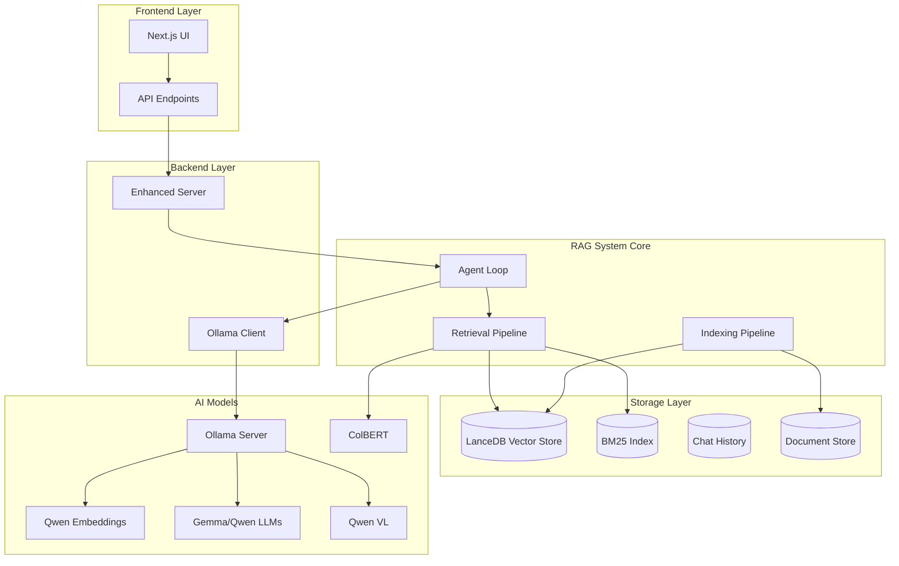
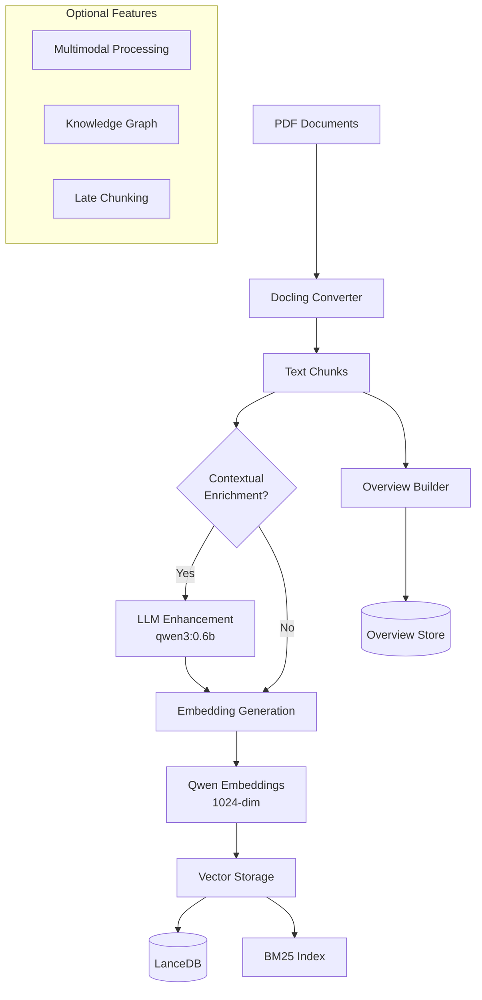
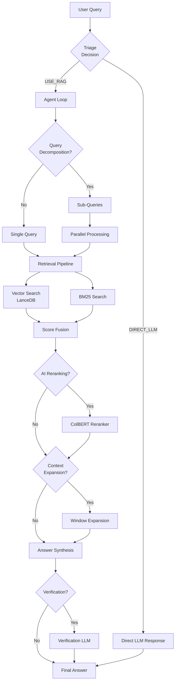

# Multimodal RAG System - Comprehensive Documentation

## Table of Contents
1. [System Overview](#system-overview)
2. [Architecture](#architecture)
3. [Indexing System](#indexing-system)
4. [Retrieval System](#retrieval-system)
5. [API Reference](#api-reference)
6. [Code Structure](#code-structure)
7. [Dependencies](#dependencies)
8. [Configuration](#configuration)
9. [Performance Analysis](#performance-analysis)
10. [Usage Examples](#usage-examples)

## System Overview

The Multimodal RAG (Retrieval-Augmented Generation) system is a sophisticated document processing and question-answering platform that combines:

- **Advanced Document Processing**: PDF → Docling chunking → Contextual enrichment → Vector embeddings
- **Hybrid Retrieval**: Vector search + BM25 + AI reranking + Context expansion
- **Agent-based QA**: Query decomposition + Parallel processing + Answer synthesis
- **Streaming Support**: Real-time token-by-token response generation

### Key Features
- 🔄 **Query Decomposition**: Breaks complex queries into sub-queries
- 🧠 **Contextual Enrichment**: LLM-enhanced chunk understanding
- 🎯 **AI Reranking**: ColBERT-based relevance scoring
- ⚡ **Streaming Responses**: Real-time token generation
- 📊 **Performance Profiling**: Detailed timing analysis
- 🔧 **Flexible Configuration**: 20+ configurable parameters

## Architecture



## Indexing System

The indexing pipeline transforms PDF documents into searchable vector representations with optional contextual enrichment.

### Indexing Architecture



### Indexing API

#### Core API: `IndexingPipeline.run()`

```python
def run(self, file_paths: List[str]) -> Dict[str, Any]:
    """
    Main indexing entry point
    
    Args:
        file_paths: List of PDF file paths to process
        
    Returns:
        {
            "success": bool,
            "documents_processed": int,
            "chunks_created": int,
            "table_name": str,
            "components": {
                "contextual_enrichment": bool,
                "vector_indexing": bool,
                "knowledge_graph": bool
            }
        }
    """
```

#### Configuration Payload

```python
indexing_config = {
    "storage": {
        "lancedb_uri": "./lancedb",
        "text_table_name": "text_pages_example",
        "bm25_path": "./index_store/bm25"
    },
    "indexing": {
        "embedding_batch_size": 10,
        "enrichment_batch_size": 3,
        "enable_multimodal": False,
        "late_chunking": False,
        "chunk_size": 1024,
        "chunk_overlap": 50
    },
    "contextual_enricher": {
        "enabled": True,
        "window_size": 5,
        "model_name": "qwen3:0.6b"
    },
    "embedding_model_name": "Qwen/Qwen3-Embedding-0.6B",
    "chunker_type": "docling",
    "reranker": {
        "enabled": True,
        "model_name": "answerdotai/answerai-colbert-small-v1",
        "top_k": 10
    }
}
```

### Indexing Process Flow

1. **Document Conversion** (Docling)
   - PDF → Structured markdown
   - Table/image extraction
   - Layout preservation

2. **Chunking** (Configurable)
   - **Docling Chunker**: High-recall sentence packing
   - **Simple Chunker**: Token-based splitting
   - **Late Chunker**: Embed-first, then chunk

3. **Contextual Enrichment** (Optional)
   - Window-based context expansion
   - LLM-generated summaries
   - Batch processing optimization

4. **Embedding Generation**
   - Qwen/BGE embedding models
   - Batch processing (configurable size)
   - 1024 or 384-dimensional vectors

5. **Vector Storage**
   - LanceDB for vector search
   - BM25 for keyword search
   - FTS index creation

### Indexing Performance Metrics

```python
# Example timing results
{
    "total_duration": 119.43,
    "document_processing": 55.92,  # Docling conversion
    "contextual_enrichment": 56.97,  # LLM enhancement
    "embedding_generation": 4.83,   # Vector creation
    "vector_indexing": 0.03,        # Storage
    "documents_processed": 3,
    "chunks_created": 46,
    "average_chunks_per_file": 15.3
}
```

## Retrieval System

The retrieval system combines multiple search strategies and uses an agent-based approach for complex query handling.

### Retrieval Architecture



### Retrieval API

#### Core API: `Agent.run()` / `Agent.stream_agent_response_async()`

```python
def run(self, 
        query: str,
        table_name: str = None,
        session_id: str = None,
        query_decompose: bool = None,
        ai_rerank: bool = None,
        context_expand: bool = None,
        max_retries: int = 1,
        event_callback: callable = None) -> Dict[str, Any]:
    """
    Main retrieval entry point
    
    Args:
        query: User question
        table_name: Vector table to search
        session_id: Chat session identifier
        query_decompose: Enable sub-query splitting
        ai_rerank: Enable ColBERT reranking
        context_expand: Enable context window expansion
        max_retries: Retry failed sub-queries
        event_callback: Real-time event handler
        
    Returns:
        {
            "answer": str,
            "source_documents": List[Dict],
            "metadata": {
                "query_decomposed": bool,
                "sub_queries": List[str],
                "total_sources": int,
                "confidence_score": float
            }
        }
    """
```

#### Streaming API Response Events

```python
# Event types emitted during streaming
event_types = [
    "analyze",                 # Query analysis started
    "decomposition_start",     # Query decomposition starting
    "decomposition",           # Sub-queries created
    "parallel_start",          # Parallel processing started
    "sub_query_result",        # Individual sub-query completed
    "composition_start",       # Final answer synthesis starting
    "token",                   # Individual token generated
    "final_answer",           # Complete answer ready
    "complete"                # Process finished
]

# Token event payload
{
    "type": "token",
    "data": {"text": "The"},
    "timestamp": 1672531200.123
}

# Sub-query result payload
{
    "type": "sub_query_result",
    "data": {
        "index": 0,
        "query": "What is the training cost of DeepSeek-V3?",
        "answer": "DeepSeek-V3 costs $5.576M to train...",
        "source_documents": [...]
    }
}
```

### Retrieval Configuration

```python
retrieval_config = {
    "storage": {
        "db_path": "./lancedb",
        "text_table_name": "text_pages_example"
    },
    "retrieval": {
        "search_type": "hybrid",  # vector|bm25|hybrid
        "top_k": 10,
        "context_expansion": True,
        "context_window_size": 1
    },
    "reranker": {
        "enabled": True,
        "strategy": "rerankers-lib",  # qwen|rerankers-lib
        "model_name": "answerdotai/answerai-colbert-small-v1",
        "top_percent": 0.4
    },
    "query_decomposition": {
        "enabled": True,
        "compose_from_sub_answers": True
    },
    "verification": {
        "enabled": False
    },
    "caching": {
        "enabled": True,
        "semantic_cache_threshold": 0.98
    },
    "embedding_model_name": "Qwen/Qwen3-Embedding-0.6B"
}
```

### Retrieval Process Flow

1. **Triage Decision**
   - Document overview analysis
   - Route to RAG vs Direct LLM
   - Simple chat detection

2. **Query Decomposition** (Optional)
   - Complex query splitting
   - Parallel sub-query processing
   - Independent fact retrieval

3. **Hybrid Search**
   - Vector similarity search
   - BM25 keyword matching
   - Score fusion algorithms

4. **AI Reranking** (Optional)
   - ColBERT relevance scoring
   - Top-K filtering
   - Precision improvement

5. **Context Expansion** (Optional)
   - Surrounding chunk retrieval
   - Window-based context
   - Coherent information assembly

6. **Answer Synthesis**
   - Multi-source integration
   - Fact composition
   - Response generation

### Performance Metrics

```python
# Retrieval timing breakdown
{
    "total_time": 22.21,
    "query_decomposition": 8.0,    # 36% - Query splitting
    "vector_search": 1.0,          # 5% - Embedding search
    "ai_reranking": 0.5,           # 2% - ColBERT scoring
    "context_expansion": 0.0,      # 0% - Disabled
    "sub_query_generation": 7.0,   # 32% - LLM processing
    "final_composition": 3.0,      # 14% - Answer synthesis
    "overhead": 2.7,               # 11% - System overhead
    
    "source_documents": 7,
    "token_events": 28,
    "answer_length": 122
}
```

## API Reference

### Backend Server APIs

#### FastAPI Endpoints

```python
# Enhanced Server (enhanced_server.py)
POST /chat
{
    "message": str,
    "session_id": str,
    "streaming": bool = False,
    "index_name": str = None
}

POST /index
{
    "files": List[str],
    "index_name": str,
    "config": Dict = None
}

GET /models
# Returns available Ollama models

GET /health
# Server health check
```

#### Response Formats

```python
# Chat Response
{
    "response": str,
    "sources": List[Dict],
    "session_id": str,
    "metadata": {
        "query_decomposed": bool,
        "retrieval_time": float,
        "source_count": int
    }
}

# Streaming Chat Response
data: {"type": "token", "content": "The"}
data: {"type": "sources", "content": [...]}
data: {"type": "complete"}

# Index Response
{
    "success": bool,
    "message": str,
    "index_name": str,
    "documents_processed": int,
    "chunks_created": int
}
```

### RAG System APIs

#### Agent API

```python
class Agent:
    def run(self, query: str, **kwargs) -> Dict[str, Any]
    async def stream_agent_response_async(self, query: str, **kwargs) -> Dict[str, Any]
    
# Usage
agent = Agent(config, ollama_client, ollama_config, index_id)
result = agent.run(
    query="What is the training cost?",
    table_name="text_pages_example",
    query_decompose=True,
    ai_rerank=True,
    context_expand=False
)
```

#### Indexing API

```python
class IndexingPipeline:
    def run(self, file_paths: List[str]) -> Dict[str, Any]
    
# Usage
pipeline = IndexingPipeline(config, ollama_client, ollama_config)
result = pipeline.run(["/path/to/doc1.pdf", "/path/to/doc2.pdf"])
```

#### Retrieval API

```python
class RetrievalPipeline:
    def run(self, query: str, table_name: str = None, 
            window_size_override: int = None, 
            event_callback: callable = None) -> Dict[str, Any]
            
# Usage
pipeline = RetrievalPipeline(config, ollama_client, ollama_config)
result = pipeline.run(
    query="What are the parameters?",
    table_name="text_pages_example",
    window_size_override=0  # Disable context expansion
)
```

## Code Structure

```
multimodal_rag_claude/
├── rag_system/                    # Core RAG implementation
│   ├── agent/                     # Agent-based processing
│   │   ├── loop.py               # Main agent loop
│   │   └── verifier.py           # Answer verification
│   ├── indexing/                 # Document processing
│   │   ├── contextualizer.py     # LLM-based enrichment
│   │   ├── embedders.py          # Vector generation
│   │   ├── multimodal.py         # Image/table processing
│   │   └── overview_builder.py   # Document summaries
│   ├── ingestion/                # Document ingestion
│   │   ├── pdf_converter.py      # PDF → Markdown
│   │   ├── chunking.py           # Text chunking
│   │   └── docling_chunker.py    # Advanced chunking
│   ├── pipelines/                # High-level orchestration
│   │   ├── indexing_pipeline.py  # Indexing workflow
│   │   └── retrieval_pipeline.py # Retrieval workflow
│   ├── retrieval/                # Search components
│   │   ├── retrievers.py         # Vector/BM25 search
│   │   └── query_transformer.py  # Query processing
│   ├── utils/                    # Utilities
│   │   ├── ollama_client.py      # LLM communication
│   │   └── batch_processor.py    # Batch operations
│   ├── config.py                 # Configuration
│   └── api_server.py             # RAG API server
├── backend/                       # Backend services
│   ├── enhanced_server.py        # Main FastAPI server
│   ├── ollama_client.py          # Ollama integration
│   └── database_manager.py       # Chat history
├── src/                          # Frontend (Next.js)
│   ├── components/               # React components
│   └── lib/api.ts               # API client
├── comprehensive_indexing.py     # Indexing script
├── comprehensive_retrieval.py    # Retrieval testing
└── docs/                         # Documentation
```

### Key Components

#### 1. Agent Loop (`rag_system/agent/loop.py`)
- Query triage and routing
- Query decomposition and parallel processing
- Answer synthesis and verification
- Streaming response generation

#### 2. Indexing Pipeline (`rag_system/pipelines/indexing_pipeline.py`)
- Document processing orchestration
- Batch processing optimization
- Multi-strategy chunking
- Vector storage management

#### 3. Retrieval Pipeline (`rag_system/pipelines/retrieval_pipeline.py`)
- Hybrid search implementation
- AI reranking integration
- Context expansion
- Response formatting

#### 4. Embedders (`rag_system/indexing/embedders.py`)
- Multiple embedding model support
- Batch processing optimization
- Vector storage abstraction
- LanceDB integration

## Dependencies

### Core Dependencies

```python
# AI/ML Libraries
ollama>=0.1.7              # Local LLM inference
sentence-transformers      # Embedding models
torch>=2.0.0              # PyTorch backend
transformers>=4.30.0      # HuggingFace models
rerankers                 # ColBERT reranking

# Vector Storage
lancedb>=0.4.0           # Vector database
lance-python             # Lance format support

# Document Processing
docling>=1.0.0           # PDF processing
pymupdf                  # PDF parsing
markdown                 # Text processing

# Web Framework
fastapi>=0.100.0         # API server
uvicorn                  # ASGI server
websockets               # Streaming support

# Data Processing
pandas>=2.0.0            # Data manipulation
numpy>=1.24.0            # Numerical computing
tiktoken                 # Token counting

# Utilities
pydantic>=2.0.0          # Data validation
python-multipart         # File uploads
cachetools               # Response caching
```

### Optional Dependencies

```python
# Advanced Features
networkx                 # Knowledge graphs
scikit-learn            # ML utilities
matplotlib              # Visualization

# Development
pytest                  # Testing
black                   # Code formatting
mypy                    # Type checking

# Frontend
next>=13.0.0            # React framework
typescript              # Type safety
tailwindcss             # Styling
```

### Model Dependencies

```bash
# Ollama Models (pull with: ollama pull <model>)
gemma3n:e4b              # Generation model
qwen3:0.6b               # Fast enrichment model
qwen2.5vl:7b             # Vision model
nomic-embed-text         # Alternative embeddings

# HuggingFace Models (auto-downloaded)
Qwen/Qwen3-Embedding-0.6B           # Primary embeddings
BAAI/bge-small-en-v1.5              # Alternative embeddings
answerdotai/answerai-colbert-small-v1  # Reranking
```

## Configuration

### Environment Variables

```bash
# Ollama Configuration
OLLAMA_HOST=http://localhost:11434
OLLAMA_KEEP_ALIVE=30m

# Storage Paths
LANCEDB_PATH=./lancedb
BM25_INDEX_PATH=./index_store/bm25
DOCUMENT_STORE_PATH=./documents

# Performance Tuning
EMBEDDING_BATCH_SIZE=20
ENRICHMENT_BATCH_SIZE=5
MAX_CONCURRENT_REQUESTS=10

# Model Configuration
DEFAULT_EMBEDDING_MODEL=Qwen/Qwen3-Embedding-0.6B
DEFAULT_GENERATION_MODEL=gemma3n:e4b
DEFAULT_ENRICHMENT_MODEL=qwen3:0.6b

# Feature Flags
ENABLE_CONTEXTUAL_ENRICHMENT=true
ENABLE_QUERY_DECOMPOSITION=true
ENABLE_AI_RERANKING=true
ENABLE_CONTEXT_EXPANSION=false
```

### Configuration Profiles

```python
# config.py profiles
PROFILES = {
    "default": {
        "contextual_enricher": {"enabled": True},
        "query_decomposition": {"enabled": True},
        "reranker": {"enabled": True},
        "verification": {"enabled": True}
    },
    "fast": {
        "contextual_enricher": {"enabled": False},
        "query_decomposition": {"enabled": False},
        "reranker": {"enabled": False},
        "verification": {"enabled": False}
    },
    "react": {
        "agent_type": "react",
        "tools": ["search", "calculator"],
        "query_decomposition": {"enabled": True}
    }
}
```

## Performance Analysis

### Indexing Performance

```python
# Benchmark Results (3 PDFs, 46 chunks)
{
    "basic_indexing": {
        "duration": 62.49,
        "documents": 3,
        "chunks": 46,
        "features": ["docling", "embeddings", "vector_storage"]
    },
    "advanced_indexing": {
        "duration": 119.43,
        "documents": 3,
        "chunks": 46,
        "features": ["docling", "contextual_enrichment", "embeddings", "vector_storage"],
        "breakdown": {
            "document_processing": 55.92,
            "contextual_enrichment": 56.97,
            "embedding_generation": 4.83,
            "vector_indexing": 0.03
        }
    }
}
```

### Retrieval Performance

```python
# Query: "What is the training cost and parameter count?"
{
    "basic_retrieval": {
        "duration": 108.12,
        "features": ["query_decomposition", "context_expansion"],
        "sub_queries": 2,
        "sources": 6
    },
    "optimized_retrieval": {
        "duration": 22.21,
        "features": ["query_decomposition", "ai_reranking"],
        "sub_queries": 2,
        "sources": 7,
        "improvement": "79% faster"
    }
}
```

### Scaling Characteristics

```python
# Performance vs Document Count
scaling_data = {
    "documents": [1, 5, 10, 50, 100],
    "indexing_time": [45, 180, 350, 1800, 3600],
    "retrieval_time": [15, 18, 22, 35, 45],
    "memory_usage_gb": [0.5, 1.2, 2.4, 12, 24]
}
```

## Usage Examples

### Basic Indexing

```python
from rag_system.pipelines.indexing_pipeline import IndexingPipeline
from rag_system.utils.ollama_client import OllamaClient

# Initialize
config = {
    "storage": {"lancedb_uri": "./lancedb", "text_table_name": "docs"},
    "indexing": {"chunk_size": 512, "embedding_batch_size": 10},
    "embedding_model_name": "Qwen/Qwen3-Embedding-0.6B"
}
ollama_config = {
    "host": "http://localhost:11434",
    "embedding_model": "Qwen/Qwen3-Embedding-0.6B",
    "generation_model": "gemma3n:e4b"
}

client = OllamaClient()
pipeline = IndexingPipeline(config, client, ollama_config)

# Run indexing
result = pipeline.run(["/path/to/document.pdf"])
print(f"Processed {result['documents_processed']} documents")
```

### Advanced Retrieval

```python
from rag_system.agent.loop import Agent

# Initialize agent
agent = Agent(config, client, ollama_config, "my_index")

# Simple query
result = agent.run("What is the main topic?")
print(result["answer"])

# Advanced query with options
result = agent.run(
    query="Compare the costs and benefits",
    query_decompose=True,
    ai_rerank=True,
    context_expand=False
)

# Streaming query
async def handle_token(event_type, data):
    if event_type == "token":
        print(data["text"], end="", flush=True)

result = await agent.stream_agent_response_async(
    query="Explain the architecture",
    event_callback=handle_token
)
```

### Command Line Usage

```bash
# Comprehensive indexing
python comprehensive_indexing.py \
  --folder ./documents \
  --index-name research_papers \
  --enable-contextual-enricher \
  --contextual-window-size 5 \
  --chunk-size 1024 \
  --log-level INFO

# Comprehensive retrieval testing
python comprehensive_retrieval.py \
  --index-name research_papers \
  --query "What are the key findings?" \
  --mode streaming \
  --enable-query-decomposition \
  --enable-reranker \
  --log-level INFO
```

### Server Integration

```python
# FastAPI integration
from backend.enhanced_server import app
import uvicorn

# Start server
uvicorn.run(app, host="0.0.0.0", port=8000)

# Client usage
import requests

response = requests.post("http://localhost:8000/chat", json={
    "message": "What is the training cost?",
    "session_id": "user123",
    "streaming": False,
    "index_name": "research_papers"
})

print(response.json()["response"])
```

---

This documentation provides a comprehensive overview of the Multimodal RAG system architecture, APIs, and usage patterns. For specific implementation details, refer to the source code and inline documentation.