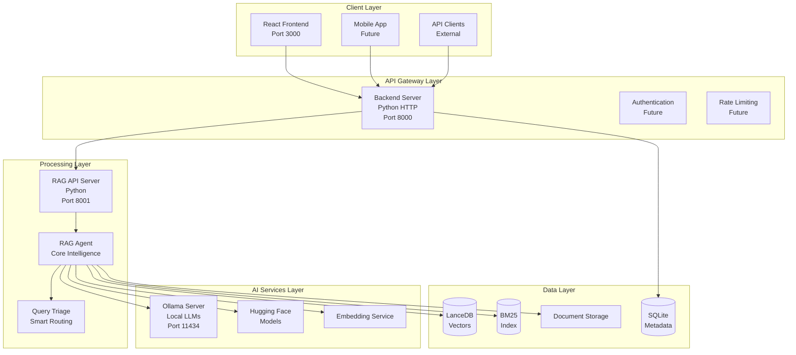
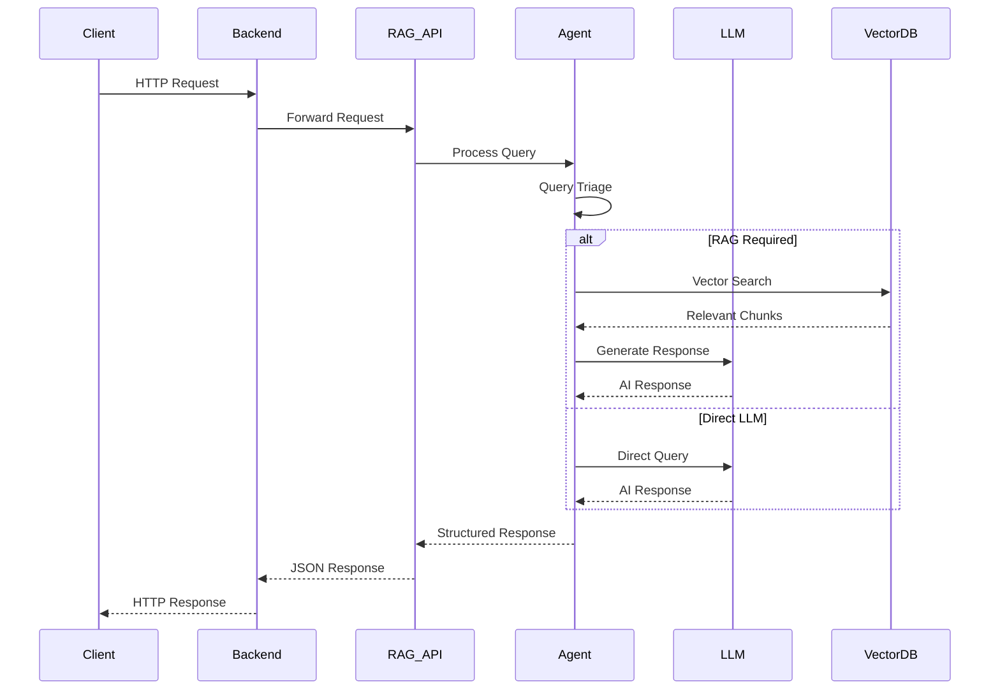
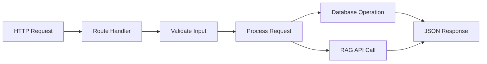
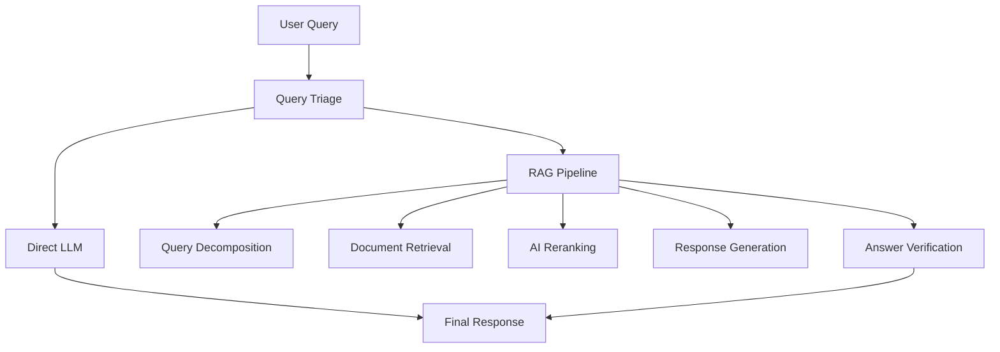
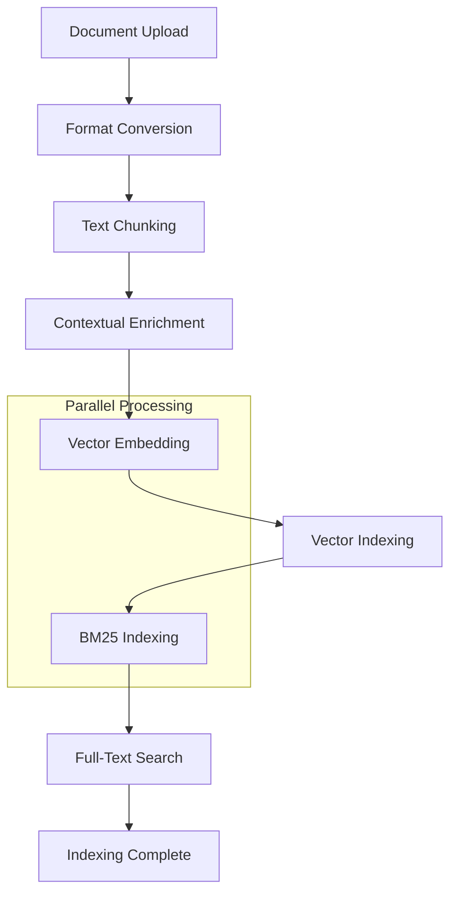
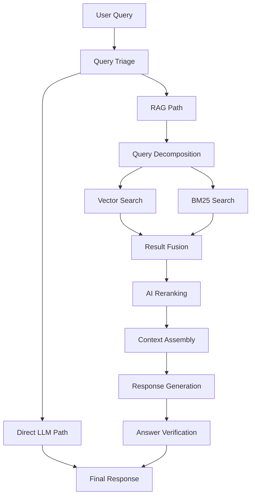

# LocalGPT Technical Specification

**Version**: 1.0  
**Last Updated**: 2025-07-06  
**Document Type**: Technical Architecture & API Specification

---

## Table of Contents

1. [System Overview](#system-overview)
2. [Architecture](#architecture)
3. [Core Components](#core-components)
4. [API Specifications](#api-specifications)
5. [Data Models](#data-models)
6. [Processing Pipelines](#processing-pipelines)
7. [Configuration System](#configuration-system)
8. [Security & Privacy](#security--privacy)
9. [Performance Specifications](#performance-specifications)
10. [Deployment Architecture](#deployment-architecture)

---

## System Overview

LocalGPT is a **private document intelligence platform** built on a microservices architecture that provides Retrieval-Augmented Generation (RAG) capabilities while maintaining complete data privacy.

### Core Principles

- **Privacy-First**: All processing occurs locally without external API calls
- **Modular Design**: Loosely coupled components with clear interfaces
- **Scalable Architecture**: Horizontal scaling through containerization
- **Model Agnostic**: Support for multiple AI model providers
- **Real-time Processing**: Streaming responses and live progress updates

### System Capabilities

| Capability | Description | Implementation |
|------------|-------------|----------------|
| **Document Processing** | Multi-format document ingestion and processing | PDF, DOCX, TXT, Markdown support |
| **Intelligent Indexing** | Advanced chunking and vectorization | Hybrid vector + BM25 indexing |
| **Smart Query Routing** | Intelligent query classification and routing | Rule-based + AI-powered triage |
| **Contextual RAG** | Context-aware retrieval and generation | Session-based context management |
| **Real-time Chat** | Streaming conversational interface | WebSocket + SSE implementation |

---

## Architecture

### High-Level Architecture



### Component Communication



---

## Core Components

### 1. Frontend (React/Next.js)

**Location**: `src/`  
**Technology**: React 19, Next.js 15, TypeScript  
**Port**: 3000

#### Key Components

| Component | Purpose | Location |
|-----------|---------|----------|
| `Demo.tsx` | Main application container | `src/components/demo.tsx` |
| `SessionChat.tsx` | Chat interface | `src/components/ui/session-chat.tsx` |
| `IndexWizard.tsx` | Document upload wizard | `src/components/IndexWizard.tsx` |
| `SessionIndexInfo.tsx` | Index metadata display | `src/components/SessionIndexInfo.tsx` |

#### State Management

```typescript
interface AppState {
  homeMode: 'HOME' | 'CHAT_EXISTING' | 'QUICK_CHAT' | 'INDEX';
  selectedSession: Session | null;
  sidebarOpen: boolean;
  sessions: Session[];
  indexes: Index[];
}
```

#### API Integration

```typescript
// API client configuration
const API_BASE = 'http://localhost:8000';

// Core API functions
export const api = {
  chat: (data: ChatRequest) => post('/chat', data),
  createSession: (data: SessionData) => post('/sessions', data),
  uploadDocument: (file: File, indexId: string) => 
    postFile(`/indexes/${indexId}/upload`, file),
  buildIndex: (indexId: string) => post(`/indexes/${indexId}/build`)
};
```

### 2. Backend Server (Python HTTP)

**Location**: `backend/`  
**Technology**: Python 3.11, HTTP Server  
**Port**: 8000

#### Core Responsibilities

- Session management and persistence
- Index lifecycle management
- Document upload and storage
- API gateway and request routing
- Database operations

#### Key Modules

```python
# backend/server.py - Main server implementation
class ChatHandler(http.server.BaseHTTPRequestHandler):
    def handle_chat(self): pass
    def handle_create_session(self): pass
    def handle_create_index(self): pass
    def handle_upload_documents(self): pass
    def handle_build_index(self): pass

# backend/database.py - Database operations
class ChatDatabase:
    def create_session(self, title: str, model: str) -> str
    def create_index(self, name: str, description: str) -> str
    def link_index_to_session(self, session_id: str, index_id: str)
    def get_session_indexes(self, session_id: str) -> List[Dict]
```

#### Request Flow



### 3. RAG API Server (Advanced Processing)

**Location**: `rag_system/`  
**Technology**: Python 3.11, Advanced NLP  
**Port**: 8001

#### Core Responsibilities

- Document processing and indexing
- Vector embeddings generation
- Intelligent query processing
- RAG pipeline orchestration
- Real-time progress tracking

#### Key Components

```python
# rag_system/api_server.py
class AdvancedRagApiHandler:
    def handle_chat(self): pass
    def handle_chat_stream(self): pass
    def handle_index(self): pass

# rag_system/main.py - Core agent initialization
def get_agent(config_name: str = 'default') -> RagAgent:
    return RagAgent(
        retrieval_pipeline=get_retrieval_pipeline(config_name),
        ollama_config=OLLAMA_CONFIG,
        external_models=EXTERNAL_MODELS
    )
```

### 4. RAG Agent (Core Intelligence)

**Location**: `rag_system/agent/`  
**Technology**: Python, Advanced NLP

#### Agent Architecture



#### Implementation

```python
# rag_system/agent/react_agent.py
class RagAgent:
    def __init__(self, retrieval_pipeline, ollama_config, external_models):
        self.retrieval_pipeline = retrieval_pipeline
        self.triage_system = TriageSystem()
        self.verifier = ResponseVerifier()
    
    def run(self, query: str, **kwargs) -> Dict[str, Any]:
        # 1. Query triage
        route = self.triage_system.classify_query(query)
        
        # 2. Execute appropriate pipeline
        if route == 'direct_llm':
            return self._direct_llm_response(query)
        else:
            return self._rag_pipeline(query, **kwargs)
    
    def _rag_pipeline(self, query: str, **kwargs) -> Dict[str, Any]:
        # Decomposition, retrieval, generation, verification
        pass
```

---

## API Specifications

### Backend API (Port 8000)

#### Session Management

```http
POST /sessions
Content-Type: application/json

{
  "title": "string",
  "model": "string",
  "embedding_model": "string (optional)"
}

Response:
{
  "session_id": "uuid",
  "title": "string",
  "model": "string",
  "created_at": "timestamp"
}
```

```http
GET /sessions
Response:
{
  "sessions": [
    {
      "id": "uuid",
      "title": "string",
      "model": "string",
      "created_at": "timestamp",
      "message_count": "integer"
    }
  ]
}
```

#### Index Management

```http
POST /indexes
Content-Type: application/json

{
  "name": "string",
  "description": "string (optional)"
}

Response:
{
  "index_id": "uuid"
}
```

```http
POST /indexes/{index_id}/upload
Content-Type: multipart/form-data

files: File[]

Response:
{
  "message": "string",
  "uploaded_files": [
    {
      "filename": "string",
      "stored_path": "string"
    }
  ]
}
```

```http
POST /indexes/{index_id}/build
Response:
{
  "response": {
    "message": "string",
    "table_name": "string",
    "indexing_config": {
      "chunk_size": "integer",
      "chunk_overlap": "integer",
      "retrieval_mode": "string",
      "window_size": "integer",
      "enable_enrich": "boolean"
    }
  }
}
```

#### Chat API

```http
POST /chat
Content-Type: application/json

{
  "query": "string",
  "session_id": "uuid",
  "table_name": "string (optional)",
  "search_type": "hybrid|vector|bm25",
  "retrieval_k": "integer (default: 20)",
  "reranker_top_k": "integer (default: 10)",
  "context_window_size": "integer (default: 1)",
  "dense_weight": "float (default: 0.7)"
}

Response:
{
  "response": "string",
  "sources": [
    {
      "chunk_id": "string",
      "document_id": "string",
      "text": "string",
      "metadata": "object",
      "score": "float"
    }
  ],
  "metadata": {
    "query_type": "string",
    "processing_time": "float",
    "retrieval_count": "integer"
  }
}
```

### RAG API (Port 8001)

#### Advanced Chat

```http
POST /chat
Content-Type: application/json

{
  "query": "string",
  "session_id": "uuid",
  "compose_sub_answers": "boolean",
  "query_decompose": "boolean",
  "ai_rerank": "boolean",
  "context_expand": "boolean",
  "verify": "boolean",
  "force_rag": "boolean",
  "provence_prune": "boolean",
  "provence_threshold": "float"
}
```

#### Streaming Chat

```http
POST /chat/stream
Content-Type: application/json

{
  "query": "string",
  "session_id": "uuid",
  "stream": true
}

Response: Server-Sent Events
event: progress
data: {"step": "retrieval", "progress": 25}

event: chunk
data: {"text": "partial response"}

event: complete
data: {"response": "complete response", "sources": [...]}
```

#### Document Indexing

```http
POST /index
Content-Type: application/json

{
  "file_paths": ["string"],
  "session_id": "uuid",
  "chunk_size": "integer",
  "chunk_overlap": "integer",
  "retrieval_mode": "string",
  "window_size": "integer",
  "enable_enrich": "boolean",
  "enable_latechunk": "boolean",
  "enable_docling_chunk": "boolean",
  "embedding_model": "string",
  "enrich_model": "string",
  "overview_model": "string"
}
```

---

## Data Models

### Database Schema

#### Sessions Table

```sql
CREATE TABLE sessions (
    id TEXT PRIMARY KEY,
    title TEXT NOT NULL,
    model TEXT NOT NULL,
    embedding_model TEXT,
    created_at TIMESTAMP DEFAULT CURRENT_TIMESTAMP,
    updated_at TIMESTAMP DEFAULT CURRENT_TIMESTAMP
);
```

#### Messages Table

```sql
CREATE TABLE messages (
    id INTEGER PRIMARY KEY AUTOINCREMENT,
    session_id TEXT NOT NULL,
    role TEXT NOT NULL CHECK (role IN ('user', 'assistant')),
    content TEXT NOT NULL,
    metadata TEXT,
    created_at TIMESTAMP DEFAULT CURRENT_TIMESTAMP,
    FOREIGN KEY (session_id) REFERENCES sessions (id)
);
```

#### Indexes Table

```sql
CREATE TABLE indexes (
    id TEXT PRIMARY KEY,
    name TEXT NOT NULL,
    description TEXT,
    status TEXT DEFAULT 'created',
    vector_table_name TEXT,
    metadata TEXT,
    created_at TIMESTAMP DEFAULT CURRENT_TIMESTAMP,
    updated_at TIMESTAMP DEFAULT CURRENT_TIMESTAMP
);
```

#### Session-Index Relationships

```sql
CREATE TABLE session_indexes (
    session_id TEXT NOT NULL,
    index_id TEXT NOT NULL,
    linked_at TIMESTAMP DEFAULT CURRENT_TIMESTAMP,
    PRIMARY KEY (session_id, index_id),
    FOREIGN KEY (session_id) REFERENCES sessions (id),
    FOREIGN KEY (index_id) REFERENCES indexes (id)
);
```

### Vector Database Schema (LanceDB)

#### Document Chunks Table

```python
schema = pa.schema([
    pa.field("vector", pa.list_(pa.float32(), 1024)),  # Embedding vector
    pa.field("text", pa.string()),                     # Chunk text
    pa.field("chunk_id", pa.string()),                 # Unique chunk ID
    pa.field("document_id", pa.string()),              # Source document ID
    pa.field("chunk_index", pa.int32()),               # Chunk position
    pa.field("metadata", pa.string())                  # JSON metadata
])
```

### Configuration Models

#### Pipeline Configuration

```python
@dataclass
class PipelineConfig:
    chunk_size: int = 512
    chunk_overlap: int = 64
    retrieval_mode: str = 'hybrid'
    window_size: int = 5
    enable_enrich: bool = True
    latechunk: bool = True
    docling_chunk: bool = True
    embedding_model: str = 'Qwen/Qwen3-Embedding-0.6B'
    generation_model: str = 'qwen3:0.6b'
    enrich_model: str = 'qwen3:0.6b'
```

#### Search Configuration

```python
@dataclass
class SearchConfig:
    search_type: str = 'hybrid'
    retrieval_k: int = 20
    reranker_top_k: int = 10
    dense_weight: float = 0.7
    sparse_weight: float = 0.3
    enable_reranking: bool = True
```

---

## Processing Pipelines

### Document Indexing Pipeline



#### Implementation Details

```python
# rag_system/pipelines/indexing_pipeline.py
class IndexingPipeline:
    def run(self, file_paths: List[str]) -> None:
        # 1. Document conversion
        documents = self.pdf_converter.convert_documents(file_paths)
        
        # 2. Text chunking
        chunks = self.chunker.chunk_documents(documents)
        
        # 3. Contextual enrichment (optional)
        if self.config.get('enable_enrich'):
            chunks = self.contextualizer.enrich_chunks(chunks)
        
        # 4. Vector embedding generation
        embeddings = self.embedder.generate_embeddings(chunks)
        
        # 5. Vector database indexing
        self.vector_indexer.index(self.table_name, chunks, embeddings)
        
        # 6. BM25 index creation
        self.bm25_indexer.index(chunks)
        
        # 7. Full-text search index
        self.create_fts_index()
```

### Query Processing Pipeline



#### Query Triage Logic

```python
# rag_system/agent/loop.py
class TriageSystem:
    def classify_query(self, query: str, context: Dict) -> str:
        # 1. Simple greeting/general queries
        if self._is_greeting(query):
            return 'direct_llm'
        
        # 2. Document-specific queries
        if self._requires_documents(query):
            return 'rag_pipeline'
        
        # 3. Complex analytical queries
        if self._is_complex_analysis(query):
            return 'rag_pipeline_advanced'
        
        # 4. Default to RAG for safety
        return 'rag_pipeline'
```

### Retrieval Pipeline

```python
# rag_system/pipelines/retrieval_pipeline.py
class RetrievalPipeline:
    def run(self, query: str, **kwargs) -> Dict[str, Any]:
        # 1. Query preprocessing
        processed_query = self.query_transformer.transform(query)
        
        # 2. Multi-modal retrieval
        vector_results = self.vector_retriever.search(processed_query)
        bm25_results = self.bm25_retriever.search(processed_query)
        
        # 3. Result fusion
        fused_results = self.fusion.combine(vector_results, bm25_results)
        
        # 4. Reranking
        if kwargs.get('ai_rerank', True):
            fused_results = self.reranker.rerank(query, fused_results)
        
        # 5. Context assembly
        context = self.context_assembler.assemble(fused_results)
        
        # 6. Response generation
        response = self.generator.generate(query, context)
        
        return {
            'response': response,
            'sources': fused_results,
            'metadata': self._build_metadata()
        }
```

---

This technical specification provides a comprehensive foundation for understanding LocalGPT's architecture and implementation. The document covers the core system design, API specifications, data models, and processing pipelines that make up the platform.

For specific implementation details, refer to the individual component documentation and source code in the respective directories. 