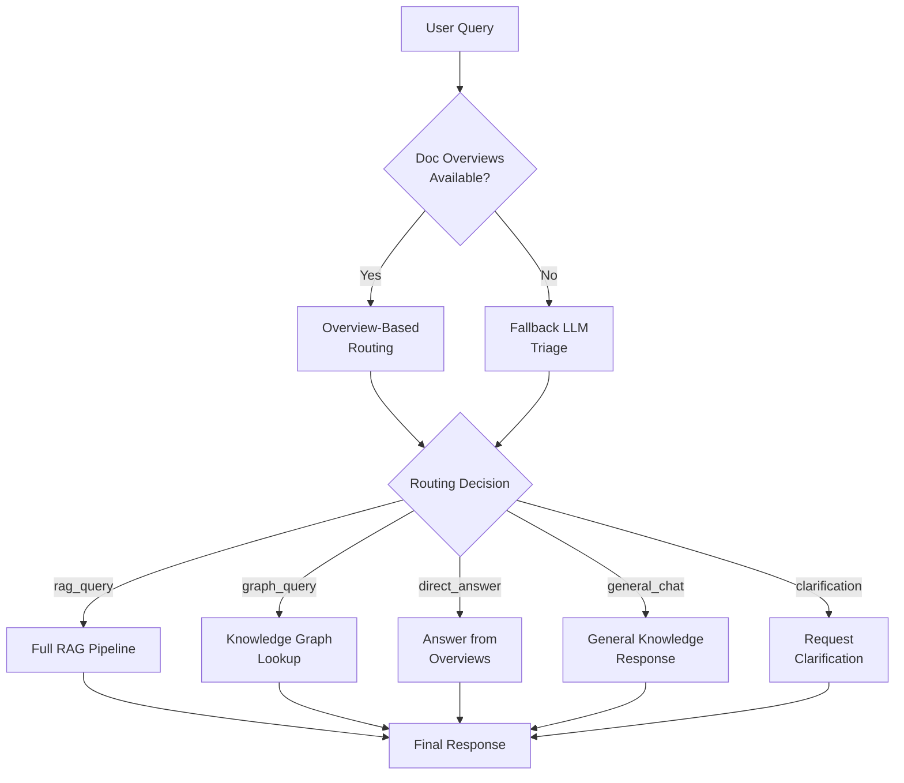
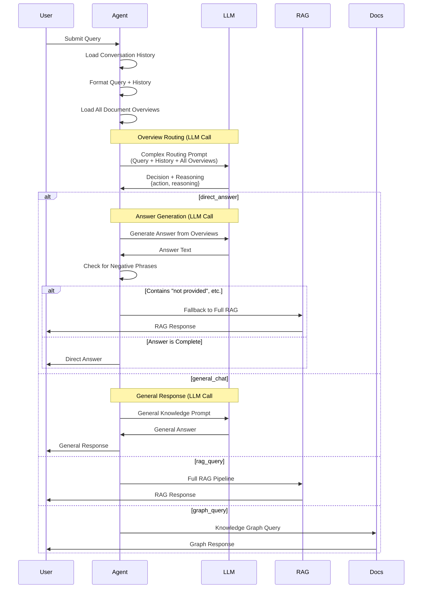
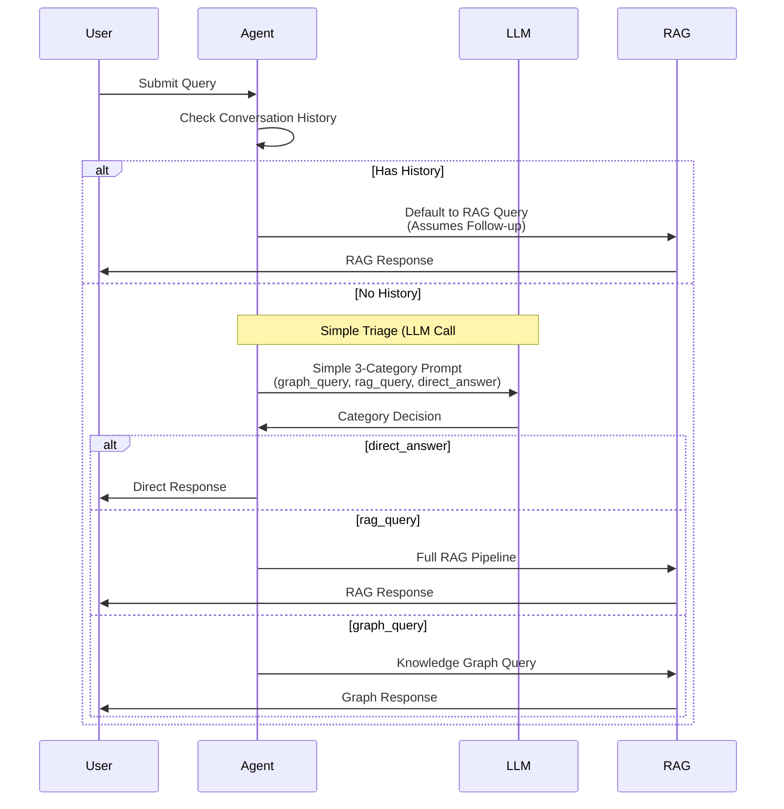
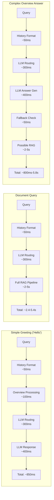

# Triage System Implementation Documentation

## 📋 **Overview**

The RAG system employs a sophisticated **two-tier triage system** to intelligently route user queries to the most appropriate processing pipeline. This system optimizes response time and accuracy by avoiding unnecessary retrieval operations for queries that don't require document access.

## 🏗️ **Architecture Overview**

### **High-Level Flow**


## 🔄 **Detailed Triage Flow**

### **Primary Path: Overview-Based Routing**

When document overviews are available (loaded from `index_store/overviews/overviews.jsonl`):



### **Fallback Path: Simple LLM Triage**

When no document overviews are available:



## 📊 **Decision Categories**

### **Overview-Based Routing (4 Categories)**

| Category | Description | Processing Path | LLM Calls |
|----------|-------------|-----------------|-----------|
| `rag_query` | Requires specific document retrieval | Full RAG pipeline | 1 (routing) |
| `direct_answer` | Answer available in overviews | Generate from overviews | 2 (routing + generation) |
| `general_chat` | General knowledge/conversation | General LLM response | 2 (routing + generation) |
| `clarification` | Ambiguous query | Request clarification | 1 (routing) |

### **Fallback Triage (3 Categories)**

| Category | Description | Processing Path | LLM Calls |
|----------|-------------|-----------------|-----------|
| `rag_query` | Document-specific queries | Full RAG pipeline | 1 (routing) |
| `graph_query` | Factual relations | Knowledge graph lookup | 1 (routing) |
| `direct_answer` | General knowledge | Direct LLM response | 1 (routing) |

## 🔧 **Implementation Details**

### **Document Overview Loading**
```python
# Location: rag_system/agent/loop.py:53-65
overview_path = os.path.join("index_store", "overviews", "overviews.jsonl")
self.doc_overviews: list[str] = []
if os.path.exists(overview_path):
    with open(overview_path, encoding="utf-8") as fh:
        for line in fh:
            rec = json.loads(line)
            if isinstance(rec, dict) and rec.get("overview"):
                self.doc_overviews.append(rec["overview"].strip())
```

### **Triage Entry Point**
```python
# Location: rag_system/agent/loop.py:135-173
async def _triage_query_async(self, query: str, history: list) -> str:
    # 1️⃣ Primary: Overview-based routing (if available)
    if self.doc_overviews:
        contextual_query = self._format_query_with_history(query, history)
        return self._route_via_overviews(contextual_query)
    
    # 2️⃣ Fallback: Simple LLM triage
    if history:
        return "rag_query"  # Default for follow-ups
    
    # Simple 3-category classification...
```

### **Overview Routing Logic**
```python
# Location: rag_system/agent/loop.py:445-531
def _route_via_overviews(self, query: str) -> str | None:
    # Concatenate ALL overviews
    overview_text = "\n\n".join(f"--- Overview {i+1} ---\n{o}" 
                                for i, o in enumerate(self.doc_overviews))
    
    # Complex routing prompt (~500+ tokens)
    prompt = f"""Complex routing instructions..."""
    
    # LLM call for routing decision
    resp = self.llm_client.generate_completion(...)
    
    # Process decision and potentially make additional LLM calls
```

## ⚡ **Performance Characteristics**

### **Latency Breakdown by Query Type**



### **Resource Usage by Path**

| Path | LLM Calls | Token Usage | Avg Latency | Cache Benefits |
|------|-----------|-------------|-------------|----------------|
| **Simple Greeting** | 2 | ~800 tokens | 850ms | High (repeatable) |
| **Document Query** | 1 | ~600 tokens | 2.4s+ | Medium (semantic cache) |
| **Overview Answer** | 2-3 | ~1200 tokens | 800ms-5.8s | Low (fallback variability) |
| **General Chat** | 2 | ~400 tokens | 700ms | High (pattern-based) |

## 🚨 **Current Bottlenecks**

### **1. Mandatory LLM Calls for Simple Queries**
- **Issue**: Even "Hello" requires 1-2 LLM calls
- **Impact**: 400-800ms overhead for instant-response queries
- **Location**: Lines 141-173 (always calls LLM for triage)

### **2. Overview Processing Overhead**
- **Issue**: ALL document overviews sent to LLM every time
- **Impact**: Larger prompt = longer processing time
- **Location**: Line 452 (joins all overviews)

### **3. Unnecessary Context Formatting**
- **Issue**: History formatting happens for all queries
- **Impact**: Extra processing for simple queries
- **Location**: Line 143 (always formats with history)

### **4. Multiple LLM Calls for Direct Answers**
- **Issue**: Routing decision + answer generation + potential fallback
- **Impact**: 2-3 LLM calls for what should be simple responses
- **Location**: Lines 506-523 (direct answer path)

### **5. Conservative Fallback Strategy**
- **Issue**: "Direct answers" often fall back to full RAG
- **Impact**: False efficiency - appears fast but becomes slow
- **Location**: Lines 508-515 (negative phrase detection)

## 📈 **Optimization Opportunities**

### **Quick Wins (High Impact, Low Effort)**
1. **Pre-LLM Pattern Matching**: Instant responses for common greetings
2. **Conditional History Formatting**: Skip for simple queries
3. **Overview Relevance Filtering**: Send only relevant overviews

### **Medium-Term Improvements**
4. **Parallel Processing**: Overlap routing and answer generation
5. **Simplified Prompts**: Reduce token usage for common cases
6. **Smart Caching**: Cache triage decisions for similar queries

### **Advanced Optimizations**
7. **Adaptive Triage Depth**: Different complexity levels based on query
8. **Background Processing**: Pre-compute common responses
9. **Intent Classification Pipeline**: Multi-stage classification

## 🔄 **Configuration Impact**

### **When Overviews Are Available**
- **Pros**: More intelligent routing, better context awareness
- **Cons**: Higher latency, more complex processing
- **Best For**: Document-heavy workloads

### **When Overviews Are Not Available**
- **Pros**: Simpler processing, faster simple queries
- **Cons**: Less intelligent routing, defaults to RAG more often
- **Best For**: General chat or knowledge-based queries

## 🎯 **Recommended Next Steps**

1. **Profile Current Performance**: Measure actual latency for different query types
2. **Implement Quick Wins**: Add pre-LLM pattern matching for immediate improvements
3. **A/B Test Optimizations**: Compare optimized vs current triage performance
4. **Monitor Resource Usage**: Track token consumption and LLM call frequency

---

This documentation provides the foundation for understanding the current triage system and planning optimization strategies. The diagrams clearly show where bottlenecks occur and help identify the highest-impact improvement opportunities. 